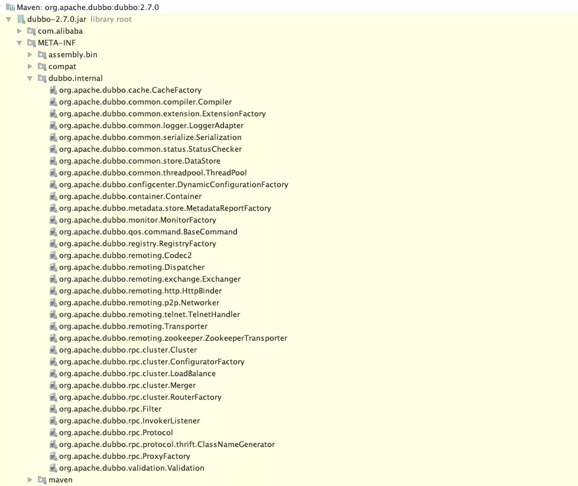
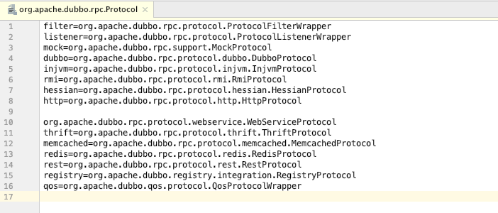
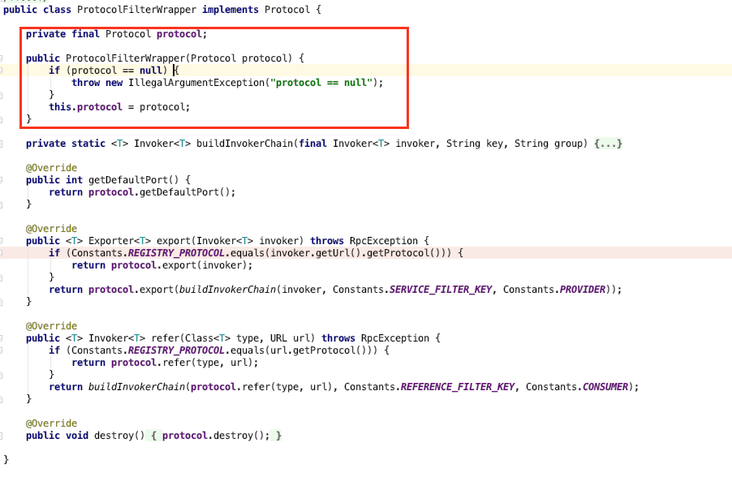
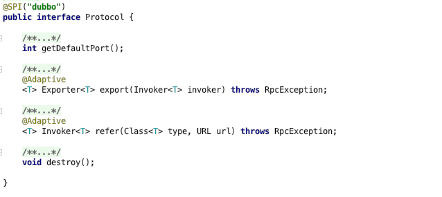
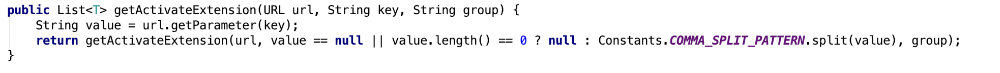

# `Dubbo` 拓展机制使用详解

## 前言
如下图所示，是`dubbo`框架的整体架构图


在严格的分层结构之下，每一层都留有对应的拓展点，来供使用方根据自己的业务需要、系统架构特需进行拓展。典型拓展点的如

+ `Protocol` - 协议

+ `Filter` - 过滤器

+ `ProxyFactory` - 代理工厂

+ `LoadBalance` - 负载均衡

+ `Cluster` - 集群

+ `Serialization` - 序列化

+ ... ...
 
在这些拓展点的背后，`dubbo`内部有专门的加载器将这些拓展实现加载到框架中，加载器具体的实现都在`org.apache.dubbo.common.extension.ExtensionLoader`类里面。

## `ExtensionLoader` 使用详解

在`dubbo`中，已经有了一些内置的拓展点实现，具体的配置都在`dubbo jar`包下面的`META-INF/dubbo.internal`目录下面



每个拓展点具体的内容形式类似于`SPI`配置，但又不完全同于`SPI`配置，举例`Protocol`拓展点如下



图中可见，每个一个拓展点都有一个专属的名字，通过这个名字可以在`ExtensionLoader`获取对应的拓展点实现。另外，还有部分拓展点实现的类名是以`Wrapper`作为结束，表明这个拓展点实现，并不是一个真正的拓展点实现，而是一个用来包装其他拓展点实现的包装类，和代理模式有点相似，如下拓展点实现-`ProtocolFilterWrapper`简要源码实现所示



在`ProtocolFilterWrapper`构造器中，会传入一个`Protocol`的具体实现，之后所有的操作都会依赖于传入的`Protocol`具体实现，并且在此之上，会做一些相关的功能集成，比如构造调用过滤链。

使用`ExtensionLoader`管理、获取具体的拓展点实现，也很简单。
+ 首先第一步获取具体拓展点的`ExtensionLoader`，如下

    ```java
    ExtensionLoader<Protocol> protocolExtensionLoader = ExtensionLoader.getExtensionLoader(Protocol.class);
    ```

+ 根据拓展点实现名称获取具体的拓展点实现
    ```java
    Protocol dubboProtocol = protocolExtensionLoader.getExtension("dubbo");
    System.out.println(dubboProtocol.getClass());
    ```
    输出
    ```
    class org.apache.dubbo.rpc.protocol.ProtocolListenerWrapper
    ```
    *上图中，会发现根据`dubbo`获取的拓展点实现，应该是`DubboProtocol`，但实际上却是`ProtocolListenerWrapper`包装对象。正如上面说的一样，只要拓展点实现的配置文件中，配置了包装类，则获取所有对应的具体拓展点实现，都是经过包装类包装后再返回，并且还会出现层层包装的情况，如下*
    ```
    ProtocolListenerWrapper -> QosProtocolWrapper -> ProtocolFilterWrapper -> DubboProtocol
    ```

+ 获取默认的拓展点实现
    ```java
    Protocol defaultProtocol = protocolExtensionLoader.getDefaultExtension();

    String defaultProtocolName = protocolExtensionLoader.getDefaultExtensionName();
    ```
    获取默认拓展点实现是根据**默认拓展点实现名称**来获取的，**默认拓展点实现名称**来源于在拓展点上的`@SPI`注解中的`value()`属性值，如`Protocol`拓展点源码所示

    

+ 获取当前支持的拓展点实现的名称集合

    ```java
    Set<String> protocolNames = protocolExtensionLoader.getSupportedExtensions();
    ```

+ 获取当前已加载的拓展点实现名称集合

    ```java
    ExtensionLoader<Protocol> protocolExtensionLoader = ExtensionLoader.getExtensionLoader(Protocol.class);

    Protocol dubboProtocol = protocolExtensionLoader.getExtension("dubbo");

    Set<String> protocolNames = protocolExtensionLoader.getSupportedExtensions();
        
    Set<String> loadedProtocolNames = protocolExtensionLoader.getLoadedExtensions();

    System.out.println(protocolNames);
    System.out.println(loadedProtocolNames);
    ```
    输出
    ```
    [dubbo, injvm, mock, redis, registry, rmi, thrift]
    [dubbo]
    ```
    *与获取当前支持的拓展点实现名称集合不一样的是，这个是指获取已经实例化的拓展点实现名称集合，而获取当前支持的拓展实现名称所对应的拓展点实现不一定实例化了，因为`ExtensionLoader`的实现机制是按需加载（实例化）拓展点实现。*

+ 根据`URL`、`group`获取匹配的拓展点实现

    ```java
    List<T> getActivateExtension(URL url, String key, String group)

    List<T> getActivateExtension(URL url, String[] values, String group)
    ```
    如上所示，根据`URL`、`group`获取匹配拓展点实现、包含所有参数的API接口是这两个，其实就是一个，因为在`getActivateExtension(URL url, String key, String group)`内部的调用，也是根据`key`从`url`中获取对应的`value`，并根据逗号进行切分，获得`String[] values`，然后去调用`getActivateExtension(URL url, String[] values, String group)`，具体代码实现如下所示

    

    + `group`、`url`

       这两个参数组合使用，获取匹配的拓展点实现。如果拓展点实现类上面的`@Activate`注解的`group`字段值集合包含参数的`group`值，则组匹配成功，如果参数的`group`值为`null`或空串，则默认组匹配成功。
       
       如果拓展点实现类上面的`@Activate`注解的`value`字段值集合，任意一个字段值在参数`url`中作为`key`出现过，则表示`url`匹配成功。如果拓展点实现类上面没有`@Activate`注解装饰，则表示`url`匹配失败。
       
       **只有group、URL同时匹配，这个拓展点实现才会被认为为激活状态，并返回**

    + `values`

        这个参数的值集合，则是直接指定对应的拓展点实现的名称，如果找不到对应的拓展点实现则会报找不到对应的拓展点实现。**通过参数获取匹配的拓展点实现，即使上述的group、URL均不匹配、以及拓展点实现类未使用`@Activate`注解装饰，也不影响对应的拓展点实现激活并返回。**
        
        *注意，`values`中的元素值如果有为 `default`，或者以 `-` 开头的，则表示为特殊的含义，具体是什么特殊处理将会在源码分析的文章里讲解。*
    
    示例Demo如下所示：

    拓展点实现1
    ```java
    @Activate(group = {"provider"}, value = {"custom1"})
    public class Custom1Protocol implements Protocol {

        @Override
        public int getDefaultPort() { throw new UnsupportedOperationException(); }

        @Override
        public <T> Exporter<T> export(Invoker<T> invoker) throws RpcException { throw new UnsupportedOperationException(); }

        @Override
        public <T> Invoker<T> refer(Class<T> type, URL url) throws RpcException { throw new UnsupportedOperationException(); }

        @Override
        public void destroy() {}
    }
    ```

    拓展点实现2
    ```java
    @Activate(group = {"consumer"}, value = {"custom2"})
    public class Custom2Protocol implements Protocol {

        @Override
        public int getDefaultPort() { throw new UnsupportedOperationException(); }

        @Override
        public <T> Exporter<T> export(Invoker<T> invoker) throws RpcException { throw new UnsupportedOperationException(); }

        @Override
        public <T> Invoker<T> refer(Class<T> type, URL url) throws RpcException { throw new UnsupportedOperationException(); }

        @Override
        public void destroy() {}
    }
    ```

    配置文件
    ```p
    custom1=org.dh2580.dubbo.provider.Custom1Protocol
    custom2=org.dh2580.dubbo.provider.Custom2Protocol
    ```
    
    测试
    ```
    public static void main(String[] args) {
        ExtensionLoader<Protocol> protocolExtensionLoader = ExtensionLoader.getExtensionLoader(Protocol.class);

        URL url = new URL("dubbo", "127.0.0.1", 10024);
        url = url.addParameter("custom1", "value1");

        String[] values = {"custom2"};

        List<Protocol> activateExtensions = protocolExtensionLoader.getActivateExtension(url, values, "provider");
    }
    ```
    
    `activateExtensions`值
    ```
    [
        ProtocolListenerWrapper -> QosProtocolWrapper -> ProtocolFilterWrapper -> Custom1Protocol,
        ProtocolListenerWrapper -> QosProtocolWrapper -> ProtocolFilterWrapper -> Custom2Protocol
    ]
    ```

一般情况下，不需要去自定义拓展点，只需要去写拓展点实现。脱离`dubbo`这个框架的内部使用场景，在外部的系统设计中也可以借助`ExtensionLoader`这个组件，来作为系统的拓展加载机制。定义一个拓展点、实现拓展点的过程如下所示：

+ 定义拓展点接口，并以`@SPI`注解装饰，表明这是一个拓展点

    ```java
    @SPI("ftp")
    public interface CustomExtend {
        void hello();
    }
    ```

+ 定义拓展点实现类，实现拓展点接口，`@Activate`注解可选可不选

    ```java
    public class FtpCustomExtend implements CustomExtend {
        @Override
        public void hello() {
            System.out.println("hello,ftp");
        }
    }
    ```

+ 在以下任一一个的资源路径下，添加配置文件，文件名称为接口`CustomExtend`的全包名-`org.dh2580.dubbo.spi.CustomExtend`

    + `META-INF/dubbo/`
    + `META-INF/dubbo/internal/`
    + `META-INF/services/`

    配置文件内容
    ```java
    ftp=org.dh2580.dubbo.spi.FtpCustomExtend
    ```

+ 最后，就可以直接使用了

    ```java
    public static void main(String[] args) {

        ExtensionLoader<CustomExtend> extendExtensionLoader = ExtensionLoader.getExtensionLoader(CustomExtend.class);

        CustomExtend customExtend = extendExtensionLoader.getDefaultExtension();
        System.out.println(customExtend.getClass());
    }
    ```

    输出
    ```
    class org.dh2580.dubbo.spi.FtpCustomExtend
    ```