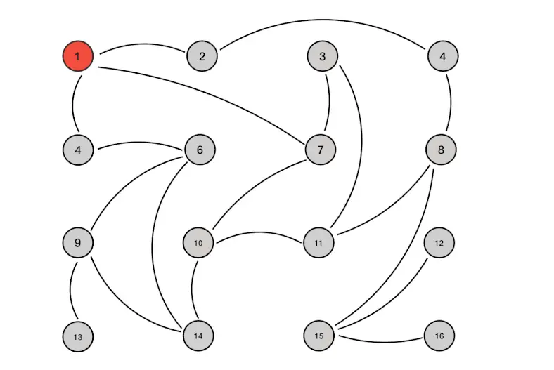

# 分布式一致性协议之`Gossip`

在分布式环境中，关于通信协议大多数是基于主从复制模式（`master-slaver-mode`）的，典型的如`raft`协议、`zab`协议，但`gossip`不是基主从模式的，是基于对等复制的，任何一个节点都可以向其他节点发送要同步的数据。`gossip`协议因其传播特点类似于病毒传播、流言传播，也被称之为`Epidemic`协议（流行病协议）、流言协议、疫情传播协议等。

## 六度分隔理论
1967年，哈弗大学心理学教授`Stanley Milgram`针对人际连系网，做过一次连锁信实验，发现任何两个人之间所间隔的人不会超过六个，也就是说最多通过六个人，能够认识地球上的任何一个人。也就是**六度分隔理论**，而这个理论恰恰也是`gossip`协议的雏形。

## `Gossip`原理
分布式环境中，某个节点如果想要同步数据给整个网络的节点，只需要**周期性**的**随机**选择**固定数量**的互通节点，向这些选中的节点发送需要同步的数据，这些被选中的节点接收到同步数据后，后续会跟着初始节点周期性的重复该过程。在数据复制，或消息传播时，需要遵循以下约束：

+ 每次周期的时间是固定的，比如1S、3S、5S

+ 复制初始时，需要设定单节点每次传播未感染节点的最大数量，称之为`fan-out`，每周期内单个被感染节点选中的未感染节点数不得超过`fan-out`值

+ 感染节点每次传播时，选中的未感染节点必须是**自己从未发送过的**节点。*（真实的网络实现中，因是单向的、且无反馈的发送消息，所以无法得知接受者是否真正接受到了消息，顾会定期重复发送多次，直至指定次数）*

+ 收到同步数据或者消息的节点，在后续的传播周期内，不得传播给自己的发送节点，即A -> B后，B后续进行传播感染时，不许再去传播感染A

具体的传播过程动画如下

## `Gossip`类型

+ `Anti-Entropy`(反熵)-传播所有的数据

    节点之间共享所有的数据，每次传播时都是全量数据，可以保证整个网络节点在数据上的，最终完全的一致性，但因为每次传播的都是全量数据，且在节点之间不断反复的交换，所以传播的数据量很大，导致网络负担很重。

+ `Rumor-Mongering`(谣言传播)-仅传播新到达的数据

    节点之间仅仅发送最新更新的消息或者数据，消息的体积更小，但整个网络节点会有一定概率的数据不一致。

## `Gossip`通信模型

+ `PUSH`
    
    节点A将数据`(key、value、version)`推送给节点B，即节点B对比`version`后更新自身数据

+ `PULL`

    节点B将`(key、version)`推送给节点A，节点A对比`version`后，将自己比`version`新的数据`(key、value、version)`推送给节点B，节点B对比`version`后更新自身数据

    

+ `PUSH`/`PULL`组合

    所有的流程和`PULL`一样，只是比`PULL`多了一步，就是节点B如果发现`cur_version_b > version_a`，则发送`(key、value、version_b)`给节点A，节点A对比版本后更新自身数据，如下

    

## `Gossip`优点

+ ### 拓展性

    允许节点随时增加、或减少，整个网络的节点状态最终会达到一致的状态

+ ### 去中心化

    所有的节点均是对等的，不需要中心节点，且任何一个节点不需要知道整个网络的状况，只要整个网络节点不出现孤岛分区的情况，任何一个节点都可以传播消息/数据。

+ ### 一致性收敛

    保持指数级的消息传播速度，新消息可以在`log(fan-out)`个周期内将消息传播给所有的网络节点，快速将所有节点收敛到一致。假设`fan-out=4`，节点数与传播周期数如下

    |节点数|20|40|80|160|320|
    |----|----|----|----|----|----|
    |周期数|2.16|2.66|3.16|3.44|4.16|

    *以上是理想情况下，真实网络情况下，为了确保接收节点接收到了消息，发送节点会多次重复发送同一消息给同一接受节点，因此实际周期数会比理想周期数大一些*

## `Gossip`缺点

+ **消息延迟**

    需要进行多个周期的消息传播，才能将消息传递到整个网络的所有节点，不可避免的存在消息延迟

+ **消息冗余**

    节点会周期性随机选择周围节点发送消息，接收到消息的节点也会重复该步骤，所以不可避免的会出现多个节点发送重复消息给同一节点，及为了确保接收节点接收到了消息，发送节点会多次重复发送同一消息给同一接受节点的情况。

## 引用

+ [P2P 网络核心技术：Gossip 协议](https://www.jianshu.com/p/8279d6fd65bb)
+ [图解Gossip：可能是最有趣的一致性协议](https://www.jianshu.com/p/54eab117e6ae)