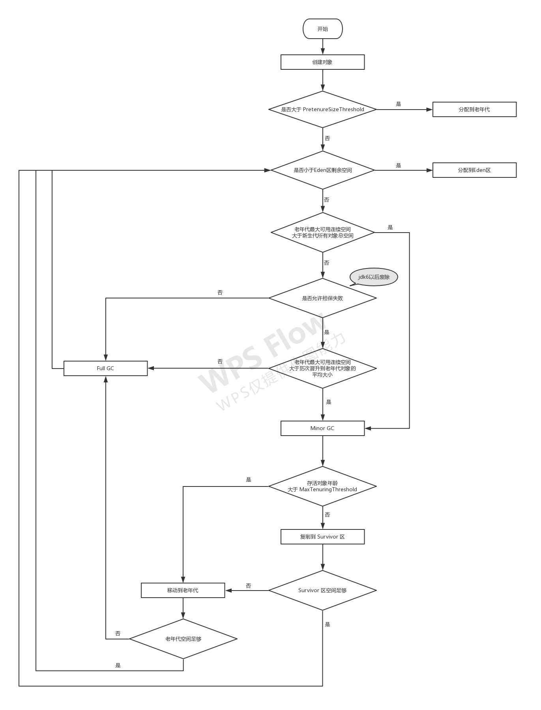
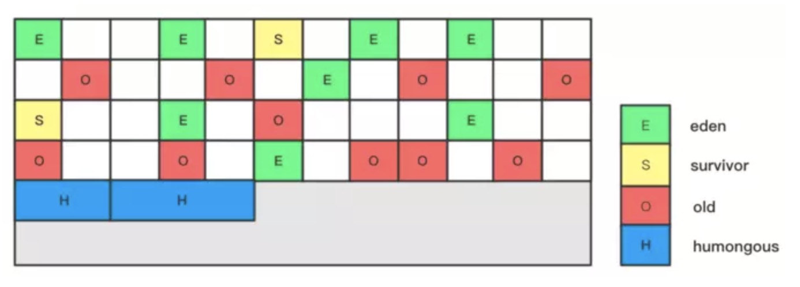

# JVM相关知识点（JDK8及其以上）

## 1、JVM 运行时内存结构


+ **程序计数器** ： 记录当前线程正在执行的字节码的行号，每个线程都有一个单独的程序计数器。

+ **虚拟机栈** ： 记录每个线程在非 `Native` 类型方法的调用栈，每一个方法对应该栈中的一个栈帧。其中栈帧记录了线程在对应方法中局部变量表、方法出口等数据。在每个JVM实现中，都规定了栈深度、栈帧大小。

+ **本地方法栈** ： 类似于虚拟机栈，只是记录的是 `Native` 类型的方法

+ **堆** ： 存放对象实例、数组，即引用类型指向的实例数据，而非值类型数据。由于该区域在线程之间共享，为提高分配效率，采用`TLAB（Thread Local Allocation Buffer）`，即线程私有分配缓冲区，来提高分配效率。（*注意 `String` 是引用类型，不是值类型*）

+ **方法区**  
    
    JDK6及其以下的JVM在该区域中主要存储加载的类信息、常量、静态变量，该区域存放在叫做永久代的空间内，永久代受限于默认内存大小（一般是128MB）、参数`-XX:MaxPermSize`值大小。

    JDK7中将常量、静态变量从方法区中移动到堆内存中，只保留加载的类信息。

    JDK8及其以上的JVM将该区域改为存放在元空间（`MetaSpace`）中，元空间直接使用本地内存，元空间大小仅仅受限于当前Java进程在操作系统中的最大可用内存。此外，JDK8及其以上的JVM中不再存在永久代。

+ **直接内存/本地内存** ： 该区域不是JVM运行时数据结构的一部分，但在`Java`中，可通过`DirectByteBuffer`对象来引用该区域内的数据，存在的主要意义在于避免`Java`堆和`Native`堆之间的来回复制数据。该区域内存不受限于`Java`堆大小的限制，但是受限于当前Java进程在操作系统中的最大可用内存。（*`JDK8`及其以上JVM的方法区就是存在于该内存中*）


## 2、可达性分析算法
在堆中，通过判断一个对象是否被其他对象引用，从而判断该对象是否存活，采用了可达性分析算法来实现。可达性分析算法通过从一个叫做`GC Roots`（根对象）的集合节点出发，根据引用关系往下遍历，那些不能从`GC Roots`被遍历到的对象即为不存在引用的对象。

固定可作为`GC Roots`的对象主要有

+ 虚拟机栈帧中，局部变量表中引用的对象

+ 类静态变量

+ 类常量

+ 被同步锁`synchronized`持有的对象

真实情况中，`GC Roots`可不止以上以上四种，在局部回收、分代回收类型的垃圾回收器中，`GC Roots`还有可能会加入其他的对象。比如在分代回收中，只进行新生代内存回收时，就需要将老年代中有引用新生代的对象也列入`GC Root`中。

## 3、 `GC Roots`（根节点）枚举
所有的垃圾回收器在开始垃圾回收之初，均存在对`GC Roots`进行枚举的操作，即找出组成`GC Roots`的所有对象。`GC Roots`枚举操作需要暂停所有的用户线程，即`STW（Stop The World）`。

### `GC Roots` 枚举之`OopMap`
类静态变量、类常量、栈帧局部变量表中的引用对象均可以作为`GC Roots`中的固定节点。鉴于`JVM`的内存发展得越来越大，为了快速查找到这些固定节点，垃圾回收器并没有采用逐一遍历方法区、栈中的每一块内存区域，而是在基于**准确式内存管理**之上，借助了一组叫做`OopMap`的数据结构来记录了方法区、栈中的引用对象。在进行`GC Roots`枚举时，直接遍历方法区、栈中的`OopMap`即可获得 `GC Roots` 固定节点。

以栈为例，在每一个栈帧中都会存在一个`OopMap`，用于记录该栈帧中所有的引用对象，在进行根节点枚举时，直接遍历每个栈帧中的`OopMap`，即可获得栈帧局部变量表中的引用对象。

关于`OopMap`的维护，JVM通过对**由字节码生成的部分本地指令**生成或者更新对应的`OopMap`，将相关的引用对象记录在`OopMap`中。**注意，这里是针对部分指令才会生成，并非每一条指令，目的是为了降低维护`OopMap`对程序运行性能的影响，和存储`OopMap`额外空间的占用。**

*所谓的准确式内存管理，就是虚拟机可以知道内存中某个位置的数据具体是什么类型，不管是引用类型，还是基本数据类型*

### `GC Roots` 枚举之安全点、安全区域
鉴于对`Oop Map`的维护，并不会为每一条指令都生成/更新`OopMap`，因此为了获得某一时间的对象引用图快照，暂停所有的用户线程，对于运行中的线程采用了安全点、非运行中的线程（`Blocked`、`Waiting`、`Timed_Waiting`状态的线程）采用了安全区域的处理方式。

+ **安全点**

  每一个生成/更新`OopMap`的指令位置都是一个安全点，发生`GC`时，每一个**正在运行、不在安全区域中**的用户线程要尽快到达离自己最近的安全点上暂停。*（一个方法中，可能会存在多个安全点）*

+ **安全区域**

  所谓安全区域就是指确保能够在一段代码片段中，对象的引用关系固定，不会发生任何变化，比如能让线程进入睡眠状态的代码片段，安全区间相当于安全点的一个拉伸区间，但是定义又不同于安全点。

  当进行`GC Roots`枚举时，如果用户线程处于安全区域，只要不离开当前安全区域，该用户线程状态不会受到`GC Roots`枚举影响；如果用户线程要离开安全区域，需要等待`GC Roots`枚举完成后才能离开。**注意，非运行中的线程都是处于安全区域中的，如果在发生`GC Roots`枚举时，非运行中的线程被唤醒，也需要等待`GC Roots`枚举完成才能离开安全区域**

  *关于`GC Roots`枚举期间，发生`STW`，暂停所有的用户线程这一说也并非完全准确，例如处于安全区域，运行中的用户线程在发生`GC Roots`枚举时，只要不离开安全区域是不会被暂停的。因为`GC Roots`枚举是为了获取某个时刻的对象引用图快照，而安全区域并不会去破坏对象引用图快照。*
  
  *目前JVM实现中只有处于`Waiting`、`Timed_Waiting`、`Blocked`中的线程才会处于安全区域，暂时不存在处于安全区域、运行中的线程，但不代表将来不会有。*


## 4、对象自救之 `finalize()` 方法
当一个对象通过可达性分析算法被判定 “死亡” 时，并不会立即被回收掉，而是会被加入到一个叫做 `F-Queue` 的队列中，等待`Finalizer`线程（*一个优先级比较低的守护线程*）去执行它的 `finalize()` 方法。对象可以通过在 `finalize()` 方法中建立其他存活对象对自己的引用，从而实现自救。但是对于 `finalize()` 方法，`Finalizer`线程并不会承诺等待 `finalize()` 方法执行结束。而且对于同一个对象的 `finalize()`， `Finalizer`只会执行一次，因此对象不能进行多次自救。

## 5、方法区与垃圾回收

方法区的垃圾回收主要是回收以下两点

+ 常量

+ 加载的类信息

在`JDK7`及其以上的`JVM`中，因为已经将常量移动到堆中，所以常量的回收类似于堆中对象的回收。（个人认为在`JDK7`及其以上的`JVM`中，常量的回收不应该在方法区的回收讨论范围内，因为常量已经不再属于方法区，而属于堆）

对于类信息回收，取决于具体的GC回收器实现，比如`ZGC`就不会进行回收类信息，而对于会回收类信息的GC回收器而言，要回收一个类信息，需要满足以下条件

+ 堆中不存在该类，以及其派生子类的任何实例

+ 该类的类加载器已经被回收掉

+ 该类的 `class` 对象在任何地方都没有被引用

*因为方法区的回收性价比很低，所以在平时垃圾回收中，方法区的GC可忽略，尤其JDK8及其以上的JVM中采用了元空间存储，原则上不会出现OOM。此外部分垃圾回收器放弃了对该方法区的内存回收更是因为如此。*

## 6、传统垃圾回收算法

+ **标记-清除**

  标记堆中需要回收的对象，标记完成后，统一回收掉所有被标记的对象。反过来也可以，即标记存活的对象，标记完成后，统一回收掉所有未标记的对象。

  **缺点**：存在内存碎片问题、堆中存在大量死亡对象时需要进行大量的标记、清除动作
  
+ **标记-复制**

  将堆内存划分为两块，每次仅使用一块，标记使用内存块中存活的对象，然后将存活对象复制到另一个内存块中，然后一次清理掉之前的内存块。

  **缺点**：存在内存浪费、堆中存在大量存活对象时需要进行大量复制动作

  **案例**：`HotSpot`分代垃圾回收中，新生代的回收采用了`Eden`、`Survivor`组合，由一个`Eden`区（权重8），两个`Survivor`区（权重均为1）组成，每次使用一个`Eden`区和一个`Survivor`区，留一个`Survivor`用作复制使用。

+ **标记-整理**

  对堆中存活的对象进行标记，然后将所有的存活对象向内存空间一端移动，然后直接清理掉边界以外的内存

  **缺点**：堆中存在大量存活对象时，移动对象并更新对象引用是一项繁重操作，并且移动、更新期间，会存在`STW`

## 7、`GC` 名词辨析

+ **`Minor GC / Young GC`（新生代回收）** ：只是新生代的垃圾回收

+ **`Major GC / Old GC`（老年代回收）** ： 只是老年代的垃圾回收，比如CMS

+ **`Mixed GC`（混合回收）** ： 回收整个新生代以及部分老年代，比如G1

+ **`Full GC`（整堆回收）** ： 回收整个Java堆和方法区

## 8、分代垃圾回收之空间分配流程


## 9、`CMS` 垃圾回收器
`CMS`作为一款基于内存分代模型下，针对老年代的，基于**并发-标记-清除**的垃圾回收器，大多数情况下与`ParNew`垃圾回收器进行配合工作。（*`ParNew`为`Serial`回收器的多线程并行版本，采取复制算法回收，回收期间全程`STW`*）

### `CMS`主要工作流程如下

+ **`初始标记`（CMS inital mark）**

  暂停所有用户线程，进行`GC Roots`固定节点枚举和新生代存活对象扫描，并标记`GC Roots`能**直接关联**到的对象。对于新生代存活对象的扫描分为以下两种情况：
  
  1. 如果由于`Minor GC`担保失败引起`Full GC`导致`Old GC`，则会借助`Minor GC`后的结果扫描新生代存活对象加入`GC Roots`

  2. 如果是由于**大对象直接进入老年代**、**`Minor GC`后存活对象因为年龄晋升到老年代**、**`Minor GC`后`Survivor`区容纳不下的存活对象进入老年代**这三种情况导致老年代内存占用超过阈值，引起的`Old GC`，则无法借助`Minor GC`结果，只能全盘扫描新生代存活对象，加入`GC Roots`。

+ **`并发标记`（CMS concurrent mark）**
  
  + 从`GC Roots`的直接关联对象集合开始遍历整个对象图，查找老年代存活的对象。

  + 通过**写后屏障**，记录并发标记期间对象之间产生的**新引用关系**。（即记录**增量更新**关系）

+ **`重新标记`（CMS remark）**

  **暂停所有用户线程，重新标记并发阶段引用关系发生过变动的对象。此处采用增量更新的解决方式，根据并发标记阶段记录下来的新引用关系，以引用对象为出发点重新遍历对象图。**（*此处并不需要遍历引用对象的所有对外引用，只需要遍历并发标记阶段未曾遍历过的对外引用即可，其实就是新引用关系中的被引用对象的方向*）

  *在此之前，为了处理在并发标记阶段，新生代对象对老年代对象的跨代引用关系发生变化（即新生代指向老年代），还会存在一个对新生代的**并发扫描阶段 `Rescan(parallel)`**。为了能够快速的完成对新生代的并发扫描，在进行并发扫描前，会存在一个**并发预清理阶段**，，在该阶段内可以通过参数设置等待一次`Minor GC`或者通过参数设置强制一次`Minor GC`来降低重新扫描新生代的时间花费。*

  *如果在并发预清理阶段未能发生 `Minor GC`，则在 `Rescan (parallel)`阶段需要扫描整个新生代。在**并发预清理阶段**，不管有没有发生`Minor GC`，都会将剩下的新生代进行分块，用于`Rescan (parallel)`阶段并发扫描。*

  *最后，**`Rescan (parallel)`是需要`STW`的***。

+ **`并发清除`（CMS concurrent sweep）**

  清理掉已经死亡的对象，不需要移动存活对象，和用户线程并发进行

### `CMS`缺点

1. **对CPU资源较为敏感**，尤其是CPU核数低于4个时。CMS默认的回收线程数是
   ```
   ( 处理器核数 + 3 ) / 4
   ```
   当CPU核数超过4个时，`CMS`对CPU资源的占用不超过25%，并随着CPU核数增加，CPU资源占用下降

2. **无法处理浮动垃圾**。由于CMS的并发标记、并发清理阶段，用户线程还是在继续运行中的，期间可能会产生新的垃圾，本次CMS无法回收掉这部分垃圾，只能等待下次CMS回收。为此，CMS预留了一部分空间用于存放浮动垃圾，可以通过参数`-XX:CMSInitiatingOccupancyFraction`设置，`JDK6`以及之后的默认值是92%，即预留了8%的空间来存放浮动垃圾。如果期间浮动垃圾占满了预留空间，则会发生`ConcurrentModeFailure`失败，转而进入全程需要`STW`的`Serial Old`垃圾回收。

3. **存在内存碎片**。CMS是基于标记-清除算法的垃圾回收器，因此每次垃圾回收之后会存在内存碎片。为了解决内存碎片问题，可以通过参数`-XX:+UseCMSCompactAtFullCollection`、`-XX:CMSFullGCsBeforeCompaction`组合使用，达到在进行多少次不进行碎片整理的CMS之后，下一次进行CMS之前进行一次碎片整理。

## 10、`G1` 垃圾回收器

`G1`垃圾回收器是基于`Region`、面向局部收集的垃圾回收器，不同于`CMS`垃圾回收目标要么是整个新生代（`Minor GC`）、要么是整个老年代（`Major GC`）、要么是整个`Java`堆（`Full GC`）这种回收方式，`G1`是通过建立起**停顿时间模型**，优先回收那些价值最大的`Region`,从而达到在用户设定的收集停顿时间（*通过参数 `+XX:MaxGCPauseMillis`设定，默认是200ms*）内完成最大内存的回收。（*所谓回收价值即回收能释放的空间和回收所需要的耗时*）

`G1`不再采用固定大小以及固定数量的分代内存划分，而是将`Java`堆划分为多个大小一样的独立区域，叫做`Region`，`Region`的容量大小可以通过参数`-XX:G1HeapRegionSize`来设置。每个分代都由一系列的`Region`组成（*注意，不要求这些`Region`连续*）。每个`Region`根据需要，在不同的时间点可能扮演不同的角色（**`Eden Region`、`Survivor Region`、`Old Region`、`Humongous Region`**）

`Humongous Region`专门用于存储大对象，如果一个对象的大小超过一个`Region`区域容量的一半，则认为该对象是一个大对象。如果一个大对象的内存占用超过`Region`的容量，该大对象将会被放入N个连续的`Humongous Region`中。在进行`GC`回收时，`G1`大多数情况下把`Humongous Region`作为老年代的一部分来处理。



