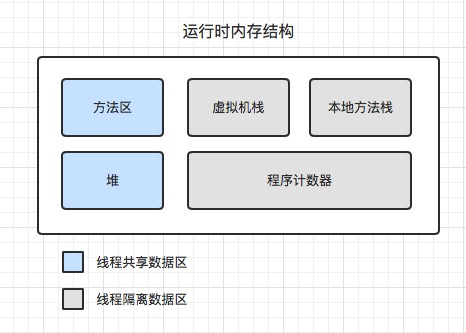

# JVM相关知识点（JDK8及其以上）

## 1、JVM 运行时内存结构

+ **程序计数器** ： 记录当前线程正在执行的字节码的行号，每个线程都有一个单独的程序计数器。

+ **虚拟机栈** ： 记录每个线程在非 `Native` 类型方法的调用栈，每一个方法对应该栈中的一个栈帧。其中栈帧记录了线程在对应方法中局部变量表、方法出口等数据。在每个JVM实现中，都规定了栈深度、栈帧大小。

+ **本地方法栈** ： 类似于虚拟机栈，只是记录的是 `Native` 类型的方法

+ **堆** ： 存放对象实例、数组，即引用类型指向的实例数据，而非值类型数据。由于该区域在线程之间共享，为提高分配效率，采用`TLAB（Thread Local Allocation Buffer）`，即线程私有分配缓冲区，来提高分配效率。（*注意 `String` 是引用类型，不是值类型*）

+ **方法区**  
    
    JDK6及其以下的JVM在该区域中主要存储加载的类信息、常量、静态变量，该区域存放在叫做永久代的空间内，永久代受限于默认内存大小（一般是128MB）、参数`-XX:MaxPermSize`值大小。

    JDK7中将常量、静态变量从方法区中移动到堆内存中，只保留加载的类信息。

    JDK8及其以上的JVM将该区域改为存放在元空间（`MetaSpace`）中，元空间直接使用本地内存，元空间大小仅仅受限于当前Java进程在操作系统中的最大可用内存。此外，JDK8及其以上的JVM中不再存在永久代。

+ **直接内存/本地内存** ： 该区域不是JVM运行时数据结构的一部分，但在`Java`中，可通过`DirectByteBuffer`对象来引用该区域内的数据，存在的主要意义在于避免`Java`堆和`Native`堆之间的来回复制数据。该区域内存不受限于`Java`堆大小的限制，但是受限于当前Java进程在操作系统中的最大可用内存。（*`JDK8`及其以上JVM的方法区就是存在于该内存中*）

## 2、可达性分析算法
在堆中，通过判断一个对象是否被其他对象引用，从而判断该对象是否存活，采用了可达性分析算法来实现。可达性分析算法通过从一个叫做`GC Roots`（根对象）的集合节点出发，根据引用关系往下遍历，那些不能从`GC Roots`被遍历到的对象即不存在引用的对象。

固定可作为`GC Roots`的对象主要有

+ 虚拟机栈帧中，局部变量表中引用的对象

+ 类静态变量

+ 类常量

+ 被同步锁`synchronized`持有的对象

真实情况中，`GC Roots`可不止以上以上四种，在局部回收、分代回收类型的垃圾回收器中，`GC Roots`还有可能会加入其他的对象。比如在分代回收中，只进行新生代内存回收时，就需要将老年代中引用新生代的对象也列入`GC Root`中。

## 3、对象自救之 `finalize()` 方法
当一个对象通过可达性分析算法被判定 “死亡” 时，并不会立即被回收掉，而是会被加入到一个叫做 `F-Queue` 的队列中，等待`Finalizer`线程（*一个优先级比较低的守护线程*）去执行它的 `finalize()` 方法。对象可以通过在 `finalize()` 方法中建立其他存活对象对自己的引用，从而实现自救。但是对于 `finalize()` 方法，`Finalizer`线程并不会承诺等待 `finalize()` 方法执行结束。而且对于同一个对象的 `finalize()`， `Finalizer`只会执行一次，因此对象不能进行多次自救。

## 4、方法区与垃圾回收

方法区的垃圾回收主要是回收以下两点

+ 常量

+ 加载的类信息

在`JDK7`及其以上的`JVM`中，因为已经将常量移动到堆中，所以常量的回收类似于堆中对象的回收。（个人认为在`JDK7`及其以上的`JVM`中，常量的回收不应该在方法区的回收讨论范围内，因为常量已经不再属于方法区，而属于堆）

对于类信息回收，取决于具体的GC回收器实现，比如`ZGC`就不会进行回收类信息，而对于会回收类信息的GC回收器而言，要回收一个类信息，需要满足以下条件

+ 堆中不存在该类，以及其派生子类的任何实例

+ 该类的类加载器已经被回收掉

+ 该类的 `class` 对象在任何地方都没有被引用

*因为方法区的回收性价比很低，所以在平时垃圾回收中，方法区的GC可忽略，尤其JDK8及其以上的JVM中采用了元空间存储，原则上不会出现OOM。此外部分垃圾回收器放弃了对该方法区的内存回收更是因为如此。*

## 5、传统垃圾回收算法

+ **标记-清除**

  标记堆中需要回收的对象，标记完成后，统一回收掉所有被标记的对象。反过来也可以，即标记存活的对象，标记完成后，统一回收掉所有未标记的对象。

  **缺点**：存在内存碎片问题、堆中存在大量死亡对象时需要进行大量的标记、清除动作
  
+ **标记-复制**

  将堆内存划分为两块，每次仅使用一块，标记使用内存块中存活的对象，然后将存活对象复制到另一个内存块中，然后一次清理掉之前的内存块。

  **缺点**：存在内存浪费、堆中存在大量存活对象时需要进行大量复制动作

  **案例**：`HotSpot`分代垃圾回收中，新生代的回收采用了`Eden`、`Survivor`组合，由一个`Eden`区（权重8），两个`Survivor`区（权重均为1）组成，每次使用一个`Eden`区和一个`Survivor`区，留一个`Survivor`用作复制使用。

+ **标记-整理**

  对堆中存活的对象进行标记，然后将所有的存活对象向内存空间一端移动，然后直接清理掉边界以外的内存

  **缺点**：堆中存在大量存活对象时，移动对象并更新对象引用是一项繁重操作，并且移动、更新期间，会存在`STW`

## 6、`GC`名次辨析

+ **`Minro GC / Young GC`（新生代回收）** ：只是新生代的垃圾回收

+ **`Major GC / Old GC`（老年代回收）** ： 只是老年代的垃圾回收，比如CMS

+ **`Mixed GC`（混合回收）** ： 回收整个新生代以及部分老年代，比如G1

+ **`Full GC`（整堆回收）** ： 回收整个Java堆和方法区

## 7、