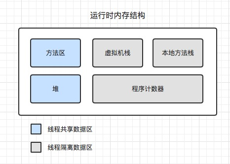
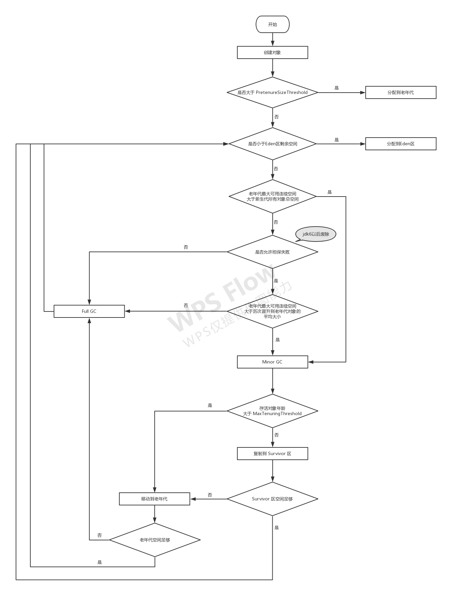
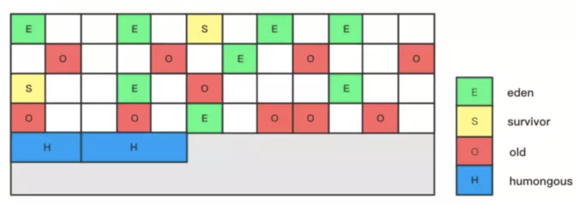
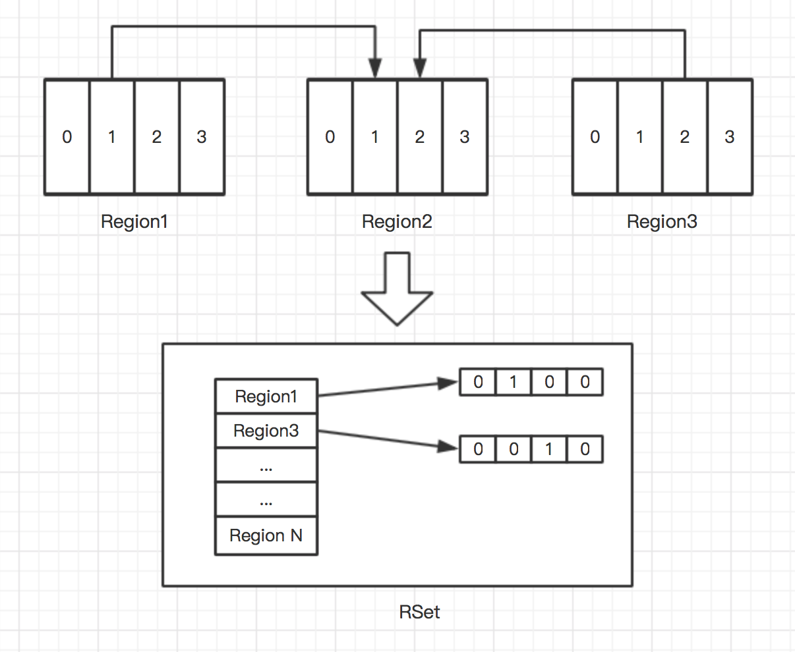
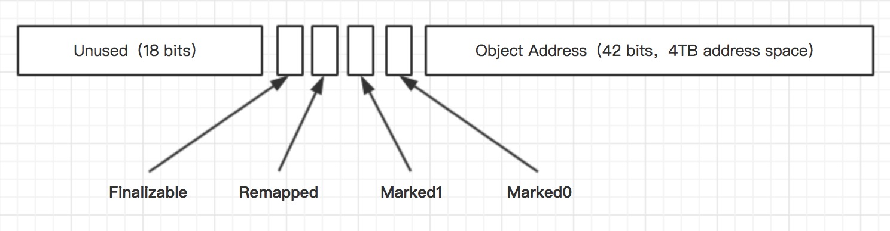
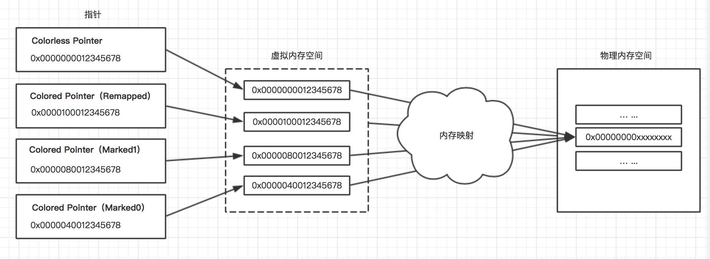

# JVM相关知识点（JDK8及其以上）

## 1、JVM 运行时内存结构


+ **程序计数器** ： 记录当前线程正在执行的字节码的行号，每个线程都有一个单独的程序计数器。

+ **虚拟机栈** ： 记录每个线程在非 `Native` 类型方法的调用栈，每一个方法对应该栈中的一个栈帧。其中栈帧记录了线程在对应方法中局部变量表、方法出口等数据。在每个JVM实现中，都规定了栈深度、栈帧大小。（`64bit`的`Linux`系统上`HotSpot`默认每个虚拟机栈大小是`1MB`）

+ **本地方法栈** ： 类似于虚拟机栈，只是记录的是 `Native` 类型的方法

+ **堆** ： 存放对象实例、数组，即引用类型指向的实例数据，而非值类型数据。由于该区域在线程之间共享，为提高分配效率，采用`TLAB（Thread Local Allocation Buffer）`，即线程私有分配缓冲区，来提高分配效率。（*注意 `String` 是引用类型，不是值类型*）

+ **方法区**  
    
    JDK6及其以下的JVM在该区域中主要存储加载的类信息、常量、类静态变量，该区域存放在叫做永久代的空间内，永久代受限于默认内存大小（一般是128MB）、参数`-XX:MaxPermSize`值大小。

    JDK7中将常量、类静态变量从方法区中移动到堆内存中，只保留加载的类信息。

    JDK8及其以上的JVM将该区域改为存放在元空间（`MetaSpace`）中，元空间直接使用本地内存，元空间大小仅仅受限于当前Java进程在操作系统中的最大可用内存。此外，JDK8及其以上的JVM中不再存在永久代。

+ **直接内存/本地内存** ： 该区域不是JVM运行时内存结构的一部分，但在`Java`中，可通过`DirectByteBuffer`对象来引用该区域内的数据，存在的主要意义在于避免`Java`堆和`Native`堆之间的来回复制数据。该区域内存不受限于`Java`堆大小的限制，但是受限于当前Java进程在操作系统中的最大可用内存。（*`JDK8`及其以上JVM的方法区就是存在于该内存中*）


## 2、可达性分析算法
在堆中，通过判断一个对象是否被其他对象引用，从而判断该对象是否存活，采用了可达性分析算法来实现。可达性分析算法通过从一个叫做`GC Roots`（根对象）的集合节点出发，根据引用关系往下遍历，那些不能从`GC Roots`被遍历到的对象即为不存在引用的对象。

固定可作为`GC Roots`的对象主要有

+ 虚拟机栈帧中，局部变量表中引用的对象

+ 类静态变量

+ 常量

+ 被同步锁`synchronized`持有的对象

真实情况中，`GC Roots`可不止以上以上四种，在局部回收、分代回收类型的垃圾回收器中，`GC Roots`还有可能会加入其他的对象。比如在分代回收中，只进行新生代内存回收时，就需要将老年代中有引用新生代的对象也列入`GC Root`中。

## 3、 `GC Roots`（根节点）枚举
所有的垃圾回收器在开始垃圾回收之初，均存在对`GC Roots`进行枚举的操作，即找出组成`GC Roots`的所有对象。`GC Roots`枚举操作需要暂停所有的用户线程，即`STW（Stop The World）`。

### `GC Roots` 枚举之`OopMap`
类静态变量、常量、栈帧局部变量表中的引用对象均可以作为`GC Roots`中的固定节点。鉴于`JVM`的内存发展得越来越大，为了快速查找到这些固定节点，垃圾回收器并没有采用逐一遍历方法区、栈中的每一块内存区域，而是在基于**准确式内存管理**之上，借助了一组叫做`OopMap`的数据结构来记录了方法区、栈中的引用对象。在进行`GC Roots`枚举时，直接遍历方法区、栈中的`OopMap`即可获得 `GC Roots` 固定节点。

以栈为例，在每一个栈帧中都会存在一个`OopMap`，用于记录该栈帧中所有的引用对象，在进行根节点枚举时，直接遍历每个栈帧中的`OopMap`，即可获得栈帧局部变量表中的引用对象。

关于`OopMap`的维护，JVM通过对**由字节码生成的部分本地指令**生成或者更新对应的`OopMap`，将相关的引用对象记录在`OopMap`中。**注意，这里是针对部分指令才会生成，并非每一条指令，目的是为了降低维护`OopMap`对程序运行性能的影响，和存储`OopMap`额外空间的占用。**

*所谓的准确式内存管理，就是虚拟机可以知道内存中某个位置的数据具体是什么类型，不管是引用类型，还是基本数据类型*

### `GC Roots` 枚举之安全点、安全区域
鉴于对`Oop Map`的维护，并不会为每一条指令都生成/更新`OopMap`，因此为了获得某一时间的对象引用图快照，暂停所有的用户线程，对于运行中的线程采用了安全点、非运行中的线程（`Blocked`、`Waiting`、`Timed_Waiting`状态的线程）采用了安全区域的处理方式。

+ **安全点**

  每一个生成/更新`OopMap`的指令位置都是一个安全点，发生`GC`时，每一个**正在运行、不在安全区域中**的用户线程要尽快到达离自己最近的安全点上暂停。*（一个方法中，可能会存在多个安全点）*

+ **安全区域**

  所谓安全区域就是指确保能够在一段代码片段中，对象的引用关系固定，不会发生任何变化，比如能让线程进入睡眠状态的代码片段，安全区间相当于安全点的一个拉伸区间，但是定义又不同于安全点。

  当进行`GC Roots`枚举时，如果用户线程处于安全区域，只要不离开当前安全区域，该用户线程状态不会受到`GC Roots`枚举影响；如果用户线程要离开安全区域，需要等待`GC Roots`枚举完成后才能离开。**注意，非运行中的线程都是处于安全区域中的，如果在发生`GC Roots`枚举时，非运行中的线程被唤醒，也需要等待`GC Roots`枚举完成才能离开安全区域**

  *关于`GC Roots`枚举期间，发生`STW`，暂停所有的用户线程这一说也并非完全准确，例如处于安全区域，运行中的用户线程在发生`GC Roots`枚举时，只要不离开安全区域是不会被暂停的。因为`GC Roots`枚举是为了获取某个时刻的对象引用图快照，而安全区域并不会去破坏对象引用图快照。*
  
  *目前JVM实现中只有处于`Waiting`、`Timed_Waiting`、`Blocked`中的线程才会处于安全区域，暂时不存在处于安全区域、运行中的线程，但不代表将来不会有。*


## 4、对象自救之 `finalize()` 方法
当一个对象通过可达性分析算法被判定 “死亡” 时，并不会立即被回收掉，而是会被加入到一个叫做 `F-Queue` 的队列中，等待`Finalizer`线程（*一个优先级比较低的守护线程*）去执行它的 `finalize()` 方法。对象可以通过在 `finalize()` 方法中建立其他存活对象对自己的引用，从而实现自救。但是对于 `finalize()` 方法，`Finalizer`线程并不会承诺等待 `finalize()` 方法执行结束。而且对于同一个对象的 `finalize()`， `Finalizer`只会执行一次，因此对象不能进行多次自救。

## 5、方法区与垃圾回收

方法区的垃圾回收主要是回收以下两点

+ 常量

+ 加载的类信息

在`JDK7`及其以上的`JVM`中，因为已经将常量移动到堆中，所以常量的回收类似于堆中对象的回收。（个人认为在`JDK7`及其以上的`JVM`中，常量的回收不应该在方法区的回收讨论范围内，因为常量已经不再属于方法区，而属于堆）

对于类信息回收，取决于具体的GC回收器实现，比如`ZGC`就不会进行回收类信息，而对于会回收类信息的GC回收器而言，要回收一个类信息，需要满足以下条件

+ 堆中不存在该类，以及其派生子类的任何实例

+ 该类的类加载器已经被回收掉

+ 该类的 `class` 对象在任何地方都没有被引用，即不能通过反射机制来创建该类的实例

*因为方法区的回收性价比很低，所以在平时垃圾回收中，方法区的GC可忽略，尤其JDK8及其以上的JVM中采用了元空间存储，原则上不会出现OOM。此外部分垃圾回收器放弃了对该方法区的内存回收更是因为如此。*

## 6、传统垃圾回收算法

+ **标记-清除**

  标记堆中需要回收的对象，标记完成后，统一回收掉所有被标记的对象。反过来也可以，即标记存活的对象，标记完成后，统一回收掉所有未标记的对象。

  **缺点**：存在内存碎片问题、堆中存在大量死亡对象时需要进行大量的标记、清除动作
  
+ **标记-复制**

  将堆内存划分为两块，每次仅使用一块，标记使用内存块中存活的对象，然后将存活对象复制到另一个内存块中，然后一次清理掉之前的内存块。

  **缺点**：存在内存浪费、堆中存在大量存活对象时需要进行大量复制动作

  **案例**：`HotSpot`分代垃圾回收中，新生代的回收采用了`Eden`、`Survivor`组合，由一个`Eden`区（权重8），两个`Survivor`区（权重均为1）组成，每次使用一个`Eden`区和一个`Survivor`区，留一个`Survivor`用作复制使用。

+ **标记-整理**

  对堆中存活的对象进行标记，然后将所有的存活对象向内存空间一端移动，然后直接清理掉边界以外的内存

  **缺点**：堆中存在大量存活对象时，移动对象并更新对象引用是一项繁重操作，并且移动、更新期间，会存在`STW`

## 7、`GC` 名词辨析

+ **`Minor GC / Young GC`（新生代回收）** ：只是新生代的垃圾回收

+ **`Major GC / Old GC`（老年代回收）** ： 只是老年代的垃圾回收，比如CMS

+ **`Mixed GC`（混合回收）** ： 回收整个新生代以及部分老年代，比如G1

+ **`Full GC`（整堆回收）** ： 回收整个Java堆和方法区，通常是采用全程需要`STW`的`Serial Old`

## 8、分代垃圾回收之空间分配流程


## 9、`CMS` 垃圾回收器
`CMS`作为一款基于内存分代模型下，针对老年代的，基于**并发-标记-清除**的垃圾回收器，大多数情况下与`ParNew`垃圾回收器进行配合工作。（*`ParNew`为`Serial`回收器的多线程并行版本，采取复制算法回收，回收期间全程`STW`*）

### `CMS`主要工作流程如下

+ **`初始标记`（CMS inital mark）**

  暂停所有用户线程，进行`GC Roots`固定节点枚举和新生代存活对象扫描，并标记`GC Roots`能**直接关联**到的对象。对于新生代存活对象的扫描分为以下两种情况：
  
  1. 如果由于`Minor GC`担保失败引起`Full GC`导致`Old GC`，则会借助`Minor GC`后的结果扫描新生代存活对象加入`GC Roots`

  2. 如果是由于**大对象直接进入老年代**、**`Minor GC`后存活对象因为年龄晋升到老年代**、**`Minor GC`后`Survivor`区容纳不下的存活对象进入老年代**这三种情况导致老年代内存占用超过阈值，引起的`Old GC`，则无法借助`Minor GC`结果，只能全盘扫描新生代存活对象，加入`GC Roots`。

+ **`并发标记`（CMS concurrent mark）**
  
  + 从`GC Roots`的直接关联对象集合开始遍历整个对象引用图，查找老年代存活的对象。

  + 通过**写后屏障**，记录并发标记期间对象之间产生的**新引用关系**。（即记录**增量更新**关系）

+ **`重新标记`（CMS remark）**

  **暂停所有用户线程，重新标记并发阶段引用关系发生过变动的对象。此处采用增量更新的解决方式，根据并发标记阶段记录下来的新引用关系，以引用对象为出发点重新遍历对象图。**（*此处并不需要遍历引用对象的所有对外引用，只需要遍历并发标记阶段未曾遍历过的对外引用即可，其实就是新引用关系中的被引用对象的方向*）

  *在此之前，为了处理在并发标记阶段，新生代对象对老年代对象的跨代引用关系发生变化（即新生代指向老年代），还会存在一个对新生代的**并发扫描阶段 `Rescan(parallel)`**。为了能够快速的完成对新生代的并发扫描，在进行并发扫描前，会存在一个**并发预清理阶段**，，在该阶段内可以通过参数设置等待一次`Minor GC`或者通过参数设置强制一次`Minor GC`来降低重新扫描新生代的时间花费。*

  *如果在并发预清理阶段未能发生 `Minor GC`，则在 `Rescan (parallel)`阶段需要扫描整个新生代。在**并发预清理阶段**，不管有没有发生`Minor GC`，都会将剩下的新生代进行分块，用于`Rescan (parallel)`阶段并发扫描。*

  *最后，**`Rescan (parallel)`是需要`STW`的***。

+ **`并发清除`（CMS concurrent sweep）**

  清理掉已经死亡的对象，不需要移动存活对象，和用户线程并发进行

### `CMS`缺点

1. **对CPU资源较为敏感**，尤其是CPU核数低于4个时。CMS默认的回收线程数是
   ```
   ( 处理器核数 + 3 ) / 4
   ```
   当CPU核数超过4个时，`CMS`对CPU资源的占用不超过25%，并随着CPU核数增加，CPU资源占用下降

2. **无法处理浮动垃圾**。由于CMS的并发标记、并发清理阶段，用户线程还是在继续运行中的，期间可能会产生新的垃圾，本次CMS无法回收掉这部分垃圾，只能等待下次CMS回收。为此，CMS预留了一部分空间用于存放浮动垃圾，可以通过参数`-XX:CMSInitiatingOccupancyFraction`设置，`JDK6`以及之后的默认值是92%，即预留了8%的空间来存放浮动垃圾。如果期间浮动垃圾占满了预留空间，则会发生`ConcurrentModeFailure`失败，转而进入全程需要`STW`的`Serial Old`垃圾回收。

3. **存在内存碎片**。CMS是基于标记-清除算法的垃圾回收器，因此每次垃圾回收之后会存在内存碎片。为了解决内存碎片问题，可以通过参数`-XX:+UseCMSCompactAtFullCollection`、`-XX:CMSFullGCsBeforeCompaction`组合使用，达到在进行多少次不进行碎片整理的CMS之后，下一次进行CMS之前进行一次碎片整理。

## 10、`G1` 垃圾回收器

`G1`垃圾回收器是基于`Region`、面向局部收集的垃圾回收器，不同于`CMS`垃圾回收目标要么是整个新生代（`Minor GC`）、要么是整个老年代（`Major GC`）、要么是整个`Java`堆（`Full GC`）这种回收方式，`G1`是通过建立起**可预测的停顿时间模型**，优先回收那些价值最大的`Region`,从而达到在用户设定的收集停顿时间（*通过参数 `+XX:MaxGCPauseMillis`设定，默认是200ms*）内完成最大内存的回收。（*所谓回收价值即回收能释放的空间和回收所需要的耗时*）

`G1`不再采用固定大小以及固定数量的分代内存划分，而是将`Java`堆划分为多个大小一样的独立区域，叫做`Region`，`Region`的容量大小可以通过参数`-XX:G1HeapRegionSize`来设置。每个分代都由一系列的`Region`组成（*注意，不要求这些`Region`连续*）。每个`Region`根据需要，在不同的时间点可能扮演不同的角色（**`Eden Region`、`Survivor Region`、`Old Region`、`Humongous Region`**）

`Humongous Region`专门用于存储大对象，如果一个对象的大小超过一个`Region`区域容量的一半，则认为该对象是一个大对象。如果一个大对象的内存占用超过`Region`的容量，该大对象将会被放入N个连续的`Humongous Region`中。在进行`GC`回收时，`G1`大多数情况下把`Humongous Region`作为老年代的一部分来处理。



### 跨代引用处理

`G1`为`Region`内置了一个类似于哈希表的数据结构，叫做`RSet`，`Key`表示指向本`Region`的其他`Region`（*其实是其他`Region`的起始地址*），`Value`则是一个以字节数组实现的`CardTable`。

通过将每一个`Region`划分为多个`Card`，字节数组的下标则表示`Region`中的`Card`下标，对应下标上的值通过`0`、`1`来表示是否是`Dirty Card`。关于`Card Table`的维护，则是通过写后屏障来实现的。


### `G1`主要工作流程

+ **初始标记（`STW`）**

  1. 暂停所有用户线程，进行`GC Roots`固定节点枚举，标记`GC Roots`能**直接关联**到的对象。
  
  2. 对每个`Region`修改`TAMS`指针，划分出额外空间用于并发标记阶段用户线程分配对象。（*为了保证在并发标记期间，不影响用户线程创建对象、分配内存空间，`G1`通过为每一个`Region`设置了两个叫做`TAMS`（即 `Top at Mark Start`）的指针，在每一个`Region`内部划分出一块内存空间用于并发标记期间新对象的分配，而且`G1`不会将这部分内存空间纳入回收范围，可类似于`CMS`中的浮动空间。*）

+ **并发标记**

  1. 从`GC Roots`的直接关联对象集合开始遍历整个对象引用图，找出所有存活对象。

  2. 通过**写前屏障**，记录并发标记期间发生变化的对象引用关系。**注意是记录变化前的对象引用关系**，即保存对象关系的**原始快照**。

+ **最终标记（`STW`）**

  暂停所有用户线程，根据并发标记阶段保存的对象关系原始快照（`SATB`），将并发标记期间引用关系发生变化前的被引用对象以及其往下引用的其他对象会以递归的方式标记为存活对象。

  > 在该阶段，可能会出现一个对象在`SATB`中是存活的，但是在最新的对象关系图中是死亡的情况。鉴于`G1`采用了`SATB`来处理并发标记期间发生变化的对象引用关系，所以这种对象会逃过当前该次的垃圾回收。

+ **筛选回收（`STW`）**
 
  更新各个`Region`的对象占用统计信息，以及根据回收价值对各个`Region`进行排序，并筛选出目标回收集。通过将目标回收集中的每一个`Region`中的存活对象复制到空的`Region`中，完成对目标回收集的垃圾清理。因为涉及到对象的复制移动，所以是需要`STW`的。（*从整体内存回收上来看是基于标记-整理算法的，但从单个`Region`内存回收上来看是基于复制算法的*）


### `G1`垃圾回收模式

+ **`Minor GC`**

  当`Eden`区不能再分配新的对象时触发，会回收所有标识为新生代的`Region`，`Eden`区中的对象移动到`Survivor`区，达到晋升年龄的对象移动到`Old`区。

+ **`Mixed GC`**

  先回收掉所有新生代的`Region`，然后根据最大停顿时间（*`-XX:MaxGCPauseMillis`参数指定*）回收掉部分标识为老年代的`Region`。**注意，这里不会像`CMS`那样存在单独针对老年代的回收，这里是先进行新生代的回收，然后进行部分老年代的回收。**

  `Mixed GC`的触发是由`-XX:InitiatingHeapOccupancyPercent`参数控制的，表示老年代的`Region`占整堆内存大小的百分比，默认是45%，如果超过了该值，则进行一次`Mixed GC`。

+ **`Full GC`**

  该`GC`是一个全程需要`STW`的`Serial Old`垃圾回收，类比于`CMS`出现`ConcurrentModeFailure`情况。触发的情况主要有以下两个：
  1. 并发标记期间，用户线程耗尽空余内存空间，新分配的对象无内存空间可用

  2. 回收复制`Region`到新的`Region`中时，新`Region`中没有足够内存可用，也没有新`Region`可用。
  

### 对比于`CMS`优势

+ 采用`Region`内部布局，各分代空间大小不再固定，比较灵活

+ 可以指定最大回收停顿时间，实现最大性价比范围的局部回收，在大内存应用上性能优于CMS

+ 通过`SATB`处理并发标记期间发生变化的引用关系，能够减少在最终标记（*CMS中叫做重新标记*）阶段中的耗时（*因为不需要重新扫描新生代*）。此外，还可以避免CMS在最终标记阶段出现因对新对象关系图更新，可能导致的停顿时间过长的问题。

+ `G1`对象的回收清理是从一个`Region`复制到一个新的的空`Region`，所以不存在内存碎片的问题

### `G1`缺点

+ 需要在每个`Region`中维护用于记录其他`Region`指向本`Region`的卡表结构，因为内存中`Region`数量较多，所以相比于`CMS`中只需要在新生代维护一份老年代指向新生代的卡表而言，`G1`在这块的内存占用过多，基本上在10% ~ 20%。

*备注：`G1`中用户指定的停顿时间是指回收过程出现`STW`的总时间，而不是整个回收过程中的总时间。在`G1`中只有并发标记阶段是不存在`STW`的，所以这里的停顿时间可以理解为初始标记、最终标记、筛选回收三个阶段的时间之和*

## 11、`ZGC`

**`ZGC`是一款采用了不固定大小的`Region`内存布局的，不存在分代概念的，借助读屏障、染色指针、内存多重映射技术，基于标记-整理算法实现的并发低延迟垃圾回收器。**`ZGC`通过在对象指针上存储三色标记信息，而`G1`则在堆内存中，采用`BitMap`的结构来存储三色标记信息。

### 内存布局
在`ZGC`中，虽然也是采用了`Region`划分内存布局，但是并不是像`G1`那样固定`Region`大小，而是由以下三种大小不同的`Region`组成：

+ **小型`Region`**
  
  容量大小为`2MB`，用于存放小于`256KB`的对象

+ **中型`Region`**

  容量大小为`32MB`，用于存放等于或者大于`256KB`，但是小于`4MB`的对象

+ **大型`Region`**

  容量不固定，但是须是`2MB`的整数倍，专门用于存放等于或者大于`4MB`的对象，且一个大型`Region`中只允许存放一个对象，即单对象独占`Region`

### `ZGC`主要工作流程

+ **并发标记（`Concurrent Mark`）**
  
  遍历对象引用图做可达性分析，寻找存活对象，在对象指针中标记为存活。

  注意这里是扫描所有的`Region`，虽然在时间上比较长，但是可以节省掉维护跨`Region`引用的成本。此外，该扫描并不会阻塞用户线程，可以同用户线程并发运行，所以用并发时间换跨`Region`引用的维护成本还是很划算的。

  > 注意，在该阶段之前还有一个小阶段，用于`GC Root`枚举，会出现短暂的停顿。
  >
  > 在该阶段中，如果出现对象引用关系发生变化，则通过读屏障来设置**被引用对象指针**的标志位为存活，即逃过当前次`GC`

+ **并发预重分配（`Concurrent Prepare for Relocate`）**

  根据特定的查询条件，统计得出目标回收`Region`集合，组成**重分配集合（`Relocation Set`）**，并将重分配集中的对象在其对象指针中标记为重分配状态

+ **并发重分配（`Concurrent Relocate`）**
  
  将**重分配集**中的每个`Region`中的存活对象复制到新的`Region`上，并为重分配集的每一个`Region`维护一个转发表（`Forward Table`），用于记录旧的地址到新地址的映射。
  
  当有用户线程并发访问对象时，会通过**读屏障**进行拦截，如果该用户线程持有的对象访问指针中标记该对象正处于重分配状态，则会根据转发表将访问转发到新复制的对象上，同时并更新用户线程持有的访问指针指向新对象。

+ **并发重映射（`Concurrent Remap`）**

  **修正整个堆内中指向重分配集中旧对象的所有引用，释放转发表。** 该阶段并不是流程中必要的，因为`ZGC`将并发重映射合并到了下一次`ZGC`的并发标记中做，目的是为了借助下一次`ZGC`并发标记阶段的对象引用图遍历。

### 染色指针



如上图所示，在`Linux 64bit`操作系统中，高`18bit`是保留位，暂未使用，剩余的`46 bit`用于内存寻址。而`ZGC`又将剩余的`46bit`中的高四位，提取出来用于存储四个标志信息：

+ `Finalizable`

   表示是否只能通过`finalize()`方法才能被访问到

+ `Remapped`

  表示对象是否进入了重分配状态

+ `Marked1` & `Marked0`

  表示对象的三色标记状态

因此，在`ZGC`中只有剩余的低`42Bit`可用于内存寻址，故此`ZGC`最大能支持的内存空间为`4TB`。

### 内存多重映射技术

在操作系统中，会把指针作为内存地址来对待，通过这个内存地址去寻找指针指向的对象。`ZGC`对指针上特定`bit`的修改，在映射到底层操作系统处理时，需要进行地址转换，才能正确的访问到指针指向的对象。

在操作系统中，存在虚拟内存空间和物理内存空间的概念，在虚拟内存空间中通过虚拟地址（也叫做线性地址）来进行寻址，在物理内存空间通过物理地址来进行寻址。应用程序是不能直接使用物理地址的，只能使用虚拟地址，应用程序在运行时是需要将虚拟地址映射到物理地址，这种映射叫做内存映射。通常情况下，虚拟内存空间是大于物理内存空间的，所以会出现一种情况就是多个虚拟地址会映射到同一物理地址。**`ZGC`则是利用这种多重内存映射技术，来实现多个染色位不同、但地址位相同的染色指针指向同一物理地址。** 如下图所示



> 虚拟内存存在的意义，在于**能够让操作系统运行远大于其物理内存的应用程序**，这中间涉及到虚拟内存和物理内存之间的内存块交换。操作系统将虚拟内存空间划分为多个大小相同的块，叫做页，同时也将物理内存空间划分为多个大小相同的块，叫做页帧。其中页和页帧的大小必须相同，因为在虚拟空间和物理空间进行内存块交换时，是以页为单位的。这种机制在操作系统中叫做**分页机制**。
>
> 在运行时，如果应用程序所需的内存空间大于物理内存，则将最近运行需要的数据加载到物理内存，其他数据则保存在外部存储器中，通常是磁盘。在后续运行中，按需从磁盘中加载数据到物理内存中，并交换部分物理内存中的数据到磁盘，这些处理都是操作系统进行处理的，无需程序介入。因此，可以理解为操作系统通过虚拟内存来为应用程序提供了一个统一完整的内存空间，应用程序只需关心虚拟空间中的虚拟地址即可，无需关心具体的物理地址。
>
> 最后，虚拟内存的另外一个作用就是通过提供**保护模式**来隔离进程，防止所有进程共享同一物理内存空间带来的内存污染问题。

### `ZGC`优点

+ 停顿时间短，除了刚开始的`GC Root`枚举出现短暂停顿外，其余阶段均可以与用户线程并发进行

+ 最大可支持`4TB`的内存空间

+ 一旦某个`Region`中的所有存活对象被移走之后，该`Region`可以立刻被释放，无需等待整个堆中所有指向该`Region`的引用都被修正后才能清理。**通过借助转发表，对指向旧`Region`的引用进行自愈修正。**

+ 降低了在垃圾收集过程中内存屏障的使用，尤其是写屏障，**`ZGC`只使用了读屏障**。

+ 染色指针作为一种可拓展的存储结构，在后续可以在`GC`中记录更多对象追踪的信息。*比如`Linux 64bit`系统中还有高`18bit`未经使用*

+ `ZGC`每次`GC`都会扫描所有的`Region`，用并发时间换维护跨 `Region`引用的内存空间，所以会省去维护跨`Region`引用的内存空间。

### `ZGC`缺点

+ 仅支持在64位的操作系统上运行

+ 在并发回收期间，同样会存在浮动垃圾的问题。