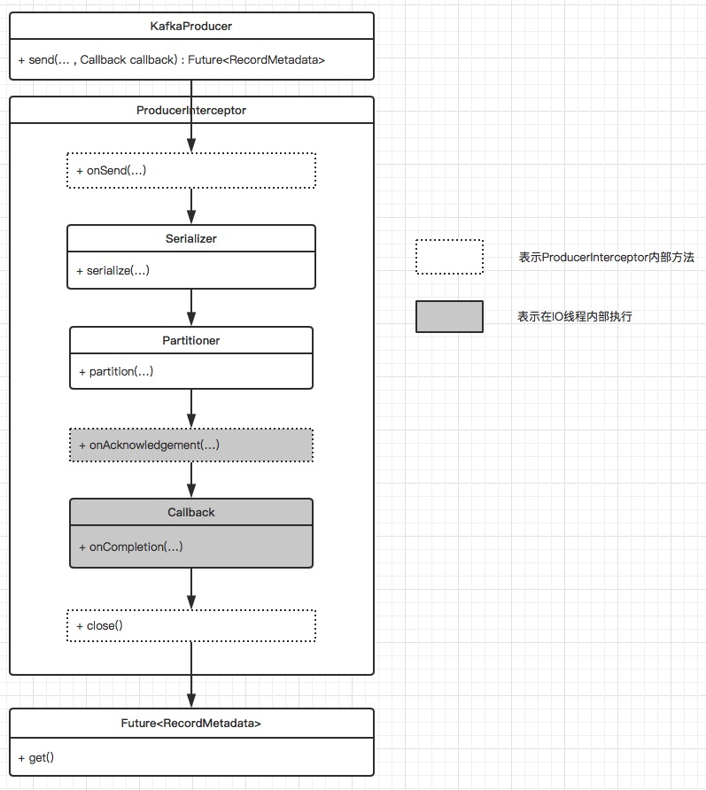
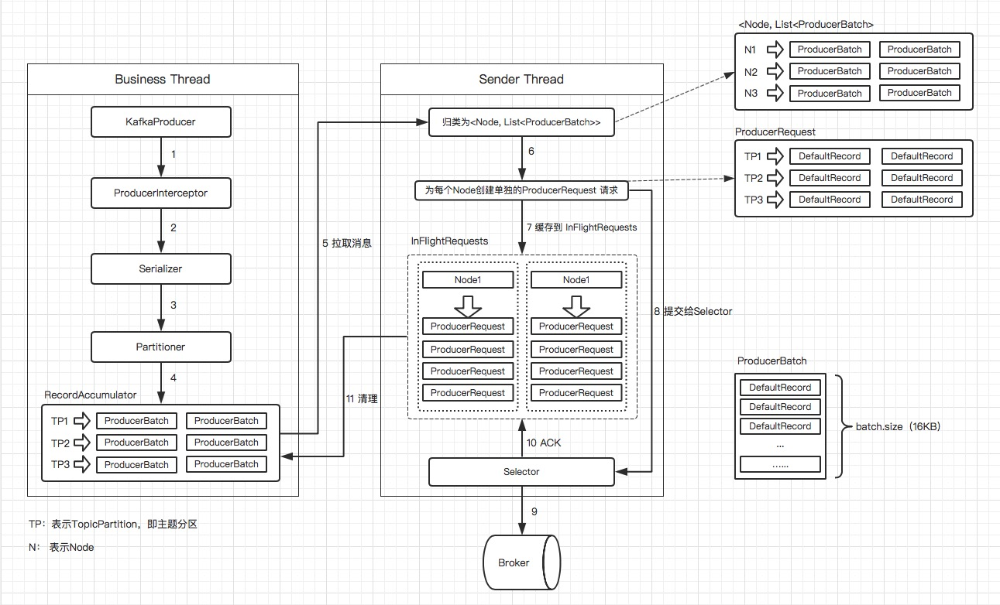
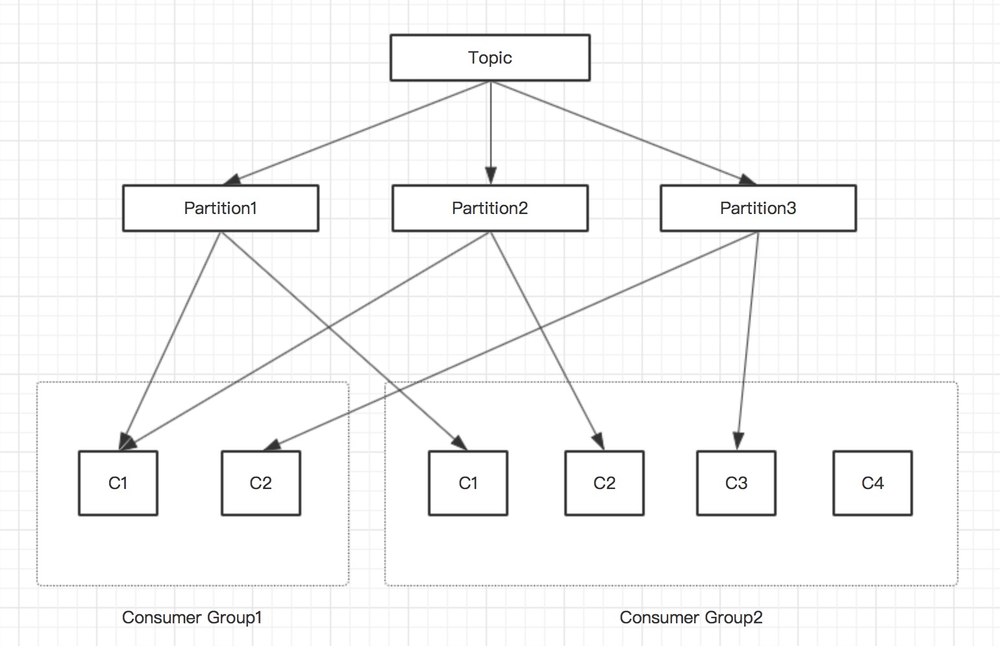
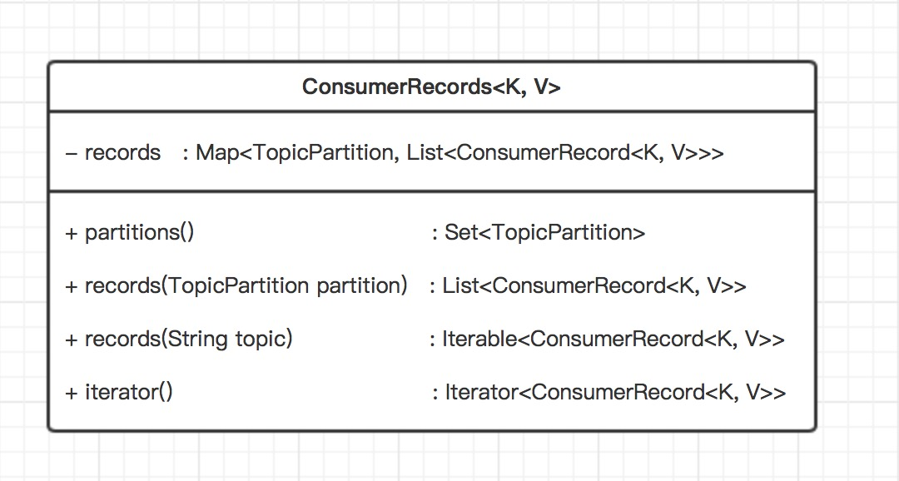
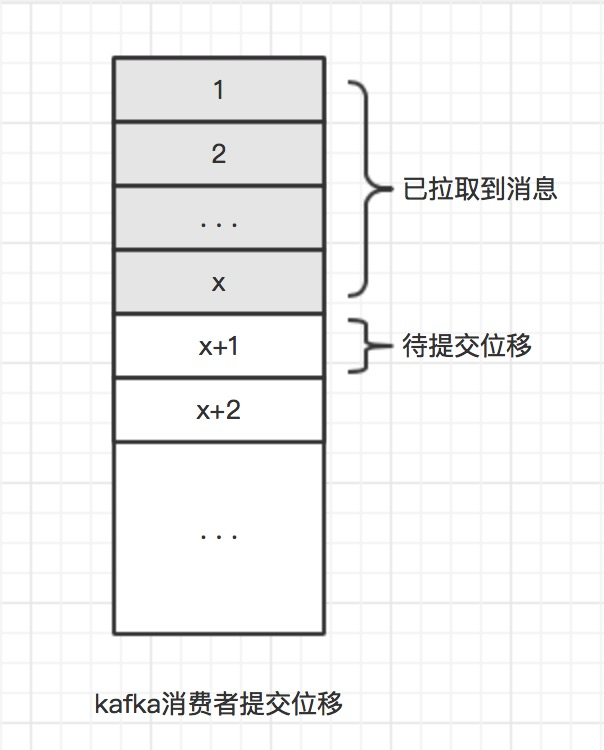
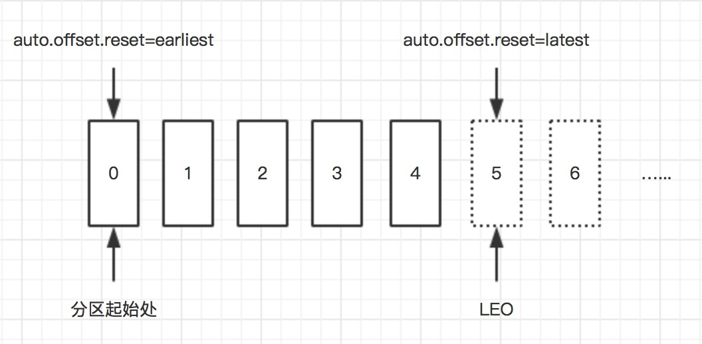

#### 1、`kafka`体系结构
+ 由三部分组成：**`Producer`(生产者)**、**`Consumer`(消费者)**、**`Broker`(服务代理)**，`Producer`负责发送数据到`Broker`，`Consumer`从`Broker`中拉取消息。

+ 每一条发送的消息以`Topic`（主题）为单位进行归类，即每一条消息都属于一个唯一的主题。为了能够水平拓展性能，每一个`Topic`由一个或者多个`Partition`（分区）组成。发送消息时，根据分区规则发送到指定分区，发送到指定分区时，每个消息会分配一个特定的偏移量`offset`，作为该消息在该分区内的唯一标示ID，这个`offet`在分区内是递增的，即分区内的消息是具有顺序性的。*注意顺序性仅仅是针对单个分区内，对于跨分区是保证不了顺序性的*

+ 为了提高容灾能力，一个`Topic`下的每个`Partition`可以由一个或者多个副本组成，同一分区的所有副本中保存的是相同的消息，副本之间采用**一主多从**的架构设计，其中`leader`副本负责处理读写请求，`follower`副本仅仅负责与`leader`副本之间进行消息同步，用于在`leader`副本所在的`Broker`节点出现故障时，在`follower`副本之间重新选举新的`leader`副本，以此来实现故障转移。

+ 一个分区在同一个`Broker`节点上，最多只有一个副本，不存在同一个`Broker`上存在一个分区的多个副本。（*出于副本是为了提高容灾能力存在的，多个副本存在于同一个`Broker`节点上并无任何意义*）

+ `follower`副本上的消息数据和`leader`副本上的消息数据之间会存在一定的滞后，所有副本统称为`AR`，和`leader`副本保持一定程度同步的副本（包括`leader`副本）组成`ISR`，和`leader`副本同步滞后过多的副本（不包括`leader`副本）组成`OSR`。由此可见，进行故障转移时，只有`ISR`中的副本可作为候选副本，`OSR`中的副本不能作为候选副本。


#### 2、`kafka`生产者发送示例
```java
Properties properties = new Properties();
//设置broker节点，多节点可以采用逗号分隔，不需要把全部的broker节点都填上
properties.put(ProducerConfig.BOOTSTRAP_SERVERS_CONFIG, "127.0.0.1:9092");
//生产者标示ID，可选
properties.put(ProducerConfig.CLIENT_ID_CONFIG, "producer-1");
//消息Key序列化类
properties.put(ProducerConfig.KEY_SERIALIZER_CLASS_CONFIG, StringSerializer.class.getName());
//消息内容序列化类
properties.put(ProducerConfig.VALUE_SERIALIZER_CLASS_CONFIG, StringSerializer.class.getName());

KafkaProducer<String, String> kafkaProducer = new KafkaProducer<String, String>(properties);

//构造待发送消息
ProducerRecord<String, String> record = new ProducerRecord<>("topic", "msg-content");

try {
    //发送消息
    Future<RecordMetadata> recordMetadataFuture = kafkaProducer.send(record);

    RecordMetadata recordMetadata = recordMetadataFuture.get();

    String topic = recordMetadata.topic();
    //获取发送到的分区
    int partition = recordMetadata.partition();
    //获取消息存储在kafka中的offset
    long offset = recordMetadata.offset();
} catch (Exception ex) {
    //
}

kafkaProducer.close();
```

*`KafkaProducer`是线程安全的，可以多线程环境下使用*

#### 3、`kafka`发送失败重试
对于`kafka`发送失败场景，可以在`producer`端设置重试参数`retries`，当发送失败时，自动重试配置次数，失败超过重试次数才会抛出异常，配置代码片段如下
```java
//配置失败重试次数为3
properties.put(ProducerConfig.RETRIES_CONFIG, 3);
//配置失败重试时间间隔为100ms
properties.put(ProducerConfig.RETRY_BACKOFF_MS_CONFIG, 100);
```

#### 4、`Partitioner`（分区器）
+ 在消息发送到`Broker`之前，需要在发送端计算出要发送的`target partition`（目标分区），如果`ProducerRecord`中指定了`partition`，则发送到`partition`指向的分区

+ 如果`ProducerRecord`未指定`partition`，在默认的分区器(`DefaultPartitioner`)中，如果`key`为`null`，则会以轮询的方式发送到主题的**可用分区**；如果`key`不为`null`，则会对`key`采用`MurmurHash2`算法计算哈希值，然后对**所有分区**进行取模运算，得到目标分区。

+ 如果需实现自定义分区器，可通过实现`Partitioner`接口，然后注册到`KafkaProducer`中，`Partitioner`接口如下所示
```java
public interface Partitioner extends Configurable, Closeable {
    public int partition(String topic,         //主题
                        Object key,            //消息key
                        byte[] keyBytes,       //消息key的字节数组形式
                        Object value,          //消息内容
                        byte[] valueBytes,     //消息内容的字节数组形式
                        Cluster cluster        //集群元数据
                        );      

    public void close();
}
```

注册到`KafkaProducer`如下所示
```java
properties.put(ProducerConfig.PARTITIONER_CLASS_CONFIG, MyCustomPartitioner.class.getName());
```

#### 5、`ProducerInterceptor`（生产者拦截器）
+ `ProducerInterceptor`用于在消息发送之前、消息发送成功API返回应答之前或者消息发送失败时进行拦截。具体接口定义如下所示

```java
public interface ProducerInterceptor<K, V> extends Configurable {

    //消息发送之前，具体的来说在序列化、分区之前
    public ProducerRecord<K, V> onSend(ProducerRecord<K, V> record);

    //在消息发送成功，API返回应答之前调用（exception为null）
    //或者消息发送失败时，进行调用（exception不为null）
    public void onAcknowledgement(RecordMetadata metadata, Exception exception);

    public void close();
}
```
注册到`KafkaProducer`如下所示
```java
//如有多个拦截器，可采用逗号进行分割
properties.put(ProducerConfig.INTERCEPTOR_CLASSES_CONFIG, MyCustomProducerInterceptor.class.getName());
```

*`onSend(..)`是在用户线程中执行的，`onAcknowledgement(..)`是在`I/O`线程中执行的，尽量不要在`onAcknowledgement(..)`中执行过多的操作*



#### 6、`kafka`发送端线程模型


+ 消息在发送出去之前，会先暂存在一个叫做消息累加器（`RecordAccumulator`）的组件中存放，多个消息组成一个`ProducerBatch`对象，每个`ProducerBatch`的默认大小为16KB，可通过设置参数`batch.size`来修改

+ 消息累加器（`RecordAccumulator`）的总容量大小默认为32MB，可以通过设置参数`buffer.memory`来修改

+ 如果消息累加器的容量大小达到设定大小，后续再发送新的消息，业务线程将会阻塞直至超时或者有空间可用，超时时间配置`max.block.ms`，默认值为60S

+ 在`InFlightRequests`内部，每个`Node`节点都有一个对应的列表用于存放已经发出，但还未收到`Broker`响应的请求，每个`Node`节点的存放请求队列的长度可以通过设置参数`max.in.flight.requests`来修改，默认是5个。

+ 如果某个`Node`节点对应的存放请求队列长度超过设定大小，`Sender`线程将不会再向该`Node`节点发送消息，直至该节点对应的存放请求队列有空间可用

#### 7、消息可靠写入实现
为了确保消息发送到`Broker`集群，并且不丢失，可以通过设置参数`acks`来指定目标分区必须有多少个副本写入成功才算是发送成功，配置如下：
```java
//默认1，只要分区的leader副本写入成功，就算写入成功
properties.put(ProducerConfig.ACKS_CONFIG, "1");

//只要发送出去，就认为写入成功
properties.put(ProducerConfig.ACKS_CONFIG, "0");

//分区 ISR 中所有的副本都写入成功，才算是写入成功
properties.put(ProducerConfig.ACKS_CONFIG, "-1");
```
*如果发送失败，可以通过重试机制来提高可靠性*

#### 8、发送消息最大限制
默认每一条发送的消息最大位1MB，可通过设置参数`max.request.size`来修改，如下
```java
//修改最大位3M
properties.put(ProducerConfig.MAX_REQUEST_SIZE_CONFIG, 3 * 1024 * 1024);
```
*该参数和`Broker`端的`message.max.bytes`参数相对应，需要确保`Producer`端的`max.request.size`参数值不大于`Broker`端的`message.max.bytes`参数值*

#### 9、消费者、消费组与分区分配


+ 在`Consumer`订阅`Topic`时，是以`Consumer Group`的形式来进行订阅的，每个`Consumer`必定属于某个`Consumer Group`

+ 在单个`Consumer Group`内，进行分区分配时，一个分区最多只能分配给一个`Consumer`，不能分配给多个`Consumer`。由此可见，当单个`Consumer Group`内的`Consumer`数量超过分区数量时，会出现部分`Consumer`分配不到分区，如上图中 `Consumer Group2` 中的`C4`

#### 10、`kafka`消费者消费示例
```java
boolean isStop = false;

Properties properties = new Properties();
//设置broker节点，多节点可以采用逗号分隔，不需要把全部的broker节点都填上
properties.put(ConsumerConfig.BOOTSTRAP_SERVERS_CONFIG, "127.0.0.1:9092");

//设置消费者组
properties.put(ConsumerConfig.GROUP_ID_CONFIG, "consumer-group1");
//设置消费者标识ID，可选
properties.put(ConsumerConfig.CLIENT_ID_CONFIG, "consumer-group1-c1");

//设置Key反序列化类
properties.put(ConsumerConfig.KEY_DESERIALIZER_CLASS_CONFIG, StringDeserializer.class.getName());
//设置Value反序列化类
properties.put(ConsumerConfig.VALUE_DESERIALIZER_CLASS_CONFIG, StringDeserializer.class.getName());

KafkaConsumer<String, String> kafkaConsumer = new KafkaConsumer<String, String>(properties);

//订阅主题
kafkaConsumer.subscribe(Arrays.asList("topic1"));

while (!isStop) {
    //拉取消息
    ConsumerRecords<String, String> consumerRecords = kafkaConsumer.poll(Duration.ofSeconds(1));

    //消费消息
    for (ConsumerRecord<String, String> consumerRecord : consumerRecords) {
        //获取主题
        System.out.println("topic -> " + consumerRecord.topic());
        //获取消息所在分区
        System.out.println("partition -> " + consumerRecord.partition());
        //获取消息在分区内偏移Offset
        System.out.println("offset -> " + consumerRecord.offset());
        //获取消息Key
        System.out.println("key -> " + consumerRecord.key());
        //获取消息Value
        System.out.println("value -> " + consumerRecord.value());
    }
}

kafkaConsumer.close();
```
*`KafkaConsumer`不是线程安全的，不能在多线程环境下使用*

*`Consuner Group`可以订阅多个`Topic`*

#### 11、`kafka`消费组订阅
+ 直接订阅
```java
//该方式直接订阅主题，如果多次订阅，则以最后一次订阅为准
kafkaConsumer.subscribe(Arrays.asList("topic1", "topic2"));
```

+ 匹配订阅
```java
//通过正则表达式进行匹配、订阅主题，后续有匹配正则表达式的新主题创建时，消费组可拉取新主题的消息进行消费
 kafkaConsumer.subscribe(Pattern.compile("topic*"));
```

+ 订阅特定分区
```java
//订阅主题 topic1 中的 0、1 分区，topic2 中的 0 分区
kafkaConsumer.assign(Arrays.asList(
    new TopicPartition("topic1", 0), 
    new TopicPartition("topic1", 1), 
    new TopicPartition("topic2", 0))
);
```
*上述三种订阅，只能选择一种方式进行订阅，即三选一，不能多种订阅同时存在*

#### 12、`ConsumerRecords<String, String>`内部结构


#### 13、`kafka`消费者提交位移
假设消费情况如下图所示



#### 自动提交位移（默认提交方式）
+ 默认采用自动提交，需要确保消费者端参数配置如下（即默认配置）
```java
//开启自动提交，默认开启
properties.put(ConsumerConfig.ENABLE_AUTO_COMMIT_CONFIG, true);
//设置自动提交时间间隔为5000ms
properties.put(ConsumerConfig.AUTO_COMMIT_INTERVAL_MS_CONFIG, 5000);
```
+ **存在重复消费场景**：拉取到一批消息，消费到一半，在并未到自动提交时间时，消费者崩溃，下次拉取将会从上一次提交位置重新拉取

+ **存在消息丢失场景**：拉取到一批消息存入本地缓存队列中，由其他线程进行消费。在其他线程正在消费消息时，由于到了自动提交时间，过早的进行位移提交后，消费者崩溃，下次拉取将从奔溃前提交的位移位置开始拉取

#### 手动同步提交
+ 需关闭自动提交位置，手动调用API进行提交，如下所示
```java
//关闭自动提交，默认开启
properties.put(ConsumerConfig.ENABLE_AUTO_COMMIT_CONFIG, false);

//手动提交分配到的所有分区的消费位移
kafkaConsumer.commitSync();

或者

//设置各个分区的消费位移
Map<TopicPartition, OffsetAndMetadata> offsetMap = new HashMap<>();
offsetMap.put(new TopicPartition("topic", 1), new OffsetAndMetadata(lastMsgOffset + 1));
//提交各个分区的消费位移
kafkaConsumer.commitSync(offsetMap);
```
#### 手动异步提交
+ 需关闭自动提交位置，手动调用API进行提交，如下所示
```java
//关闭自动提交，默认开启
properties.put(ConsumerConfig.ENABLE_AUTO_COMMIT_CONFIG, false);

//手动异步提交分配到的所有分区的消费位移
kafkaConsumer.commitAsync();

或者

//设置各个分区的消费位移
Map<TopicPartition, OffsetAndMetadata> offsetMap = new HashMap<>();
offsetMap.put(new TopicPartition("topic", 1), new OffsetAndMetadata(lastMsgOffset + 1));

//提交各个分区的消费位移，并注入回调方法
kafkaConsumer.commitAsync(offsetMap, new OffsetCommitCallback() {
    @Override
    public void onComplete(Map<TopicPartition, OffsetAndMetadata> offsets, Exception exception) {
        //异步执行完成回调处理
    }
});
```

#### 14、`kafka`消费者消费位移自动重置
+ 在消费者消费主题消息时，会根据存放在`__consumer_offsets`主题中的消费位移，来决定下次拉取消息的起始位置。但是在消费刚开始，`__consumer_offsets`主题中并未保存该消费者的消费位移，或者`__consumer_offsets`中保存消费者消费位移的数据因过期而被删除。这时候就需要一个默认值，来重置消费者的消费位移。（*更准确的来说是消费组的消费位移，因为消费者是以消费组的形式进行拉取消息*）

+ 可通过参数`ConsumerConfig.AUTO_OFFSET_RESET_CONFIG`来设置 **默认的重置消费位移**，如下所示
```java
//可选值有 latest、earliest、none
properties.put(ConsumerConfig.AUTO_OFFSET_RESET_CONFIG, "latest");
```

*如果设置`none`，在需要使用**重置位移**时，会报`NoOffsetForPartitionException`异常*，关于`earliest`、`latest`的示意图如下所示


#### 15、`kafka`消费者拉取特定位置消息

#### 16、`kafka`消费者优雅的退出消息拉取
+ 通过在其他线程里面调用`KafkaConsumer`的`wakeup()`方法，该方法是`KafkaConsumer`中唯一一个可以从其他线程里安全调用的方法，通过抛出`WakeupExcepton`异常，来退出`poll(final Duration timeout)`执行。如下所示
```java
try {
    while (true) {
        //拉取消息
        ConsumerRecords<String, String> consumerRecords = kafkaConsumer.poll(Duration.ofSeconds(1));

        //proc msg
    }

} catch (WakeupException ex) {
    //该异常仅仅用于跳出poll(...)，可忽略该异常

} finally {
    //确保关闭
    kafkaConsumer.close();
}
```
#### 16、