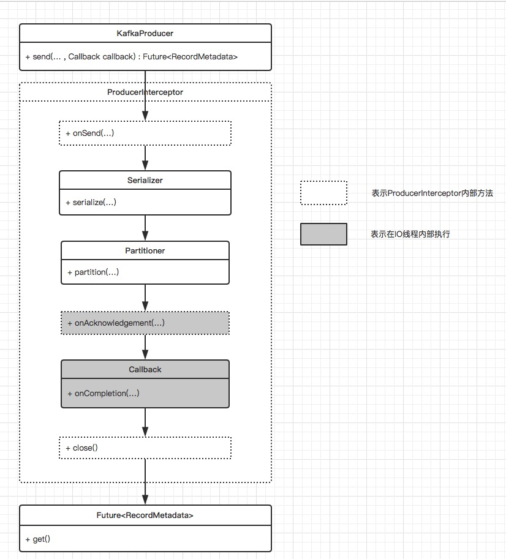

#### 1、`kafka`体系结构
+ 由三部分组成：**`Producer`(生产者)**、**`Consumer`(消费者)**、**`Broker`(服务代理)**，`Producer`负责发送数据到`Broker`，`Consumer`从`Broker`中拉取消息。

+ 每一条发送的消息以`Topic`（主题）为单位进行归类，即每一条消息都属于一个唯一的主题。为了能够水平拓展性能，每一个`Topic`由一个或者多个`Partition`（分区）组成。发送消息时，根据分区规则发送到指定分区，发送到指定分区时，每个消息会分配一个特定的偏移量`offset`，作为该消息在该分区内的唯一标示ID，这个`offet`在分区内是递增的，即分区内的消息是具有顺序性的。*注意顺序性仅仅是针对单个分区内，对于跨分区是保证不了顺序性的*

+ 为了提高容灾能力，一个`Topic`下的每个`Partition`可以由一个或者多个副本组成，同一分区的所有副本中保存的是相同的消息，副本之间采用**一主多从**的架构设计，其中`leader`副本负责处理读写请求，`follower`副本仅仅负责与`leader`副本之间进行消息同步，用于在`leader`副本所在的`Broker`节点出现故障时，在`follower`副本之间重新选举新的`leader`副本，以此来实现故障转移。

+ 一个分区在同一个`Broker`节点上，最多只有一个副本，不存在同一个`Broker`上存在一个分区的多个副本。（*出于副本是为了提高容灾能力存在的，多个副本存在于同一个`Broker`节点上并无任何意义*）

+ `follower`副本上的消息数据和`leader`副本上的消息数据之间会存在一定的滞后，所有副本统称为`AR`，和`leader`副本保持一定程度同步的副本（包括`leader`副本）组成`ISR`，和`leader`副本同步滞后过多的副本（不包括`leader`副本）组成`OSR`。由此可见，进行故障转移时，只有`ISR`中的副本可作为候选副本，`OSR`中的副本不能作为候选副本。


#### 2、`kafka`生产者发送示例
```java
Properties properties = new Properties();
//设置broker节点，多节点可以采用逗号分隔，不需要把全部的broker节点都填上
properties.put(ProducerConfig.BOOTSTRAP_SERVERS_CONFIG, "127.0.0.1:9092");
//生产者标示ID
properties.put(ProducerConfig.CLIENT_ID_CONFIG, "producer-1");
//消息Key序列化类
properties.put(ProducerConfig.KEY_SERIALIZER_CLASS_CONFIG, StringSerializer.class.getName());
//消息内容序列化类
properties.put(ProducerConfig.VALUE_SERIALIZER_CLASS_CONFIG, StringSerializer.class.getName());

KafkaProducer<String, String> kafkaProducer = new KafkaProducer<String, String>(properties);

//构造待发送消息
ProducerRecord<String, String> record = new ProducerRecord<>("topic", "msg-content");

try {
    //发送消息
    Future<RecordMetadata> recordMetadataFuture = kafkaProducer.send(record);

    RecordMetadata recordMetadata = recordMetadataFuture.get();

    String topic = recordMetadata.topic();
    //获取发送到的分区
    int partition = recordMetadata.partition();
    //获取消息存储在kafka中的offset
    long offset = recordMetadata.offset();
} catch (Exception ex) {
    //
}

kafkaProducer.close();
```

*`KafkaProducer`是线程安全的，可以多线程环境下使用*

#### 3、`kafka`发送失败重试
对于`kafka`发送失败场景，可以在`producer`端设置重试参数`retries`，当发送失败时，自动重试配置次数，失败超过重试次数才会抛出异常，配置代码片段如下
```java
//配置失败重试次数为3
properties.put(ProducerConfig.RETRIES_CONFIG, 3);
```

#### 4、分区器
+ 在消息发送到`Broker`之前，需要在发送端计算出要发送的`target partition`（目标分区），如果`ProducerRecord`中指定了`partition`，则发送到`partition`指向的分区

+ 如果`ProducerRecord`未指定`partition`，在默认的分区器(`DefaultPartitioner`)中，如果`key`为`null`，则会以轮询的方式发送到主题的**可用分区**；如果`key`不为`null`，则会对`key`采用`MurmurHash2`算法计算哈希值，然后对**所有分区**进行取模运算，得到目标分区。

+ 如果需实现自定义分区器，可通过实现`Partitioner`接口，然后注册到`KafkaProducer`中，`Partitioner`接口如下所示
```java
public interface Partitioner extends Configurable, Closeable {
    public int partition(String topic,         //主题
                        Object key,            //消息key
                        byte[] keyBytes,       //消息key的字节数组形式
                        Object value,          //消息内容
                        byte[] valueBytes,     //消息内容的字节数组形式
                        Cluster cluster        //集群元数据
                        );      

    public void close();
}
````

注册到`KafkaProducer`如下所示
```java
properties.put(ProducerConfig.PARTITIONER_CLASS_CONFIG, MyCustomPartitioner.class.getName());
````

#### 5、`ProducerInterceptor`（生产者拦截器）
+ `ProducerInterceptor`用于在消息发送之前、消息发送成功API返回应答之前或者消息发送失败时进行拦截。具体接口定义如下所示

```java
public interface ProducerInterceptor<K, V> extends Configurable {

    //消息发送之前，具体的来说在序列化、分区之前
    public ProducerRecord<K, V> onSend(ProducerRecord<K, V> record);

    //在消息发送成功，API返回应答之前调用（exception为null）
    //或者消息发送失败时，进行调用（exception不为null）
    public void onAcknowledgement(RecordMetadata metadata, Exception exception);

    public void close();
}
```
注册到`KafkaProducer`如下所示
```java
//如有多个拦截器，可采用逗号进行分割
properties.put(ProducerConfig.INTERCEPTOR_CLASSES_CONFIG, MyCustomProducerInterceptor.class.getName());
````

*`onSend(..)`是在用户线程中执行的，`onAcknowledgement(..)`是在`I/O`线程中执行的，尽量不要在`onAcknowledgement(..)`中执行过多的操作*



#### 消息发送过程
`Interceptor`（生产者拦截器） -> `Serializer`（序列化器） -> `Partitioner`（分区器）

+ `Serializer`需要实现`org.apache.kafka.common.serialization.Serializer<T>`接口

+ `Partitioner`需要实现`org.apache.kafka.clients.producer.Partitioner`接口