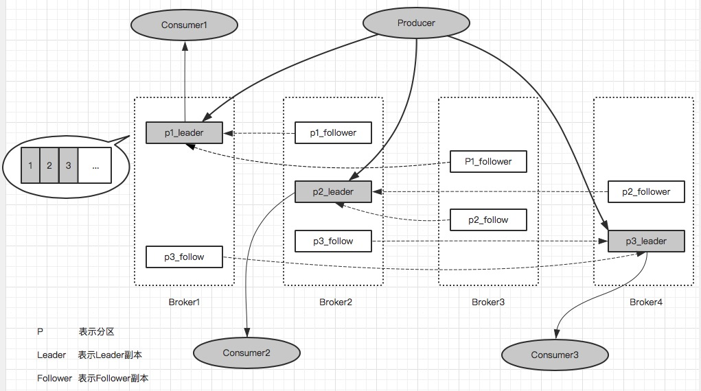
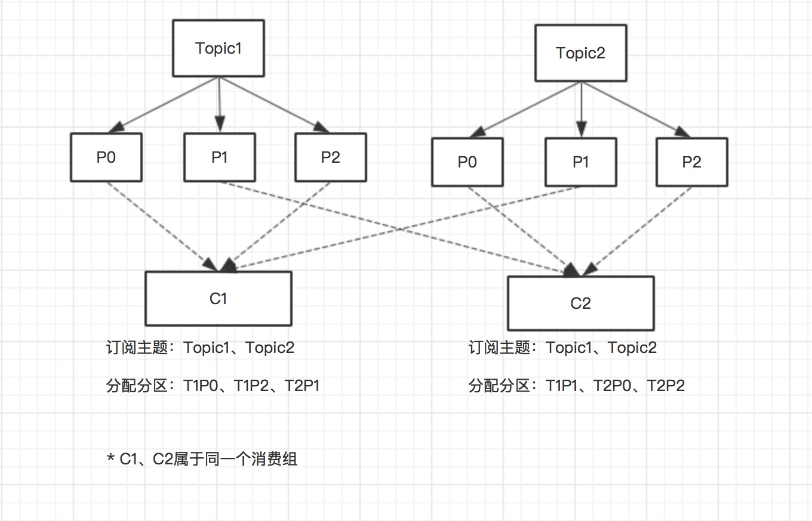
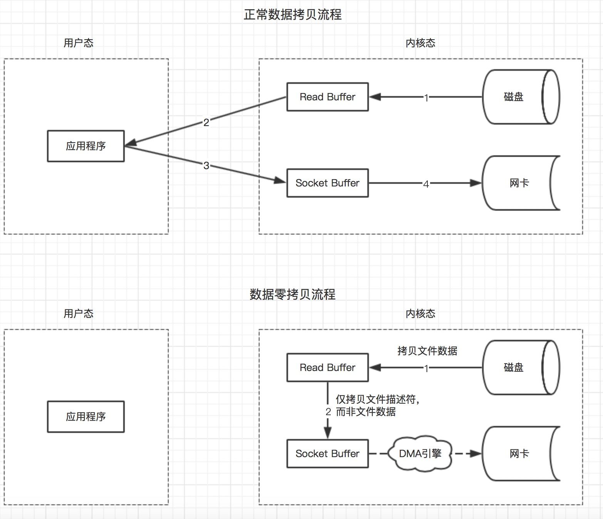

## 1、`kafka`体系结构
+ 由三部分组成：**`Producer`(生产者)**、**`Consumer`(消费者)**、**`Broker`(服务代理)**，`Producer`负责发送数据到`Broker`，`Consumer`从`Broker`中拉取消息。

+ 每一条发送的消息以`Topic`（主题）为单位进行归类，即每一条消息都属于一个唯一的主题。为了能够水平拓展性能，每一个`Topic`由一个或者多个`Partition`（分区）组成。发送消息时，根据分区规则发送到指定分区，发送到指定分区时，每个消息会分配一个特定的偏移量`offset`，作为该消息在该分区内的唯一标示ID，这个`offet`在分区内是递增的，即分区内的消息是具有顺序性的。*注意顺序性仅仅是针对单个分区内，对于跨分区是保证不了顺序性的*

+ 为了提高容灾能力，一个`Topic`下的每个`Partition`可以由一个或者多个副本组成，同一分区的所有副本中保存的是相同的消息，副本之间采用**一主多从**的架构设计，其中`leader`副本负责处理读写请求，`follower`副本仅仅负责与`leader`副本之间进行消息同步，用于在`leader`副本所在的`Broker`节点出现故障时，在`follower`副本之间重新选举新的`leader`副本，以此来实现故障转移。

+ 一个分区在同一个`Broker`节点上，最多只有一个副本，不存在同一个`Broker`上存在一个分区的多个副本。（*出于副本是为了提高容灾能力存在的，多个副本存在于同一个`Broker`节点上并无任何意义*）

+ `follower`副本上的消息数据和`leader`副本上的消息数据之间会存在一定的滞后，所有副本统称为`AR`，和`leader`副本保持一定程度同步的副本（包括`leader`副本）组成`ISR`，和`leader`副本同步滞后过多的副本（不包括`leader`副本）组成`OSR`。由此可见，进行故障转移时，只有`ISR`中的副本可作为候选副本，`OSR`中的副本不能作为候选副本。



## 2、`kafka`生产者发送示例
```java
Properties properties = new Properties();
//设置broker节点，多节点可以采用逗号分隔，不需要把全部的broker节点都填上
properties.put(ProducerConfig.BOOTSTRAP_SERVERS_CONFIG, "127.0.0.1:9092");
//生产者标示ID，可选，如果未填写，则由broker端生成
properties.put(ProducerConfig.CLIENT_ID_CONFIG, "producer-1");
//消息Key序列化类
properties.put(ProducerConfig.KEY_SERIALIZER_CLASS_CONFIG, StringSerializer.class.getName());
//消息内容序列化类
properties.put(ProducerConfig.VALUE_SERIALIZER_CLASS_CONFIG, StringSerializer.class.getName());

KafkaProducer<String, String> kafkaProducer = new KafkaProducer<String, String>(properties);

//构造待发送消息
ProducerRecord<String, String> record = new ProducerRecord<>("topic", "msg-content");

try {
    //发送消息
    Future<RecordMetadata> recordMetadataFuture = kafkaProducer.send(record);

    RecordMetadata recordMetadata = recordMetadataFuture.get();

    String topic = recordMetadata.topic();
    //获取发送到的分区
    int partition = recordMetadata.partition();
    //获取消息存储在kafka中的offset
    long offset = recordMetadata.offset();
} catch (Exception ex) {
    //
}

kafkaProducer.close();
```

*`KafkaProducer`是线程安全的，可以多线程环境下使用*

## 3、`kafka`发送失败重试
对于`kafka`发送失败场景，可以在`producer`端设置重试参数`retries`，当发送失败时，自动重试配置次数，失败超过重试次数才会抛出异常，配置代码片段如下
```java
//配置失败重试次数为3
properties.put(ProducerConfig.RETRIES_CONFIG, 3);
//配置失败重试时间间隔为100ms
properties.put(ProducerConfig.RETRY_BACKOFF_MS_CONFIG, 100);
```

## 4、`Partitioner`（分区器）
+ 在消息发送到`Broker`之前，需要在发送端计算出要发送的`target partition`（目标分区），如果`ProducerRecord`中指定了`partition`，则发送到`partition`指向的分区

+ 如果`ProducerRecord`未指定`partition`，在默认的分区器(`DefaultPartitioner`)中，如果`key`为`null`，则会以轮询的方式发送到主题的**可用分区**；如果`key`不为`null`，则会对`key`采用`MurmurHash2`算法计算哈希值，然后对**所有分区**进行取模运算，得到目标分区。

+ 如果需实现自定义分区器，可通过实现`Partitioner`接口，然后注册到`KafkaProducer`中，`Partitioner`接口如下所示
```java
public interface Partitioner extends Configurable, Closeable {
    public int partition(String topic,         //主题
                        Object key,            //消息key
                        byte[] keyBytes,       //消息key的字节数组形式
                        Object value,          //消息内容
                        byte[] valueBytes,     //消息内容的字节数组形式
                        Cluster cluster        //集群元数据
                        );      

    public void close();
}
```

注册到`KafkaProducer`如下所示
```java
properties.put(ProducerConfig.PARTITIONER_CLASS_CONFIG, MyCustomPartitioner.class.getName());
```

## 5、`ProducerInterceptor`（生产者拦截器）
+ `ProducerInterceptor`用于在消息发送之前、消息发送成功API返回应答之前或者消息发送失败时进行拦截。具体接口定义如下所示

```java
public interface ProducerInterceptor<K, V> extends Configurable {

    //消息发送之前，具体的来说在序列化、分区之前
    public ProducerRecord<K, V> onSend(ProducerRecord<K, V> record);

    //在消息发送成功，API返回应答之前调用（exception为null）
    //或者消息发送失败时，进行调用（exception不为null）
    public void onAcknowledgement(RecordMetadata metadata, Exception exception);

    public void close();
}
```
注册到`KafkaProducer`如下所示
```java
//如有多个拦截器，可采用逗号进行分割
properties.put(ProducerConfig.INTERCEPTOR_CLASSES_CONFIG, MyCustomProducerInterceptor.class.getName());
```

*`onSend(..)`是在用户线程中执行的，`onAcknowledgement(..)`是在`I/O`线程中执行的，尽量不要在`onAcknowledgement(..)`中执行过多的操作*


## 6、`kafka`发送端线程模型


+ 消息在发送出去之前，会先暂存在一个叫做消息累加器（`RecordAccumulator`）的组件中存放，多个消息组成一个`ProducerBatch`对象，每个`ProducerBatch`的默认大小为16KB，可通过设置参数`batch.size`来修改

+ 消息累加器（`RecordAccumulator`）的总容量大小默认为32MB，可以通过设置参数`buffer.memory`来修改

+ 如果消息累加器的容量大小达到设定大小，后续再发送新的消息，业务线程将会阻塞直至超时或者有空间可用，超时时间配置`max.block.ms`，默认值为60S

+ 在`InFlightRequests`内部，每个`Node`节点都有一个对应的列表用于存放已经发出，但还未收到`Broker`响应的请求，每个`Node`节点的存放请求队列的长度可以通过设置参数`max.in.flight.requests`来修改，默认是5个。

+ 如果某个`Node`节点对应的存放请求队列长度超过设定大小，`Sender`线程将不会再向该`Node`节点发送消息，直至该节点对应的存放请求队列有空间可用

## 7、消息可靠写入实现
为了确保消息发送到`Broker`集群，并且不丢失，可以通过设置参数`acks`来指定目标分区必须有多少个副本写入成功才算是发送成功，配置如下：
```java
//默认1，只要分区的leader副本写入成功，就算写入成功
properties.put(ProducerConfig.ACKS_CONFIG, "1");

//只要发送出去，就认为写入成功
properties.put(ProducerConfig.ACKS_CONFIG, "0");

//分区 ISR 中所有的副本都写入成功，才算是写入成功
properties.put(ProducerConfig.ACKS_CONFIG, "-1");
```
*如果发送失败，可以通过重试机制来提高可靠性*

## 8、发送消息最大限制
默认每一条发送的消息最大位1MB，可通过设置参数`max.request.size`来修改，如下
```java
//修改最大位3M
properties.put(ProducerConfig.MAX_REQUEST_SIZE_CONFIG, 3 * 1024 * 1024);
```
*该参数和`Broker`端的`message.max.bytes`参数相对应，需要确保`Producer`端的`max.request.size`参数值不大于`Broker`端的`message.max.bytes`参数值*

## 9、消费者、消费组与分区分配


+ 在`Consumer`订阅`Topic`时，是以`Consumer Group`的形式来进行订阅的，每个`Consumer`必定属于某个`Consumer Group`

+ 在单个`Consumer Group`内，进行分区分配时，一个分区最多只能分配给一个`Consumer`，不能分配给多个`Consumer`。由此可见，当单个`Consumer Group`内的`Consumer`数量超过分区数量时，会出现部分`Consumer`分配不到分区，如上图中 `Consumer Group2` 中的`C4`

## 10、`kafka`消费者消费示例
```java
boolean isStop = false;

Properties properties = new Properties();
//设置broker节点，多节点可以采用逗号分隔，不需要把全部的broker节点都填上
properties.put(ConsumerConfig.BOOTSTRAP_SERVERS_CONFIG, "127.0.0.1:9092");

//设置消费者组
properties.put(ConsumerConfig.GROUP_ID_CONFIG, "consumer-group1");
//设置消费者标识ID，可选
properties.put(ConsumerConfig.CLIENT_ID_CONFIG, "consumer-group1-c1");

//设置Key反序列化类
properties.put(ConsumerConfig.KEY_DESERIALIZER_CLASS_CONFIG, StringDeserializer.class.getName());
//设置Value反序列化类
properties.put(ConsumerConfig.VALUE_DESERIALIZER_CLASS_CONFIG, StringDeserializer.class.getName());

KafkaConsumer<String, String> kafkaConsumer = new KafkaConsumer<String, String>(properties);

//订阅主题
kafkaConsumer.subscribe(Arrays.asList("topic1"));

while (!isStop) {
    //拉取消息
    ConsumerRecords<String, String> consumerRecords = kafkaConsumer.poll(Duration.ofSeconds(1));

    //消费消息
    for (ConsumerRecord<String, String> consumerRecord : consumerRecords) {
        //获取主题
        System.out.println("topic -> " + consumerRecord.topic());
        //获取消息所在分区
        System.out.println("partition -> " + consumerRecord.partition());
        //获取消息在分区内偏移Offset
        System.out.println("offset -> " + consumerRecord.offset());
        //获取消息Key
        System.out.println("key -> " + consumerRecord.key());
        //获取消息Value
        System.out.println("value -> " + consumerRecord.value());
    }
}

kafkaConsumer.close();
```
*`KafkaConsumer`不是线程安全的，不能在多线程环境下使用*

*`Consuner Group`可以订阅多个`Topic`*

## 11、`kafka`消费组订阅
+ 直接订阅
```java
//该方式直接订阅主题，如果多次订阅，则以最后一次订阅为准
kafkaConsumer.subscribe(Arrays.asList("topic1", "topic2"));
```

+ 匹配订阅
```java
//通过正则表达式进行匹配、订阅主题，后续有匹配正则表达式的新主题创建时，消费组可拉取新主题的消息进行消费
 kafkaConsumer.subscribe(Pattern.compile("topic*"));
```

+ 订阅特定分区
```java
//订阅主题 topic1 中的 0、1 分区，topic2 中的 0 分区
kafkaConsumer.assign(Arrays.asList(
    new TopicPartition("topic1", 0), 
    new TopicPartition("topic1", 1), 
    new TopicPartition("topic2", 0))
);
```
*上述三种订阅，只能选择一种方式进行订阅，即三选一，不能多种订阅同时存在*

## 12、`ConsumerRecords<String, String>`内部结构


## 13、`kafka`消费者提交位移
假设消费情况如下图所示


### 自动提交位移（默认提交方式）
+ 默认采用自动提交，需要确保消费者端参数配置如下（即默认配置）
```java
//开启自动提交，默认开启
properties.put(ConsumerConfig.ENABLE_AUTO_COMMIT_CONFIG, true);
//设置自动提交时间间隔为5000ms
properties.put(ConsumerConfig.AUTO_COMMIT_INTERVAL_MS_CONFIG, 5000);
```
+ **存在重复消费场景**：拉取到一批消息，消费到一半，在并未到自动提交时间时，消费者崩溃，下次拉取将会从上一次提交位置重新拉取

+ **存在消息丢失场景**：拉取到一批消息存入本地缓存队列中，由其他线程进行消费。在其他线程正在消费消息时，由于到了自动提交时间，过早的进行位移提交后，消费者崩溃，下次拉取将从奔溃前提交的位移位置开始拉取

### 手动同步提交
+ 需关闭自动提交位置，手动调用API进行提交，如下所示
```java
//关闭自动提交，默认开启
properties.put(ConsumerConfig.ENABLE_AUTO_COMMIT_CONFIG, false);

//手动提交分配到的所有分区的消费位移
kafkaConsumer.commitSync();

或者

//设置各个分区的消费位移
Map<TopicPartition, OffsetAndMetadata> offsetMap = new HashMap<>();
offsetMap.put(new TopicPartition("topic", 1), new OffsetAndMetadata(lastMsgOffset + 1));
//提交各个分区的消费位移
kafkaConsumer.commitSync(offsetMap);
```
### 手动异步提交
+ 需关闭自动提交位置，手动调用API进行提交，如下所示
```java
//关闭自动提交，默认开启
properties.put(ConsumerConfig.ENABLE_AUTO_COMMIT_CONFIG, false);

//手动异步提交分配到的所有分区的消费位移
kafkaConsumer.commitAsync();

或者

//设置各个分区的消费位移
Map<TopicPartition, OffsetAndMetadata> offsetMap = new HashMap<>();
offsetMap.put(new TopicPartition("topic", 1), new OffsetAndMetadata(lastMsgOffset + 1));

//提交各个分区的消费位移，并注入回调方法
kafkaConsumer.commitAsync(offsetMap, new OffsetCommitCallback() {
    @Override
    public void onComplete(Map<TopicPartition, OffsetAndMetadata> offsets, Exception exception) {
        //异步执行完成回调处理
    }
});
```

## 14、`kafka`消费者消费位移自动重置
+ 在消费者消费主题消息时，会根据存放在`__consumer_offsets`主题中的消费位移，来决定下次拉取消息的起始位置。但是在消费刚开始，`__consumer_offsets`主题中并未保存该消费者的消费位移，或者`__consumer_offsets`中保存消费者消费位移的数据因过期而被删除。这时候就需要一个默认值，来重置消费者的消费位移。（*更准确的来说是消费组的消费位移，因为消费者是以消费组的形式进行拉取消息*）

+ 可通过参数`ConsumerConfig.AUTO_OFFSET_RESET_CONFIG`来设置 **默认的重置消费位移**，如下所示
```java
//可选值有 latest、earliest、none
properties.put(ConsumerConfig.AUTO_OFFSET_RESET_CONFIG, "latest");
```

*如果设置`none`，在需要使用**重置位移**时，会报`NoOffsetForPartitionException`异常*，关于`earliest`、`latest`的示意图如下所示


## 15、`kafka`消费者消费位移重置
+ 相比于自动重置而言，还可以手动重置消费者的消费位移，如下代码所示
```java
KafkaConsumer<String, String> kafkaConsumer = new KafkaConsumer<String, String>(properties);

kafkaConsumer.subscribe(Collections.singletonList("topic2"));

//执行拉取动作，获取分配的分区
kafkaConsumer.poll(Duration.ofMillis(1000));

//获取分区的分区，如果没有之前的 poll(...) 拉取动作，这里将会是一个空集合
Set<TopicPartition> assignTopicPartitions = kafkaConsumer.assignment();

for (TopicPartition topicPartition : assignTopicPartitions) {
    //重置分配到的分区消费位移为 10
    kafkaConsumer.seek(topicPartition, 10);

    或者

    //重置分配到的分区消费位移为起始位置，即从头开始消费
    kafkaConsumer.beginningOffsets(Arrays.asList(topicPartition));

    或者

    //重置分配到的分区消费位移为最后位置，即跳过前面所有的消息
    kafkaConsumer.endOffsets(Arrays.asList(topicPartition));

    或者

    //重置分配到的分区消费位移，将消费2019-10-10 00:00:00这个时间点之后的消息（包括这个时间点的消息）
    kafkaConsumer.offsetsForTimes(Collections.singletonMap(topicPartition, sdf.parse("2019-10-10 00:00:00").getTime()));
}
```

## 16、`kafka`消费者分区分配及再均衡
### 分区分配
+ 在消费者进行消费主题消息前，需要进行分区分配，目前三种分区分配方案：**RangeAssignor**、**RoundRobinAssignor**、**StickyAssignor**

+ **RangeAssignor**：在消费组内，对于**每个订阅的主题**，进行分区数除以消费者数，得到一个分区范围，每个消费者按照分区范围顺序分配对应的分区段；如果不能平均分配，则前面的每个消费者多分配一个，如下图所示


+ **RoundRobinAssignor**：在消费组内，将**所有订阅的主题**分区按照字母顺序排序，依次分给各个消费者，如果某个消费者没有订阅某个主题，则分配时跳过，寻找下一个消费者分配，如下图所示：


+ **StickyAssignor**：粘性分配策略，该策略首次分配时类似于`RoundRobinAssignor`分配策略。但是对于某个消费者下线或者down掉情况，进行分区再分配时，尽量不会去修改存活的消费者的已经分配到的分区，这样可以尽可能使前后两次的分配结果相似，降低由于再分配导致存活消费者已分配到的分区发生大改动，如下图所示。（*因为一个分区从一个存活的消费者，重新分配到另一个存活的消费者意义不是很大，还会存在额外的性能损耗以及关于消费位移提交、重复消费等情况发生*）

  *重分配前*
  
  *重分配后*
  

+ **自定义分区分配策略**：需要实现`PartitionAssignor`接口或者`AbstractPartitionAssignor`抽象类，此处看接口定义即可，不在赘述。

### 分区再分配情况（再均衡情况）
1. 新的`Consumer`加入`Consumer Group`
2. `Consumer Group`内的`Consumer`下线、宕机、或者由于长时间GC/网络延迟等情况导致未向`GroupCoordinator`发送心跳续约
3. `Consumer Group`订阅的任一`Topic`的`Partition`数量发生变化
4. `Consumer` 调用 `unsubscribe(...)`或者`assign(...)`取消订阅某些`Topic`

### 再均衡过程
每个`Consumer Group`都有对应的`Group Coordinator`（组协调器），负责处理该`Consumer Group`的分区分配和再均衡操作，以一个新的`Consumer`加入已存在的`Consumer Group`，进行再均衡的示例过程进行讲述，具体步骤可分为以下四步：

#### 1、**寻找`Group Coordinator`**：

向集群中的一个`Broker`发送`FindCoordinatorRequest`（寻找协调器请求），`Broker`接收到请求后，根据该`Consumer`所属的`Consumer Group`计算出`GroupCoordinator`节点位置，具体计算公式如下所示：

> *abs( `consumer_group_id`.hashCode )  %  ( `__consumer_offsets`主题的分区数量 )*
>
> 计算出对应的分区后，该分区所对应的`leader`副本所在的`Broker`节点即为该`Consumer Group`的`Group Coordinator`

`Broker`计算出对应的`Group Coordinator`后，将`Group Coordinator`所在节点的`brokerId`、`IP`、`port`包装在`FindCoordinatorResponse`响应对象发送给`Consumer`

#### 2、**加入`Consumer Group`**：

获取到对应的`Group Coordinator`后，`Consumer`向`Group Coordinator`发送`JoinGroupRequest`请求，请求加入`Consumer Group`，其中`JoinGroupRequest`包含了以下主要信息：
> `group_id`：消费组ID
>
> `session_timeout`：与组协调器保持会话的超时时间，默认10s），对应于`ConsumerConfig.SESSION_TIMEOUT_MS_CONFIG`参数
>
> `rebalance_timeout`：消费者拉取消息（调用`poll(...)`方法）的最大间隔时间，超过该时间，则认为消费者失效，进行再均衡，对应于`ConsumerConfig.MAX_POLL_INTERVAL_MS_CONFIG`参数
>
> `group_protocols`：该消费者支持的分区策略，和参数`ConsumerConfig.PARTITION_ASSIGNMENT_STRATEGY_CONFIG`有关

`Group Coordinator`接收到`JoinGroupRequest`后，需要进行两件事：**选举消费组的leader**、**选举分区策略**
+ **选举消费组的leader**：如果不存在`leader`，则第一个加入消费组的消费者即为`leader`；如果`leader`下线或者退出消费组，则任意选取一个消费者作为`leader`
+ **选举分区策略**：将消费组内所有消费者支持的分区策略组成一个候选集，遍历每个消费者支持的分区策略，为当前遍历消费者支持的第一个分区策略投上一票，最终得票数量最多的策略即为选举出来的策略。*如果选举出来的策略，有部分消费者不支持，则该部分消费者会抛出异常*

选举出消费组的`leader`、分区策略后，将选举结果包装在`JoinGroupResponse`对象发送给各个消费者，其中主要包含以下信息：
> `leader_id` : 选举出来的`leader`消费者组内标识ID
>
> `member_id` : 消费者在组内的标识ID，每个`Consumer`都不一样，在消费组内唯一标识消费者
> 
> `group_protocol` : 选举出来的分区策略名称，`range`、`roundrobin`、`sticky`
>
> `members` : 消费组内的成员列表，包含每个消费者的`member_id` 和订阅的主题列表，**仅`leader`消费者接收到的`JoinGroupResponse`中才会有该值**

#### 3、**同步分配结果**：

`leader consumer`根据上一阶段选举出来的分区策略，和各个消费者的订阅信息，执行分区分配操作，计算出来各个消费者分配的主题分区结果

各个消费者发送`SyncGroupRequest`请求给`GroupCoordinator`，请求获取分区分配结果，`SyncGroupRequest`请求中主要包含以下数据：
> `group_id` : 消费组ID
>
> `member_id` : 消费者组内标识ID
>
> `group_assignment` : 分区分配结果，该字段只有`leader`消费者发送的请求中有数据，其余消费者发送的请求中该数据为空

`Group Coordinator`接收到`leader`消费者的`SyncGroupRequest`请求后，将分区分配结果提取出来，连同消费组的元数据信息存入到`kafka`的`__consumer_offsets`主题中，并将分区分配结果包装在`SyncGroupResponse`对象中返回给消费者

#### 4、**保持心跳**

+ 各个消费者获取到各自分配的主题分区后，通过与`Group Coordinator`定期发送`HeartbeatRequest`请求，`Group Coordinator`返回`HeartbeatResponse`响应，以此双方保持心跳。

+ 如果某个消费者超过`ConsumerConfig.SESSION_TIMEOUT_MS_CONFIG`配置的时间，仍然未发送心跳，则会视为该消费者下线失效，进行分区再均衡操作

+ 如果某个消费者超过`ConsumerConfig.MAX_POLL_INTERVAL_MS_CONFIG`配置的时间间隔，未拉取更多的消息（即调用`poll(...)`方法），也会被视为下线失效，同样也会进行再均衡操作。

### 消费者监听再均衡操作
在消费者订阅主题时，可传入`ConsumerRebalanceListener`，用于监听再均衡操作，如下代码所示
```java
kafkaConsumer.subscribe(Collections.singletonList("topic"), new ConsumerRebalanceListener() {
    @Override
    public void onPartitionsRevoked(Collection<TopicPartition> partitions) {
        //再分区开始前，可用于手动提交位移，防止未来得及提交位移，导致接手分区的其他消费者重复消费
    }

    @Override
    public void onPartitionsAssigned(Collection<TopicPartition> partitions) {
        //再分区完成后
    }
});
```

## 17、消费者位移信息保存
+ 在旧版本中的`kafka`中，消费者的消费位移（*更准确的来说是消费组的位移*）是保存在`zookeeper`上的，具体保存在`/consumers/{group}/offsets/{topic}/{partition}`路径上。

+ 在新版本的`kafka`中，改为保存在`__consumer_offset`主题中，以为`<group, topic, partition>` 为 `key`保存消费组在其订阅的主题分区上的`offset`信息。

+ 该位移消息是会过期的，具体过期时间取决于提交位移时，发送`OffsetCommitRequest`请求中的`retentionTime`参数值，如果`retentionTime`参数值为`null`或者`-1`，则采用`broker`端参数的`offsets.retention.minutes`参数配置（默认为7天）

+ 如果某个主题被删除了，那么订阅这个主题的所有消费组的`offset`信息也会被对应删除

## 18、`kafka`消费者优雅的退出消息拉取
+ 通过在其他线程里面调用`KafkaConsumer`的`wakeup()`方法，该方法是`KafkaConsumer`中唯一一个可以从其他线程里安全调用的方法，通过抛出`WakeupExcepton`异常，来退出`poll(final Duration timeout)`执行。如下所示
```java
try {
    while (true) {
        //拉取消息
        ConsumerRecords<String, String> consumerRecords = kafkaConsumer.poll(Duration.ofSeconds(1));

        //proc msg
    }

} catch (WakeupException ex) {
    //该异常仅仅用于跳出poll(...)，可忽略该异常

} finally {
    //确保关闭
    kafkaConsumer.close();
}
```
## 19、`Topic`、`Partition`、`Replication`、`broker`之间的关系


每个`broker`上的 `${log.dir}` 或者 `${log.dirs}` 目录里（默认是 `/tmp/kafka-logs`），存放该`broker`上的主题分区的日志数据，具体分区日志的存放目录格式如：`{topic}-{partition}`，该目录中存放了该分区副本的`log`文件、`offset`索引文件、`time`索引文件、以及各种检查点文件

*在同一个`broker`上不可能存在同一个`Partition`的多个副本，因为副本的意义就是为了容灾存在*

## 20、`leader`副本选举
+ 为了提高容灾能力，`kafka`实现了多副本机制，对于每个分区，都可以拥有多个副本，其中`leader`副本负责对外提供读写功能，`follow`副本仅负责和`leader`副本之间进行消息同步，`follow`副本并不对外读写服务。

+ **`优先副本`**：每个分区 `AR` 集合中的第一个副本，在不发生任何`broker`节点宕机情况下，分区的优先副本就是分区的`leader`副本

+ 为了保证各个`broker`节点的负载均衡，创建主题分区时，`kafka`会尽量确保所有主题分区的优先副本在`broker`上均匀分布，*优先副本在`broker`上均匀分布不一定能完全确保`broker`负载均衡，因为还取决于各个`leader`副本的负载情况和分布情况，因为`leader`副本不一定时时刻刻都是优先副本*

+ 当`leader`副本所在`broker`节点宕机时，会从`follow`节点中挑选出一个副本作为新`leader`副本，挑选方法就是取`AR`集合中的第一个可用副本，如果后续旧的`leader`副本所在的`broker`节点恢复了，那么旧的`leader`副本将会变为`follower`副本存在

+ 为了防止随着时间的推移，过多的`leader`副本不是优先副本，导致`broker`负载不均衡，`kafka`提供了**分区自平衡**功能，在每个`broker`上定期（`leader.imbalance.check.interval.seconds`参数，默认5分钟）检查分区不平衡率
    ```
        分区不平衡率 = 不是优先副本的leader个数 / 分区总数
    ```
    如果分区不平衡率超过`leader.imbalance.per.broker.percentage`配置，默认10%，则会触发优先副本选举操作，可通过设置`auto.leader.rebalance.enable`为`false`来关闭`kafka`分区自平衡，默认开启。
    
    不建议开启`kafka`分区自平衡，因为这个分区自平衡的操作时间点不可控，在自平衡期间会产生一定的性能问题，可能会导致生产者/消费者发生阻塞，建议根据`kafka`脚本来手动执行分区平衡操作(见`kafka-perferred-replica-election.sh`脚本)

## 21、分区副本重新分配
### 分区副本重新分配场景
1. 如需要对某个`broker`节点执行下线操作，需要将`broker`上的分区副本迁移到其他的`broker`节点上；
2. 上线一个新的`broker`节点，只有新创建的主题分区才会将副本分布到该`broker`上，需将其他节点的分区副本迁移一部分过来时

### 执行分区副本重新分配
1. 通过`kafka-reassign-partitions.sh`脚本生成在新`broker`节点列表上的一个预分配方案，
2. 通过`kafka-reassign-partitions.sh`执行预分配方案
3. 下线旧的`broker`节点列表

### 分区副本重分配原理
通过控制器为每个分区在新`broker`上添加新副本，然后从分区的`leader`副本复制所有数据，复制完成后，控制器将旧副本从分区的副本清单中移除掉。对于复制数据量比较大的场景，复制可能会花费较多的时间

为了在复制期间，尽量降低对`kafka`正常运作的影响，可以限制复制的网络速率，通过`kafka-config.sh`设定

+ `leader.replication.throttled.rate` — `leader`副本复制速率

+ `follower.replication.throttled.rate` - `follower`副本复制速率

+ `leader.replication.throttled.replicas` - `leader`副本列表

+ `follower.replication.throttled.replicas` - `follow`副本列表

## 22、分区数量的上限
在每个`broker`上并不能无限制的创建分区数量，因为`kafka`作为一个进程运行在操作系统之上，受限于系统的软硬件资源，对于分区数来说，受限于每个进程能够打开的文件描述符数量，每个分区副本即占用一个文件描述符，如果单个`broker`上创建的分区副本数量超过每个进程最大可用的文件描述符数量，将会创建失败。（因为每个分区在`broker`上最多存在一个副本，所以在单台`broker`上说创建分区和创建分区副本是一个意思）

## 23、分区与日志关系


`.log`文件表示消息日志文件，`.timeindex`表示时间戳索引文件，`.index`表示偏移量索引文件，均存放在`broker`的`${log.dir}` 或者 `${log.dirs}`目录下的 `${topic}-${partition}`形式的文件夹内

`{baseOffset}`为固定的20位数字，表示该日志段的起始`offset`

## 24、消息日志结构


+ `attributes`字段在`Record`里面属于弃用字段，不包含任何含义，在`RecordBatch`中，低3位表示压缩类型，第4位表示时间戳类型（0-`CreateTime`，1-`LogAppendTime`）,第5位表示是否属于事务消息（0-非事务，1-事务）

+ `producer id`、`producer epoch`、`first sequence`用于支持事务和幂等，下面有介绍

+ 如果开启了压缩，则是对`RecordBatch`中的`records`字段进行压缩，而不是对整个`RecordBatch`进行压缩

+ `RecordBatch`（消息集）是用于**磁盘存储**、**网络传输**、**消息压缩**的基本单位

## 25、消息日志、消息索引分割
消息日志、消息索引是以段的形式存在，并且消息日志段、索引端都是一起存在，比如存在一个`{baseOffset}.log`的日志段，必然存在`{baseOffset}.index`、`{baseOffset}.timeindex`的两个文件，**三个文件的`{baseOffset}`一致**，只要满足以下四个条件之一都会触发日志/索引分段操作：
+ 当前日志分段文件大小超过`broker`端参数`log.segment.bytes`配置，默认1GB
+ `{baseOffset}.index`文件大小超过了`broker`端参数`log.index.size.max.bytes`配置，默认10MB
+ 追加的消息偏移量与当前日志分段的偏移量之差超过`Integer.MAX_VALUE`
    ```java
    offset - baseOffset > Intege.MAX_VALUE
    ```
+ 当前日志分段中消息的最大时间戳与系统时间戳差值超过`broker`端参数`log.roll.ms`或者`log.roll.hours`参数配置，默认7天

*对于`{baseOffset}.index`来说，消息的`offset`是单调递增的，对于`${baseOffset}.timeindex`来说，消息的`timestamp`如果是`LogAppendTime`，则是单调递增的，如果是`CreateTime`，则不保证单调递增，因为`CreateTime`来源于各个`producer`*

## 26 消息查找
偏移量索引文件、时间戳索引文件均采用了**稀疏索引结构**，即不保证每个消息在索引文件里都有对应的索引项，类似于跳跃表的索引，只能先定位到一定范围，然后在目标范围内进行遍历查找。

### 根据`offset`查找消息
根据`offset`定位到目标偏移量索引文件，在目标偏移量索引文件里采用二分查找的方式定位到`offset`位置，如果`offset`不在索引文件中，则返回小于`offset`的最大偏移量位置，然后从该位置向后遍历查找

### 根据`timestamp`查找消息
+ 将`targetTimestamp`和每个`.timeindex`文件中的最大时间`largestTimestamp`逐个对比，找到不小于`targetTimestamp`的`largestTimestamp`所对应的`.timeindex`文件

+ `largestTimestamp`取`.timeindex`文件中的最后一条索引项的时间戳，如果最后一条索引项的时间戳为0，则取该`.timeindex`文件的最近修改时间

+ 找到目标时间戳索引文件后，根据二分法查找不大于`targetTimestamp`的最大索引项，根据该索引项向后查找`targetTimestamp`对应的索引项

+ 根据查询得到的索引项，再去对应的**偏移量索引文件**中发起二次查找

**基于偏移量的查找、基于时间戳的查找类似于基于聚簇索引查询、基于非聚簇索引查询**

## 27、日志清理策略
有两种日志清理策略，通过`broker`端 `log.cleanup.policy` 参数来配置，可选值有 `delete`（默认策略）、`compact`

### **日志删除**
按照保留策略定期执行一个专门的日志删除任务来检测和删除不符合保留策略的日志分段，可通过配置`broker`端的 `log.retention.check.interval.ms` 参数来确定执行间隔，默认5分钟，相关的日志保留策略如下
+ **基于时间**
  
  根据`broker`端的 `log.retention.hours`、或者 `log.retention.minutes`、或`log.retention.ms` 参数来决定需要删除的日志分段，默认只保留最近7天的消息。
  
  从第一个日志分段开始遍历，从该日志分段的时间索引文件中取出最后一条索引项作为`largestTimestamp`，如果`largestTimestamp`为0，则取该日志分段的最近修改时间

  将所有`largestTimestamp`早于设定的保留时间的日志分段全部删除即可

+ **基于日志大小**

  检测所有日志分段的总`size`，如果超过`broker`端配置的`log.retention.bytes`参数，默认 -1 表示无限大，则触发删除操作

  将所有日志分段的总`size` 减去 `log.retention.bytes` 得到的 `diff`，即为本次需要删除的日志大小

  从前面的日志分段开始删除，直至满足删除的日志分段总`size`大于或者等于`diff`

+ **基于日志起始偏移量**

    在`broker`上的每个分区日志都有一个起始偏移量，叫做 `logStartOffset`，可以通过`KafkaAdminClient`管理工具向`broker`发送`DeleteRecordsRequest`请求设置`logStartOffset`，默认情况下`logStartOffset`是第一个日志分段的`baseOffset`

    从头开始遍历日志分段，如果某个日志分段的下一个日志分段的`baseOffset`小于或者等于`logStartOffset`，则该日志分段即为需要删除的日志分段
  

### **日志压缩**
对每个消息的`key`进行整合，对于有相同`key`的不同`value`值，只保留最后一个版本，相比于日志删除策略，日志压缩不仅可以将每个写入`broker`的`key`和它的最新`value`保存下来，还能在`kafka`崩溃恢复时，减少需要恢复的数据的加载量，从而加快`kafka`恢复速度

不是所有在`broker`上的分区日志都会进行日志压缩清理，而是会对污浊率超过`broker`端`log.cleaner.min.cleanable.ratio`，默认 0.5 的分区日志进行压缩，污浊率计算公式如下：
```java
污浊率 = 所有未压缩分段的总大小 / ( 所有压缩分段的总大小 + 所有未压缩分段的总大小 )
```


执行过日志压缩后的日志分段文件要比之前的未压缩钱的日志分段文件要小，为了防止出现大量的小文件，在清理过程会所有的日志文件进行分组，每个组内的所有日志分段大小之和不超过`broker`端`log.segment.bytes`参数配置，默认1G，按照组进行日志压缩处理，每个组压缩后只会产生一个压缩后的日志文件，如下图所示


日志压缩是针对`key`而言的，因此需要确保每个消息的`key`都不能为`null`，执行过日志压缩后的日志分段，其中的消息`offset`不再是连续的，但仍是递增的

## 28、日志存储
`kafka`的日志是存储在磁盘上的，，并且采用了文件追加的方式来写入消息，即只能在日志文件的尾部追加新的消息，并且不允许修改已经写入的消息，属于顺序写入磁盘，磁盘的顺序写入的性能远远比随机写入要快很多。

`kafka`中大量使用了页缓存，页缓存相当于磁盘文件在内存中的缓存，每次对于磁盘文件内容的更改都会先应用于页缓存中，然后由操作系统调度执行刷盘操作，将页缓存中的数据刷到磁盘中，默认由操作系统调度执行刷盘操作，对应于`linux`系统中的`fsync`操作，也可以通过`broker`端`log.flush.interval.messages`、`log.flush.interval.ms`参数来配置刷盘间隔消息数，或者间隔时间。

为了加速消息的读取，`kafka`还采用了零拷贝技术来进一步提升性能。零拷贝即将数据直接从磁盘文件复制到网卡设备中，属于纯内核模式下的操作，不需要经过应用程序，减少了内核态和用户态之间的上下文切换，大大提高了消息的读取速度。关于数据正常拷贝以及零拷贝示意图如下所示


## 29、`broker controller`（控制器）
`kafka controller`相当于`broker`集群之间的`leader`节点，用于处理一下场景
+ 负责分区的`leader`副本选举
+ 新增/删除`topic`，或者 `topic` 的 `ISR`集合发生变化时，负责通知所有`broker`更新`topic`元数据
+ 执行`topic`分区重分配操作

### **`broker controller`的选举**
在任意时刻，`broker`集群中有且仅有一个`controller`，`broker`间进行选举`controller`时，会在`zookeeper`中尝试创建`/controller`**临时节点**，最终成功创建这个`/controller` zk临时节点的`broker`则为`controller`，在`zk`的`/controller`节点中存放的数据如下
```json
{"version":1,"brokerid":0,"timestamp":"1577193032785"}
```
此外，为了防止存在过期的`controller`，`zookeep`中还会存在一个记录`controller`纪元的**持久化节点**：`/controller_epoch`，其值存放了`controller`的纪元信息

### 存在意义
在旧的`kafka`版本中，每个`broker`都会在`zookeeper`上为主题、分区、副本注册大量的监听器，当主题、分区、副本发生变化时，会唤醒许多不必要的监听器，严重依赖于`zookeeper`，会存在羊群效应、脑裂问题存在，采用`controller`设计的好处是只有一个`broker`会在`zookeeper`上注册大量监听器，其他`broker`只需要在`zookeeper`上注册少量监听器即可，减少了对`zookeep`的依赖。

## 30、`kafka`与延迟操作
`kafka`中存在多种延时操作，并且均配有超时时间。如果在超时时间内，延时操作仍未完成，那么超时时间耗尽后，将会强制结束，并返回结果给调用方。延时操作支持外部事件的触发，可以通过外部事件的触发来提前完成延时操作。典型的延时操作就是**延时生产**、**延时拉取**

### **延时生产**
如果客户端配置了`ack = -1`，则`kafka`在接收到新消息时，需要确保该新消息成功写入各个`ISR`副本才算是成功写入，因此在写入`leader`副本后，会创建一个延时操作，等待其他副本写入，超时时间由`broker`端参数`request.timeout.ms`配置，默认30s。在超时时间内，`leader`副本会监听`ISR`的`HW`变化，如果所有的`ISR`副本均写入新消息成功，则`HW`会对应增长，那么会触发延时操作提前结束。如果超时时间耗尽后，`HW`仍然未发生增长，则返回消息写入失败响应给客户端。

### **延时拉取**
当`follow`副本已经拉取到了`leader`副本的最新位置后，又向`leader`副本发送拉取请求，而`leader`副本并没有新的消息写入，即没有新消息可拉取，那么这时会创建一个延时操作，等待拉取足够多的消息，在超时时间耗尽后，延迟操作会重新读取一次日志文件，将读取结果返回给`follow`副本。在超时时间内，如果有新的消息写入`leader`副本，则会触发延时操作提前重新读取日志文件，将读取结果返回给`follow`副本。

不仅仅是`leader`、`follow`之间同步存在延时拉取，消费者从`leader`中拉取也会存在延时拉取，只不过触发延时操作提前执行的事件是主题分区`ISR` 的 `HW`发生变化，即有新的消息写入成功

### 延时操作管理器
每一个延时操作都有一个对应的延时操作管理器，延时操作管理采用了多级时间轮的方式来管理延时任务，每一层时间轮都有刻度、尺寸
```
每一层时间轮的大小 = 刻度 x 刻度数量
```
每一层时间轮的大小都是其上一级时间轮的刻度大小，随着时间的推移，高级时间轮上的任务会不断降级到低级时间轮上，低级时间轮上的任务会不断地被执行，如下图所示


## 31、`kafka`与延迟队列
`kafka`本身并不原生支持延迟队列，即`delayqueue`，可以在现有`kafka`基础之上进行封装、改造使`kafka`支持延迟队列，大概的方案有以下三种：

### **延时等级队列**
按照不同的延时等级来划分多个内部的延时队列，消息发送时，根据延迟时间发送到对应的延时队列，每个延时队列都存在一个对应的后台服务定时从延时队列中拉取消息，然后投递到真实的主题分区中，该方案会存在一定的延迟误差，最大的延迟误差为 `(延迟刻度 - 1) * 延迟单位`，示意图如下所示

`延迟队列1` 中的最大延迟误差为`（ 5 - 1 ）* 1 s = 4s ` 

### **借助`kafka`延迟操作实现延迟队列**
借助`kakfa`延迟操作模块，在`kafka`服务端内置一个发送缓存队列，采用时间轮进行管理，根据延迟时间出发延迟操作，通过延迟操作来投递到对应的真实主题分区中，该方案的延迟精度会比较高，但是该方案需要改造`kafka`内部源码，改动较大，不建议使用。

### **实现时间轮**
基于文件的方式实现一个自定义的时间轮，每一个时间刻度对应一个磁盘文件，每次将最近刻度的对应文件加载进来，进行投递到对应的真实主题分区中，建议采用单层时间轮，不要采用多层时间轮，不仅因为模型简单更容易实现，还因为采用懒加载对应文件，不存在打开文件句柄数量限制，所以不需要采用多层时间轮


## 32、`kakfa`与幂等
`kafka`中，幂等是对于发送消息而言，即防止将`producer`将同一条消息重复发送到`broker`场景，默认是未开启幂等的，需要通过配置来开启，开启幂等需要保证 `produer` 端参数配置如下
+ `ProducerConfig.ENABLE_IDEMPOTENCE_CONFIG` = `true` ，                默认 `false`
+ `ProducerConfig.RETRIES_CONFIG` > 0 ，                                默认 0
+ `ProducerConfig.MAX_IN_FLIGHT_REQUESTS_PER_CONNECTION` <= 5 ，        默认 5
+ `ProducerConfig.ACKS_CONFIG` = -1 ，                                  默认 1

在第 24 条的消息日志结构中，消息集`RecordBatch`中存在三个字段：`producer id`、`producer epoch`、`first sequence`，其中`producer id`和`producer epoch`用于唯一标示`prodcuer`，`first sequence`表示消息集中的第一条消息的序列号。

在`broker`端会为每一个`<PID, Partition>`维护序列号，用于表示`PID`对应的 `producer` 发送到每一个分区的消息序列号，该序列号由`producer`生成，且单调递增。当`broker`接收到`producer`发来的消息时，会将新消息的序列号和保存的序列号进行对比：
+ 如果等于保存的序列 + 1 ，则接受该新消息；
+ 如果小于保存的序列号 + 1，则拒绝该消息，即认为重复发送；
+ 如果大于保存的序列号 + 1，则表明中间存在消息未写入，出现乱序，则返回给生产者`OutOfOrderSequenceException`异常。

*因为`producer`发送的是消息集，所以`broker`在接受消息，判断序列号时，会结合`RecordBatch`中的 `first sequence` 和 `records_count`两个字段进行**整体判断比较**。*


## 33、`kafka`与事务
幂等是单个分区而言的，不能跨分区也不能跨主题，而事务是可以跨分区跨主题的（前提是所有的`topic`在同一个`kafka`集群内），可以保证在同一个事务内的**消息发送**、**位移提交**等组合操作以原子性的方式执行，若需开启事务特性，需要保证以下条件
+ 开启幂等
+ `producer`端的`ProducerConfig.TRANSACTIONAL_ID_CONFIG`不为空或者`null`，即需要配置`transactional.id`

关于事务`kafka`提供了以下API
```java
//初始化事务，必须
void initTransactions();

//开始事务，必须
void beginTransacton();

//提交消费位移，不必须
void sendOffsetsToTransaction()

//提交事务，与 abortTransaction() 二选一
void commitTransaction()

//终止事务，与 commitTransaction() 二选一
void abortTransaction()
```

### 基础理论
+ `transactional.id` 表示事务ID，即某个事务的唯一标识，同一时刻该 `transactional.id`下最多只能有一个事务在执行，不可能同时存在多个事务在同时执行。
 
+ `transactional.id` 和`producer`的关系是一一对应的，不会同时存在一个 `transactional.id` 下对应着多个 `producer` ，**这里不同于消费组与消费者的关系**。当有两个 `producer` 配置了相同的 `transactional.id` 时，后启动的`producer`会成为`transactional.id`对应的`producer`，而先启动的`producer`则会报错。（ *这里的启动对应于调用`initTransactions()`方法* ）

 + 每个`transactional.id` 都有一个对应的 `TransactionCoordinator`（事务协调器），负责事务的协调执行，每次执行一个事务时都会在主题`__transaction_state` 中存储一条消息，用于存储当前事务的相关信息，该消息的数据格式如下所示


### 事务执行流程
+ 发送`FindCoordinatorRequest`给任意一个`broker`，寻找事务协调器，`Broker`接收到请求后，根据该`transactional.id`计算出`TransactionCoordinator`节点位置，具体计算公式如下所示：

    > *abs( `transactional.id`.hashCode )  %  ( `__transaction_state`主题的分区数量 )*
    >
    > 计算出对应的分区后，该分区所对应的`leader`副本所在的`Broker`节点即为该`transactional.id`的`TransactionCoordinator`
    >
    > `Broker`计算出对应的`TransactionCoordinator`后，将`TransactionCoordinator`所在节点的`brokerId`、`IP`、`port`包装在`FindCoordinatorResponse`响应对象发送给`producer`

+ 向`TransactionCoordinator`获取`producer id`、`producer epoch`，事务协调器在`__transaction_state`主题中存储一条关于该`transactional.id`的事务消息

+ 开启事务，执行相关操作，将事务涉及到的相关主题分区包装在事务消息中的`transaction_partitions`结构中，发送新的事务消息到`__transaction_state`（`__transaction_state`采用的压缩策略，不是删除策略，所以旧的事务消息会被新的事务消息覆盖掉）

+ 提交或者终止事务，更新事务状态，发送新的事务消息到`__transaction_state`

+ 删除`__transaction_state`中对应的事务消息

### 事务隔离性
在`Consumer`端可以通过配置参数 `isolation.level` 配置事务的隔离性，默认是`read_uncommitted` ，即未提交读，`Consumer`可以消费到未提交的事务的相关消息。此外，该参数还可以设置为`read_committed`，即提交读，那样子`Consumer`将会看不到未提交的事务的相关消息。

对于`read_committed`隔离级别，`Consumer`会在在内部缓存未交事务的消息，直至事务提交后，`Consumer`才会将内部缓存的事物消息返回给业务代码，**注意是在Consumer端缓存，不是Broker端缓存**。

### 事务消息的存储
该事务消息并不是上面提到的在`__transaction_state`主题中存储的消息，而是事务中涉及到的正常消息，即`RecordBatch`。`RecordBatch`中`attributes`字段的第五位为1，即表示是事务消息。

在事务消息列表的最后一定会存在一个控制消息，用于表示事务的结束，控制消息为`ControlBatch`，也是一个消息集，不过该消息集中只有一条`Record`，具体数据结构如下所示


+ `type`表示控制类型：0 - `ABORT`，1 - `COMMIT`
+ `coordinator_epoch` 表示 `TransactionCoordinator` 纪元


## 为什么`Topic`支持增加分区，但不支持减少分区
`kafka`如需支持主题减少分区，就需要对删除的分区中的数据做处理，如果选择丢弃，那么消息的可靠性会得不到保证，会影响消费者业务；如果选择转移到其他分区，那么消息的顺序性得不到保证，因为`kafka`消息的顺序性是针对单个分区内而言的，合并到其他分区，会与其他分区现存的分区消息产生顺序冲突。此外，如果删除的分区中存在大量的消息需要转移，会面对内部数据大量复制的问题，可能会影响到其他分区的正常运作。
