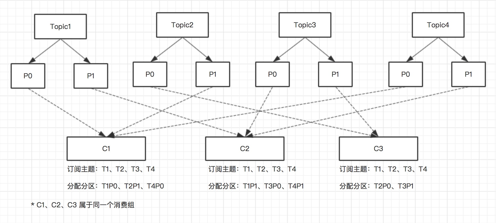
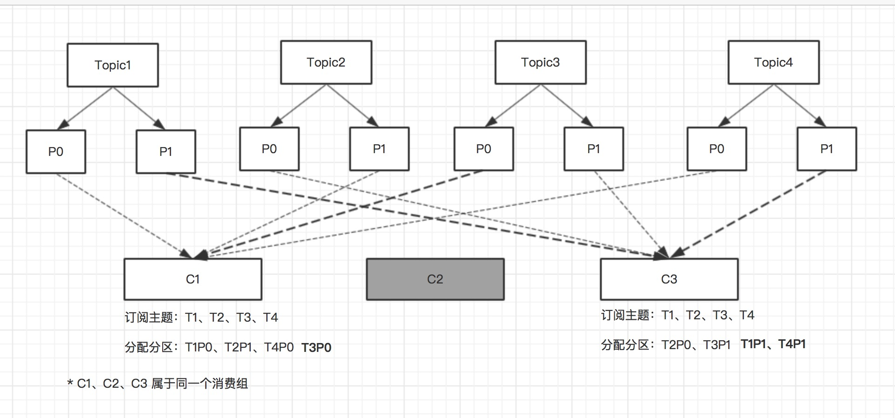

## 1、`kafka`体系结构
+ 由三部分组成：**`Producer`(生产者)**、**`Consumer`(消费者)**、**`Broker`(服务代理)**，`Producer`负责发送数据到`Broker`，`Consumer`从`Broker`中拉取消息。

+ 每一条发送的消息以`Topic`（主题）为单位进行归类，即每一条消息都属于一个唯一的主题。为了能够水平拓展性能，每一个`Topic`由一个或者多个`Partition`（分区）组成。发送消息时，根据分区规则发送到指定分区，发送到指定分区时，每个消息会分配一个特定的偏移量`offset`，作为该消息在该分区内的唯一标示ID，这个`offet`在分区内是递增的，即分区内的消息是具有顺序性的。*注意顺序性仅仅是针对单个分区内，对于跨分区是保证不了顺序性的*

+ 为了提高容灾能力，一个`Topic`下的每个`Partition`可以由一个或者多个副本组成，同一分区的所有副本中保存的是相同的消息，副本之间采用**一主多从**的架构设计，其中`leader`副本负责处理读写请求，`follower`副本仅仅负责与`leader`副本之间进行消息同步，用于在`leader`副本所在的`Broker`节点出现故障时，在`follower`副本之间重新选举新的`leader`副本，以此来实现故障转移。

+ 一个分区在同一个`Broker`节点上，最多只有一个副本，不存在同一个`Broker`上存在一个分区的多个副本。（*出于副本是为了提高容灾能力存在的，多个副本存在于同一个`Broker`节点上并无任何意义*）

+ `follower`副本上的消息数据和`leader`副本上的消息数据之间会存在一定的滞后，所有副本统称为`AR`，和`leader`副本保持一定程度同步的副本（包括`leader`副本）组成`ISR`，和`leader`副本同步滞后过多的副本（不包括`leader`副本）组成`OSR`。由此可见，进行故障转移时，只有`ISR`中的副本可作为候选副本，`OSR`中的副本不能作为候选副本。


## 2、`kafka`生产者发送示例
```java
Properties properties = new Properties();
//设置broker节点，多节点可以采用逗号分隔，不需要把全部的broker节点都填上
properties.put(ProducerConfig.BOOTSTRAP_SERVERS_CONFIG, "127.0.0.1:9092");
//生产者标示ID，可选
properties.put(ProducerConfig.CLIENT_ID_CONFIG, "producer-1");
//消息Key序列化类
properties.put(ProducerConfig.KEY_SERIALIZER_CLASS_CONFIG, StringSerializer.class.getName());
//消息内容序列化类
properties.put(ProducerConfig.VALUE_SERIALIZER_CLASS_CONFIG, StringSerializer.class.getName());

KafkaProducer<String, String> kafkaProducer = new KafkaProducer<String, String>(properties);

//构造待发送消息
ProducerRecord<String, String> record = new ProducerRecord<>("topic", "msg-content");

try {
    //发送消息
    Future<RecordMetadata> recordMetadataFuture = kafkaProducer.send(record);

    RecordMetadata recordMetadata = recordMetadataFuture.get();

    String topic = recordMetadata.topic();
    //获取发送到的分区
    int partition = recordMetadata.partition();
    //获取消息存储在kafka中的offset
    long offset = recordMetadata.offset();
} catch (Exception ex) {
    //
}

kafkaProducer.close();
```

*`KafkaProducer`是线程安全的，可以多线程环境下使用*

## 3、`kafka`发送失败重试
对于`kafka`发送失败场景，可以在`producer`端设置重试参数`retries`，当发送失败时，自动重试配置次数，失败超过重试次数才会抛出异常，配置代码片段如下
```java
//配置失败重试次数为3
properties.put(ProducerConfig.RETRIES_CONFIG, 3);
//配置失败重试时间间隔为100ms
properties.put(ProducerConfig.RETRY_BACKOFF_MS_CONFIG, 100);
```

## 4、`Partitioner`（分区器）
+ 在消息发送到`Broker`之前，需要在发送端计算出要发送的`target partition`（目标分区），如果`ProducerRecord`中指定了`partition`，则发送到`partition`指向的分区

+ 如果`ProducerRecord`未指定`partition`，在默认的分区器(`DefaultPartitioner`)中，如果`key`为`null`，则会以轮询的方式发送到主题的**可用分区**；如果`key`不为`null`，则会对`key`采用`MurmurHash2`算法计算哈希值，然后对**所有分区**进行取模运算，得到目标分区。

+ 如果需实现自定义分区器，可通过实现`Partitioner`接口，然后注册到`KafkaProducer`中，`Partitioner`接口如下所示
```java
public interface Partitioner extends Configurable, Closeable {
    public int partition(String topic,         //主题
                        Object key,            //消息key
                        byte[] keyBytes,       //消息key的字节数组形式
                        Object value,          //消息内容
                        byte[] valueBytes,     //消息内容的字节数组形式
                        Cluster cluster        //集群元数据
                        );      

    public void close();
}
```

注册到`KafkaProducer`如下所示
```java
properties.put(ProducerConfig.PARTITIONER_CLASS_CONFIG, MyCustomPartitioner.class.getName());
```

## 5、`ProducerInterceptor`（生产者拦截器）
+ `ProducerInterceptor`用于在消息发送之前、消息发送成功API返回应答之前或者消息发送失败时进行拦截。具体接口定义如下所示

```java
public interface ProducerInterceptor<K, V> extends Configurable {

    //消息发送之前，具体的来说在序列化、分区之前
    public ProducerRecord<K, V> onSend(ProducerRecord<K, V> record);

    //在消息发送成功，API返回应答之前调用（exception为null）
    //或者消息发送失败时，进行调用（exception不为null）
    public void onAcknowledgement(RecordMetadata metadata, Exception exception);

    public void close();
}
```
注册到`KafkaProducer`如下所示
```java
//如有多个拦截器，可采用逗号进行分割
properties.put(ProducerConfig.INTERCEPTOR_CLASSES_CONFIG, MyCustomProducerInterceptor.class.getName());
```

*`onSend(..)`是在用户线程中执行的，`onAcknowledgement(..)`是在`I/O`线程中执行的，尽量不要在`onAcknowledgement(..)`中执行过多的操作*


## 6、`kafka`发送端线程模型


+ 消息在发送出去之前，会先暂存在一个叫做消息累加器（`RecordAccumulator`）的组件中存放，多个消息组成一个`ProducerBatch`对象，每个`ProducerBatch`的默认大小为16KB，可通过设置参数`batch.size`来修改

+ 消息累加器（`RecordAccumulator`）的总容量大小默认为32MB，可以通过设置参数`buffer.memory`来修改

+ 如果消息累加器的容量大小达到设定大小，后续再发送新的消息，业务线程将会阻塞直至超时或者有空间可用，超时时间配置`max.block.ms`，默认值为60S

+ 在`InFlightRequests`内部，每个`Node`节点都有一个对应的列表用于存放已经发出，但还未收到`Broker`响应的请求，每个`Node`节点的存放请求队列的长度可以通过设置参数`max.in.flight.requests`来修改，默认是5个。

+ 如果某个`Node`节点对应的存放请求队列长度超过设定大小，`Sender`线程将不会再向该`Node`节点发送消息，直至该节点对应的存放请求队列有空间可用

## 7、消息可靠写入实现
为了确保消息发送到`Broker`集群，并且不丢失，可以通过设置参数`acks`来指定目标分区必须有多少个副本写入成功才算是发送成功，配置如下：
```java
//默认1，只要分区的leader副本写入成功，就算写入成功
properties.put(ProducerConfig.ACKS_CONFIG, "1");

//只要发送出去，就认为写入成功
properties.put(ProducerConfig.ACKS_CONFIG, "0");

//分区 ISR 中所有的副本都写入成功，才算是写入成功
properties.put(ProducerConfig.ACKS_CONFIG, "-1");
```
*如果发送失败，可以通过重试机制来提高可靠性*

## 8、发送消息最大限制
默认每一条发送的消息最大位1MB，可通过设置参数`max.request.size`来修改，如下
```java
//修改最大位3M
properties.put(ProducerConfig.MAX_REQUEST_SIZE_CONFIG, 3 * 1024 * 1024);
```
*该参数和`Broker`端的`message.max.bytes`参数相对应，需要确保`Producer`端的`max.request.size`参数值不大于`Broker`端的`message.max.bytes`参数值*

## 9、消费者、消费组与分区分配


+ 在`Consumer`订阅`Topic`时，是以`Consumer Group`的形式来进行订阅的，每个`Consumer`必定属于某个`Consumer Group`

+ 在单个`Consumer Group`内，进行分区分配时，一个分区最多只能分配给一个`Consumer`，不能分配给多个`Consumer`。由此可见，当单个`Consumer Group`内的`Consumer`数量超过分区数量时，会出现部分`Consumer`分配不到分区，如上图中 `Consumer Group2` 中的`C4`

## 10、`kafka`消费者消费示例
```java
boolean isStop = false;

Properties properties = new Properties();
//设置broker节点，多节点可以采用逗号分隔，不需要把全部的broker节点都填上
properties.put(ConsumerConfig.BOOTSTRAP_SERVERS_CONFIG, "127.0.0.1:9092");

//设置消费者组
properties.put(ConsumerConfig.GROUP_ID_CONFIG, "consumer-group1");
//设置消费者标识ID，可选
properties.put(ConsumerConfig.CLIENT_ID_CONFIG, "consumer-group1-c1");

//设置Key反序列化类
properties.put(ConsumerConfig.KEY_DESERIALIZER_CLASS_CONFIG, StringDeserializer.class.getName());
//设置Value反序列化类
properties.put(ConsumerConfig.VALUE_DESERIALIZER_CLASS_CONFIG, StringDeserializer.class.getName());

KafkaConsumer<String, String> kafkaConsumer = new KafkaConsumer<String, String>(properties);

//订阅主题
kafkaConsumer.subscribe(Arrays.asList("topic1"));

while (!isStop) {
    //拉取消息
    ConsumerRecords<String, String> consumerRecords = kafkaConsumer.poll(Duration.ofSeconds(1));

    //消费消息
    for (ConsumerRecord<String, String> consumerRecord : consumerRecords) {
        //获取主题
        System.out.println("topic -> " + consumerRecord.topic());
        //获取消息所在分区
        System.out.println("partition -> " + consumerRecord.partition());
        //获取消息在分区内偏移Offset
        System.out.println("offset -> " + consumerRecord.offset());
        //获取消息Key
        System.out.println("key -> " + consumerRecord.key());
        //获取消息Value
        System.out.println("value -> " + consumerRecord.value());
    }
}

kafkaConsumer.close();
```
*`KafkaConsumer`不是线程安全的，不能在多线程环境下使用*

*`Consuner Group`可以订阅多个`Topic`*

## 11、`kafka`消费组订阅
+ 直接订阅
```java
//该方式直接订阅主题，如果多次订阅，则以最后一次订阅为准
kafkaConsumer.subscribe(Arrays.asList("topic1", "topic2"));
```

+ 匹配订阅
```java
//通过正则表达式进行匹配、订阅主题，后续有匹配正则表达式的新主题创建时，消费组可拉取新主题的消息进行消费
 kafkaConsumer.subscribe(Pattern.compile("topic*"));
```

+ 订阅特定分区
```java
//订阅主题 topic1 中的 0、1 分区，topic2 中的 0 分区
kafkaConsumer.assign(Arrays.asList(
    new TopicPartition("topic1", 0), 
    new TopicPartition("topic1", 1), 
    new TopicPartition("topic2", 0))
);
```
*上述三种订阅，只能选择一种方式进行订阅，即三选一，不能多种订阅同时存在*

## 12、`ConsumerRecords<String, String>`内部结构


## 13、`kafka`消费者提交位移
假设消费情况如下图所示


### 自动提交位移（默认提交方式）
+ 默认采用自动提交，需要确保消费者端参数配置如下（即默认配置）
```java
//开启自动提交，默认开启
properties.put(ConsumerConfig.ENABLE_AUTO_COMMIT_CONFIG, true);
//设置自动提交时间间隔为5000ms
properties.put(ConsumerConfig.AUTO_COMMIT_INTERVAL_MS_CONFIG, 5000);
```
+ **存在重复消费场景**：拉取到一批消息，消费到一半，在并未到自动提交时间时，消费者崩溃，下次拉取将会从上一次提交位置重新拉取

+ **存在消息丢失场景**：拉取到一批消息存入本地缓存队列中，由其他线程进行消费。在其他线程正在消费消息时，由于到了自动提交时间，过早的进行位移提交后，消费者崩溃，下次拉取将从奔溃前提交的位移位置开始拉取

### 手动同步提交
+ 需关闭自动提交位置，手动调用API进行提交，如下所示
```java
//关闭自动提交，默认开启
properties.put(ConsumerConfig.ENABLE_AUTO_COMMIT_CONFIG, false);

//手动提交分配到的所有分区的消费位移
kafkaConsumer.commitSync();

或者

//设置各个分区的消费位移
Map<TopicPartition, OffsetAndMetadata> offsetMap = new HashMap<>();
offsetMap.put(new TopicPartition("topic", 1), new OffsetAndMetadata(lastMsgOffset + 1));
//提交各个分区的消费位移
kafkaConsumer.commitSync(offsetMap);
```
### 手动异步提交
+ 需关闭自动提交位置，手动调用API进行提交，如下所示
```java
//关闭自动提交，默认开启
properties.put(ConsumerConfig.ENABLE_AUTO_COMMIT_CONFIG, false);

//手动异步提交分配到的所有分区的消费位移
kafkaConsumer.commitAsync();

或者

//设置各个分区的消费位移
Map<TopicPartition, OffsetAndMetadata> offsetMap = new HashMap<>();
offsetMap.put(new TopicPartition("topic", 1), new OffsetAndMetadata(lastMsgOffset + 1));

//提交各个分区的消费位移，并注入回调方法
kafkaConsumer.commitAsync(offsetMap, new OffsetCommitCallback() {
    @Override
    public void onComplete(Map<TopicPartition, OffsetAndMetadata> offsets, Exception exception) {
        //异步执行完成回调处理
    }
});
```

## 14、`kafka`消费者消费位移自动重置
+ 在消费者消费主题消息时，会根据存放在`__consumer_offsets`主题中的消费位移，来决定下次拉取消息的起始位置。但是在消费刚开始，`__consumer_offsets`主题中并未保存该消费者的消费位移，或者`__consumer_offsets`中保存消费者消费位移的数据因过期而被删除。这时候就需要一个默认值，来重置消费者的消费位移。（*更准确的来说是消费组的消费位移，因为消费者是以消费组的形式进行拉取消息*）

+ 可通过参数`ConsumerConfig.AUTO_OFFSET_RESET_CONFIG`来设置 **默认的重置消费位移**，如下所示
```java
//可选值有 latest、earliest、none
properties.put(ConsumerConfig.AUTO_OFFSET_RESET_CONFIG, "latest");
```

*如果设置`none`，在需要使用**重置位移**时，会报`NoOffsetForPartitionException`异常*，关于`earliest`、`latest`的示意图如下所示


## 15、`kafka`消费者消费位移重置
+ 相比于自动重置而言，还可以手动重置消费者的消费位移，如下代码所示
```java
KafkaConsumer<String, String> kafkaConsumer = new KafkaConsumer<String, String>(properties);

kafkaConsumer.subscribe(Collections.singletonList("topic2"));

//执行拉取动作，获取分配的分区
kafkaConsumer.poll(Duration.ofMillis(1000));

//获取分区的分区，如果没有之前的 poll(...) 拉取动作，这里将会是一个空集合
Set<TopicPartition> assignTopicPartitions = kafkaConsumer.assignment();

for (TopicPartition topicPartition : assignTopicPartitions) {
    //重置分配到的分区消费位移为 10
    kafkaConsumer.seek(topicPartition, 10);

    或者

    //重置分配到的分区消费位移为起始位置，即从头开始消费
    kafkaConsumer.beginningOffsets(Arrays.asList(topicPartition));

    或者

    //重置分配到的分区消费位移为最后位置，即跳过前面所有的消息
    kafkaConsumer.endOffsets(Arrays.asList(topicPartition));

    或者

    //重置分配到的分区消费位移，将消费2019-10-10 00:00:00这个时间点之后的消息（包括这个时间点的消息）
    kafkaConsumer.offsetsForTimes(Collections.singletonMap(topicPartition, sdf.parse("2019-10-10 00:00:00").getTime()));
}
```

## 16、`kafka`消费者分区分配及再均衡
### 分区分配
+ 在消费者进行消费主题消息前，需要进行分区分配，目前三种分区分配方案：**RangeAssignor**、**RoundRobinAssignor**、**StickyAssignor**

+ **RangeAssignor**：在消费组内，对于**每个订阅的主题**，进行分区数除以消费者数，得到一个分区范围，每个消费者按照分区范围顺序分配对应的分区段；如果不能平均分配，则前面的每个消费者多分配一个，如下图所示


+ **RoundRobinAssignor**：在消费组内，将**所有订阅的主题**分区按照字母顺序排序，依次分给各个消费者，如果某个消费者没有订阅某个主题，则分配时跳过，寻找下一个消费者分配，如下图所示：


+ **StickyAssignor**：粘性分配策略，该策略首次分配时类似于`RoundRobinAssignor`分配策略。但是对于某个消费者下线或者down掉情况，进行分区再分配时，尽量不会去修改存活的消费者的已经分配到的分区，这样可以尽可能使前后两次的分配结果相似，降低由于再分配导致存活消费者已分配到的分区发生大改动，如下图所示。（*因为一个分区从一个存活的消费者，重新分配到另一个存活的消费者意义不是很大，还会存在额外的性能损耗以及关于消费位移提交、重复消费等情况发生*）

  *重分配前*
  
  *重分配后*
  

+ **自定义分区分配策略**：需要实现`PartitionAssignor`接口或者`AbstractPartitionAssignor`抽象类，此处看接口定义即可，不在赘述。

### 分区再分配情况（再均衡情况）
1. 新的`Consumer`加入`Consumer Group`
2. `Consumer Group`内的`Consumer`下线、宕机、或者由于长时间GC/网络延迟等情况导致未向`GroupCoordinator`发送心跳续约
3. `Consumer Group`订阅的任一`Topic`的`Partition`数量发生变化
4. `Consumer` 调用 `unsubscribe(...)`或者`assign(...)`取消订阅某些`Topic`

### 再均衡过程
每个`Consumer Group`都有对应的`Group Coordinator`（组协调器），负责处理该`Consumer Group`的分区分配和再均衡操作，以一个新的`Consumer`加入已存在的`Consumer Group`，进行再均衡的示例过程进行讲述，具体步骤可分为以下四步：

#### 1、**寻找`Group Coordinator`**：

向集群中的一个`Broker`发送`FindCoordinatorRequest`（寻找协调器请求），`Broker`接收到请求后，根据该`Consumer`所属的`Consumer Group`计算出`GroupCoordinator`节点位置，具体计算公式如下所示：

> *abs( `consumer_group_id`.hashCode )  %  ( `__consumer_offsets`主题的分区数量 )*
>
> 计算出对应的分区后，该分区所对应的`leader`副本所在的`Broker`节点即为该`Consumer Group`的`Group Coordinator`

`Broker`计算出对应的`Group Coordinator`后，将`Group Coordinator`所在节点的`brokerId`、`IP`、`port`包装在`FindCoordinatorResponse`响应对象发送给`Consumer`

#### 2、**加入`Consumer Group`**：

获取到对应的`Group Coordinator`后，`Consumer`向`Group Coordinator`发送`JoinGroupRequest`请求，请求加入`Consumer Group`，其中`JoinGroupRequest`包含了以下主要信息：
> `group_id`：消费组ID
>
> `session_timeout`：与组协调器保持会话的超时时间，默认10s），对应于`ConsumerConfig.SESSION_TIMEOUT_MS_CONFIG`参数
>
> `rebalance_timeout`：消费者拉取消息（调用`poll(...)`方法）的最大间隔时间，超过该时间，则认为消费者失效，进行再均衡，对应于`ConsumerConfig.MAX_POLL_INTERVAL_MS_CONFIG`参数
>
> `group_protocols`：该消费者支持的分区策略，和参数`ConsumerConfig.PARTITION_ASSIGNMENT_STRATEGY_CONFIG`有关

`Group Coordinator`接收到`JoinGroupRequest`后，需要进行两件事：**选举消费组的leader**、**选举分区策略**
+ **选举消费组的leader**：如果不存在`leader`，则第一个加入消费组的消费者即为`leader`；如果`leader`下线或者退出消费组，则任意选取一个消费者作为`leader`
+ **选举分区策略**：将消费组内所有消费者支持的分区策略组成一个候选集，遍历每个消费者支持的分区策略，为当前遍历消费者支持的第一个分区策略投上一票，最终得票数量最多的策略即为选举出来的策略。*如果选举出来的策略，有部分消费者不支持，则该部分消费者会抛出异常*

选举出消费组的`leader`、分区策略后，将选举结果包装在`JoinGroupResponse`对象发送给各个消费者，其中主要包含以下信息：
> `leader_id` : 选举出来的`leader`消费者组内标识ID
>
> `member_id` : 消费者在组内的标识ID，每个`Consumer`都不一样，在消费组内唯一标识消费者
> 
> `group_protocol` : 选举出来的分区策略名称，`range`、`roundrobin`、`sticky`
>
> `members` : 消费组内的成员列表，包含每个消费者的`member_id` 和订阅的主题列表，**仅`leader`消费者接收到的`JoinGroupResponse`中才会有该值**

#### 3、**同步分配结果**：

`leader consumer`根据上一阶段选举出来的分区策略，和各个消费者的订阅信息，执行分区分配操作，计算出来各个消费者分配的主题分区结果

各个消费者发送`SyncGroupRequest`请求给`GroupCoordinator`，请求获取分区分配结果，`SyncGroupRequest`请求中主要包含以下数据：
> `group_id` : 消费组ID
>
> `member_id` : 消费者组内标识ID
>
> `group_assignment` : 分区分配结果，该字段只有`leader`消费者发送的请求中有数据，其余消费者发送的请求中该数据为空

`Group Coordinator`接收到`leader`消费者的`SyncGroupRequest`请求后，将分区分配结果提取出来，连同消费组的元数据信息存入到`kafka`的`__consumer_offsets`主题中，并将分区分配结果包装在`SyncGroupResponse`对象中返回给消费者

#### 4、**保持心跳**

+ 各个消费者获取到各自分配的主题分区后，通过与`Group Coordinator`定期发送`HeartbeatRequest`请求，`Group Coordinator`返回`HeartbeatResponse`响应，以此双方保持心跳。

+ 如果某个消费者超过`ConsumerConfig.SESSION_TIMEOUT_MS_CONFIG`配置的时间，仍然未发送心跳，则会视为该消费者下线失效，进行分区再均衡操作

+ 如果某个消费者超过`ConsumerConfig.MAX_POLL_INTERVAL_MS_CONFIG`配置的时间间隔，未拉取更多的消息（即调用`poll(...)`方法），也会被视为下线失效，同样也会进行再均衡操作。

### 消费者监听再均衡操作
在消费者订阅主题时，可传入`ConsumerRebalanceListener`，用于监听再均衡操作，如下代码所示
```java
kafkaConsumer.subscribe(Collections.singletonList("topic"), new ConsumerRebalanceListener() {
    @Override
    public void onPartitionsRevoked(Collection<TopicPartition> partitions) {
        //再分区开始前，可用于手动提交位移，防止未来得及提交位移，导致接手分区的其他消费者重复消费
    }

    @Override
    public void onPartitionsAssigned(Collection<TopicPartition> partitions) {
        //再分区完成后
    }
});
```

## 17、消费者位移信息保存
+ 在旧版本中的`kafka`中，消费者的消费位移（*更准确的来说是消费组的位移*）是保存在`zookeeper`上的，具体保存在`/consumers/{group}/offsets/{topic}/{partition}`路径上。

+ 在新版本的`kafka`中，改为保存在`__consumer_offset`主题中，以为`<group, topic, partition>` 为 `key`保存消费组在其订阅的主题分区上的`offset`信息。

+ 该位移消息是会过期的，具体过期时间取决于提交位移时，发送`OffsetCommitRequest`请求中的`retentionTime`参数值，如果`retentionTime`参数值为`null`或者`-1`，则采用`broker`端参数的`offsets.retention.minutes`参数配置（默认为7天）

+ 如果某个主题被删除了，那么订阅这个主题的所有消费组的`offset`信息也会被对应删除

## 18、`kafka`消费者优雅的退出消息拉取
+ 通过在其他线程里面调用`KafkaConsumer`的`wakeup()`方法，该方法是`KafkaConsumer`中唯一一个可以从其他线程里安全调用的方法，通过抛出`WakeupExcepton`异常，来退出`poll(final Duration timeout)`执行。如下所示
```java
try {
    while (true) {
        //拉取消息
        ConsumerRecords<String, String> consumerRecords = kafkaConsumer.poll(Duration.ofSeconds(1));

        //proc msg
    }

} catch (WakeupException ex) {
    //该异常仅仅用于跳出poll(...)，可忽略该异常

} finally {
    //确保关闭
    kafkaConsumer.close();
}
```
## 19、`Topic`、`Partition`、`Replication`、`broker`之间的关系


每个`broker`上的 `${log.dir}` 或者 `${log.dirs}` 目录里（默认是 `/tmp/kafka-logs`），存放该`broker`上的主题分区的日志数据，具体分区日志的存放目录格式如：`{topic}-{partition}`，该目录中存放了该分区副本的`log`文件、`offset`索引文件、`time`索引文件、以及各种检查点文件

*在同一个`broker`上不可能存在同一个`Partition`的多个副本，因为副本的意义就是为了容灾存在*

## 20、`leader`副本选举
+ 为了提高容灾能力，`kafka`实现了多副本机制，对于每个分区，都可以拥有多个副本，其中`leader`副本负责对外提供读写功能，`follow`副本仅负责和`leader`副本之间进行消息同步，`follow`副本并不对外读写服务。

+ **`优先副本`**：每个分区 `AR` 集合中的第一个副本，在不发生任何`broker`节点宕机情况下，分区的优先副本就是分区的`leader`副本

+ 为了保证各个`broker`节点的负载均衡，创建主题分区时，`kafka`会尽量确保所有主题分区的优先副本在`broker`上均匀分布，*优先副本在`broker`上均匀分布不一定能完全确保`broker`负载均衡，因为还取决于各个`leader`副本的负载情况和分布情况，因为`leader`副本不一定时时刻刻都是优先副本*

+ 当`leader`副本所在`broker`节点宕机时，会从`follow`节点中挑选出一个副本作为新`leader`副本，挑选方法就是取`AR`集合中的第一个可用副本，如果后续旧的`leader`副本所在的`broker`节点恢复了，那么旧的`leader`副本将会变为`follower`副本存在

+ 为了防止随着时间的推移，过多的`leader`副本不是优先副本，导致`broker`负载不均衡，`kafka`提供了**分区自平衡**功能，在每个`broker`上定期（`leader.imbalance.check.interval.seconds`参数，默认5分钟）检查分区不平衡率
    ```
        分区不平衡率 = 不是优先副本的leader个数 / 分区总数
    ```
    如果分区不平衡率超过`leader.imbalance.per.broker.percentage`配置，默认10%，则会触发优先副本选举操作，可通过设置`auto.leader.rebalance.enable`为`false`来关闭`kafka`分区自平衡，默认开启。
    
    不建议开启`kafka`分区自平衡，因为这个分区自平衡的操作时间点不可控，在自平衡期间会产生一定的性能问题，可能会导致生产者/消费者发生阻塞，建议根据`kafka`脚本来手动执行分区平衡操作(见`kafka-perferred-replica-election.sh`脚本)

## `Topic`端主要参数

+ `max.message.bytes`：每条消息的最大字节数，默认为为1M左右

+ `message.timestamp.type`：消息的时间戳类型，默认`CreateTime`，即创建时间，由`Producer`提供，还可设置为`LogAppendTime`，由`broker`端接收消息时提供

+ `cleanup.policy`：**日志压缩策略**，默认为`delete`即删除策略，还可以配置`compact`，即对重复`key`的采用压缩策略，一直保存每个`key`最新的值，而不是删除消息

+ `compression.type`：**消息压缩策略**，对消息内容的压缩类型，默认为`producer`，即由生产者决定，可选配置为`uncompressed`（不压缩）、`snappy`、`gzip`

+ `flush.messages`：需要收集多少条消息才会强制刷新到磁盘，默认由系统决定

+ `flush.ms`：需要等待才会将消息强制刷新到磁盘，默认由系统决定

+ `retention.bytes`：分区副本中能保存的消息总字节数，默认-1，即没有限制

+ `retention.ms`：使用`delete`删除策略时，消息的保存时长，默认7天


## 为什么`Topic`支持增加分区，但不支持减少分区
`kafka`如需支持主题减少分区，就需要对删除的分区中的数据做处理，如果选择丢弃，那么消息的可靠性会得不到保证，会影响消费者业务；如果选择转移到其他分区，那么消息的顺序性得不到保证，因为`kafka`消息的顺序性是针对单个分区内而言的，合并到其他分区，会与其他分区现存的分区消息产生顺序冲突。此外，如果删除的分区中存在大量的消息需要转移，会面对内部数据大量复制的问题，可能会影响到其他分区的正常运作。
