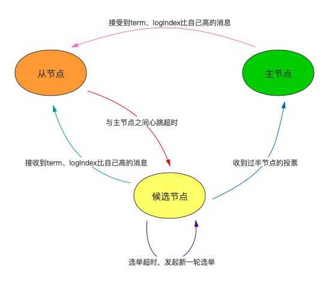
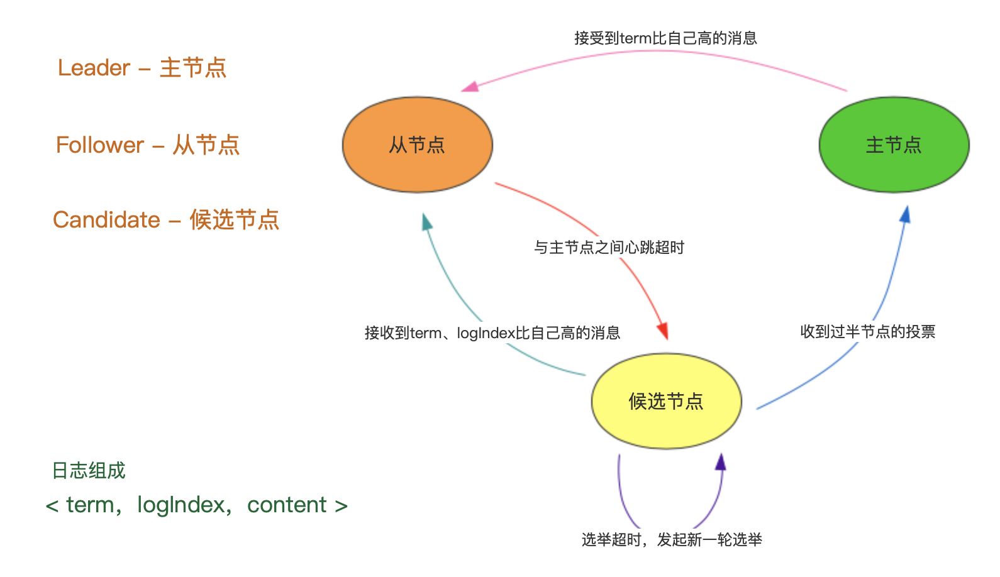
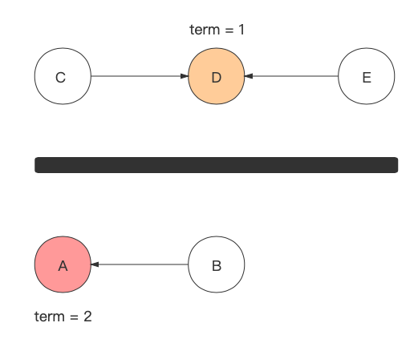

## 分布式一致性协议之 `Raft`

### **协议简介**

所谓一致性协议，简而言之就是针对某一个事情达成一致看法，或者对某一个数据状态达成共识。至于分布式一致性协议，就是将场景限定在分布式场景下，通过遵守、执行该协议，以此在各个节点之间达成共识。在分布式一致性协议中，大名鼎鼎的`Paxos`一直以其完美性稳坐第一宝座，但因为晦涩难懂、实现难度大等缺点，一直为人所诟病。`Raft`协议在概念上更为简洁，理解起来更为容易，操作实现起来也更简单，因此在实际生产中应用的也比较多，典型的如`Redis`在哨兵模式下的哨兵选举。

### **`Leader` 选举**

在`raft`协议中，任何一个节点在任何时候，会处于一下三个状态中的其中一个
+ `leader` — 主节点
+ `follower` — 从节点
+ `candidate` — 候选节点

具体的状态转换如下图所示

*每个节点都维护一个字段 - `term`，表示自己所处的任期，或者称之为**朝代**、**纪元**似乎更为合适，这是一个只能增长、而且增长步数只能为1的正整数。*

1. 当从节点在固定的时间内，没有收到来自主节点的心跳信息（*也包括来自主节点的 `Append Entries`，即日志复制消息*），即和主节点失去连接，则会随机等待一段时间后，将自己的`term + 1`，同时从`follower`状态切换到`candidate`状态。**为了方便，将`term + 1`称之为`new_term`，之前的任期仍称为`term`。**

2. 切换到`candidate`状态后，首先自己给自己投一票，然后给其他节点发送`RequestVote`，即请求投票消息，请求其他节点给自己投票。投票消息中包含当前节点的`term` - 任期、`logIndex` - 日志下标。

3. 其他节点接收到该节点的`RequestVote`后，处理方式有以下三个

    + 如果从未在`term + 1`的任期投过票，则会和自己的`term`、`logIndex`进行对比。如果`RequestVote`中的`term`比自己的`term`大，或者`logIndex`比自己的`logIndex`大，则投票给该节点。
    + 如果从未在`term + 1`的任期投过票，且`RequestVote`中的`term`比自己的`term`小，或者`logIndex`比自己的`logIndex`小，则返回自己当前所跟随的主节点信息（*主节点的ID、term、logIndex*）给该节点。
    + 如果在`term + 1`的任期内投递过票，则不再投票给该节点。如果已经有跟随的主节点，则返回主节点的信息（*主节点的ID、term、logIndex*）给该节点。

4. 该节点接收到投票信息后，有以下三种情况

    + 接受到超过半数的节点投票（包括自己的一票），则自己当选为主节点，从`candidate`状态切换为`leader`状态，然后发送一条空的`log entry`消息给其他节点，通知其他节点自己晋升为`leader`。这条空消息包含当前节点的`ID`、`new_term`、`logIndex`。

    + 通过对比其他节点返回来的`term`、`logIndex`，发现有比自己更高的主节点存在，则从`candidate`切换为`follower`，发起和主节点的日志复制。

    + 等待一段时间后，仍然没有收到过半的节点投票，也没有发现比自己`term`、`logIndex`更高的主节点存在。等待超时，继续保持`candidate`状态，修改`term`为`term+2`重新发起新一轮的选举。

**注意事项**

+ 这里有三个超时，第一个是心跳超时，第二个是随机等待超时，第三个是选举超时

+ 在任何一个新的任期内（`new_term`），每个节点最多只能投一票，而且遵循先到先得的原则

### **日志复制**
这里的日志复制，有两种含义：

+ 正常状态之下，接受客户端请求，新的数据从主节点同步到各节点

+ 刚刚选举出新的`leader`时，从节点从主节点拉取缺失的日志

**新数据同步**

有写请求过来时，只有主节点可以接受处理，如果请求发送到了从节点上，要转发到主节点，具体的数据同步步骤如下

+ 主节点追加新的`log entry`

+ 主节点发送`Append Entry`消息给从节点，消息中包含的具体的数据信息、主节点的`term`、以及`log index`

+ 从节点接收到`Append Entry`消息，追加到自己的日志列表，并返回响应给主节点

+ 主节点接收到过半从节点的响应

+ 主节点将`log entry`应用到自己的`state machine`（状态机）

+ 主节点发送应答给客户端，表示写入成功

+ 主要节点提醒从节点应用`log entry`到各自的状态机

通过上面的步骤可以看出，其实就是一个类似于`2PC`的过程，但是和`2PC`不一样的是`raft`的`leader`节点只需要收到过半节点（也包括自己）的响应，就可以应用日志并回复客户端写入成功。

数据同步的过程，存在状态机的概念，所谓状态机其实就是一个类似于状态转换的流程，只要输入参数、输入顺序是相同的，则最终的状态也是一样的。只要保证各个节点应用到状态机的的日志内容、日志顺序是相同的，则各个节点的数据状态就是一致的。此外，通过引入`Log Entry`、`State Machine`可以将数据的复制、提交分开处理，其实就是对应于`2PC`的两个处理阶段。

+ **当从节点接收到主节点发送过来的`Append Entry`后，会根据消息中的`log index`来重置自己的`log index`。** *这里之所保证在收到过半的节点回应后，才向客户端返回写入成功，就是为了确保即使在刚收到过半节点回应后，主节点挂了，发起新一轮选举，未来的主节点必在返回响应过的过半从节点中。因为这些返回响应过的过半从节点的`log index`是目前最高的*

+ 如果从节点在数据复制过程中，接收到`term`比自己高，但是`logIndex`和自己当前`logIndex`一样的消息，则说明期间发生了选举，该从节点不知道，也未参与，则会重置掉未应用到状态机的日志，并重置自己的`logIndex - 1`，然后与新主节点进行数据恢复。

**从新`leader`节点同步数据**

当选举出新的主节点后，会维护一个`nextIndex[]`数组用来保存各个从节点的复制下标，并立刻给所有的`follower`节点发送一个空的`Append Entry`消息，具体的过程如下所示

1. 主节点初始化`nextIndex[x]`为自己节点的`log index + 1`

2. 发送空的`Append Entry`消息给从节点，空消息中包含主节点日志中下标为`nextIndex[x] -1`的日志的`term`、`logIndex`

3. 从节点接收到空消息，根据空消息中的`term`、`logIndex`和自己已提交状态的日志的`term`、`logIndex`进行对比，如果完全一致，则返回`True`，如果不一致，则返回`False`。

4. 主节点如果收到来自从节点的`False`，则重置 `nextIndex[x] = `nextIndex[x] - 1`，从重复第2步

5. 主节点同步`nextIndex[x]`后的所有`log entry`给从节点

### **脑裂处理**

所谓脑裂，即产生网络分区的情况下，产生两个`Leader`的情况，如下图所示

如上图所示，在`term=1`的时候，`A`是主节点，后因产生网络分区，将`A`、`B`隔离在一个分区，`C`、`D`、`E`隔离在一个分区。因为`C`、`D`、`E`占据过半节点，所以可以重新选举出新的主节点，也就是`D`。当有写请求过来时，有以下情况处理
1. 写请求发送到`D`节点，正常提交写入

2. 写请求发送到`A`节点，因为收不到过半的节点回应，则一直无法写入成功

当有读请求过来时
1. 读请求发送到上半区，则获取最新的数据

2. 读请求发送到下半区，则获取旧的数据（对于未应用到状态机的日志，其包含数据不会返回）

因为只有某个网络分区内拥有过半的节点，才能选举出新的主节点，以下图示的这种情况绝不可能会出现

### **名词梳理**

+ `term` - 当前节点所处的实际任期

+ `new_term` - 候选节点期待成为主节点的未来任期

+ `log index` - 当前节点的最新日志下标，包含已经应用到状态机的日志、以及未应用到状态机的日志。**该日志下标不仅用于与新主节点的日志复制，也用于新主节点的选举投票权衡。**

### **引用**

+ [一文搞懂Raft算法](https://www.cnblogs.com/xybaby/p/10124083.html)

+ [Raft动画展示](http://thesecretlivesofdata.com/raft/)