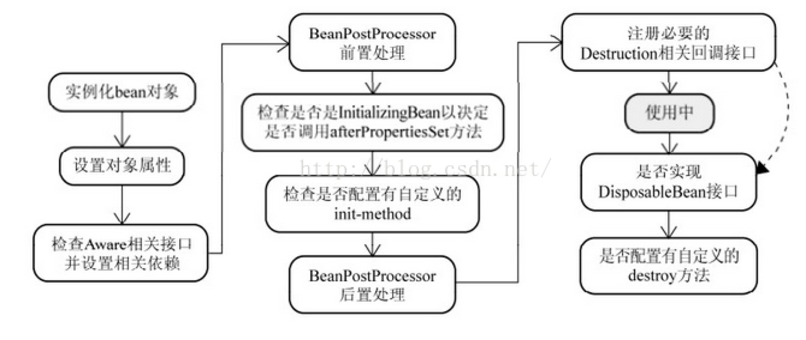

#### 1、`Spring`框架中都用到了哪些设计模式
+ **工厂模式**：`BeanFactory`就是简单工厂模式的体现，用于创建对象实例
+ **单例模式**：`Spring`创建的`Bean`默认就是单例的
+ **代理模式**：`Spring AOP`功能用到了`JDK`动态代理和`CGLIB`字节码生成技术
+ **观察者模式**：`Spring`中的事件机制
+ **模板方法**：具体体现有`JdbcTemplate`、`JpaTemplate`、`RestTemplate`

#### 2、`BeanFactory`与`ApplicationContext`区别
+ `BeanFactory`是Spring IOC模块中的基础接口，负责读取`Bean Definition`、`Bean`的加载与实例化、管理`Bean`的生命周期以及维护各个`Bean`之间的关系，`ApplicationContext`接口继承于`BeanFactory`，除了具有`BeanFactory`的所有功能之外，还提供了其他一些增强功能，如下
+ 继承了`MessageSource`，支持国际化功能
+ 提供了统一的资源文件访问方式
+ 支持事件机制
+ 可同时加载多个配置文件
+ 可载入多个具有继承关系的上下文，使得每一个上下文都专注于一个特定的层次，即支持立体结构的上下文结构，如web应用中，web层的`applicationContext`和应用层的`applicationContext`

#### 3、`Spring`框架是怎么解决`Bean`之间的循环依赖
+ 宏观上来说，`Spring`在实例化`Bean`时，将`Bean`的创建和初始化进行分离，具体到代码层来说，`Spring`在初始化`Bean`时，采用了三级缓存模式：`singletonObjects`（第一级缓存，存放已经实例化好的单例对象）、`earlySingletonObjects`（第二级缓存，存放已创建但并未装配属性，提前对外暴露的单例对象）、`singletonFactories`（第三级缓存，存放要被实例化的对象的对象工厂）。当一个`Bean`进行初始化时，通过构造函数创建完成后，会被包装成为一个ObjectFactory对象，并以为beanName作为key保存在`singletonFactories`对象中，然后进行后续处理（装配属性、装配`Aware`类型接口、调用`init`方法、注册销毁方法），期间如果有其他`Bean`创建需要该`Bean`，则先通过`singletonFactories`中的`ObjectFactory`对象获取，并且把该对象从`singletonFactoies`转移到`earlySingletonObjects`中。在该对象后续处理都完成后，将对象放置在`singletonObjects`中，然后清除掉`earlySingletonObjects`、`singletonFactories`中关于该对象的相关数据。

#### 4、`Spring Bean`生命周期

#### 5、`Spring`事件机制中异步处理、同步处理问题

#### 6、`SpringBoot`自动装配的实现原理

#### 7、`Spring5`新特性有哪些
+ 只能运行在`JDK8`以上的环境中
+ 通过`WebFlux`模块支持响应式编程
+ 支持HTTP2.0
+ 提供了对`Kotlin`语言的支持
+ 测试套件中增加了对`JUnit5`的支持，`Spring5`中可以在单元测试中使用`JDK8`提供的函数编程特性
+ 中止了部分过时`API`的支持，比如`Hibernate3`、`Hibernate4`以及`XMLBeans`、`Guava Cache`（Spring5中放弃Guava Cache改用Caffeine作为本地Cache组件）