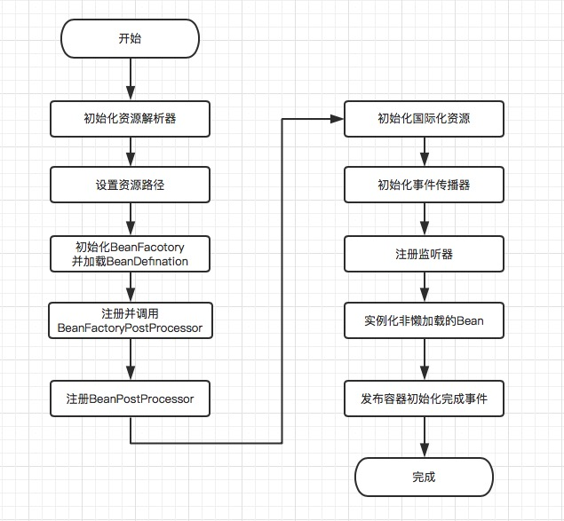

#### 1、`Spring`框架中都用到了哪些设计模式
+ **工厂模式**：`BeanFactory`就是简单工厂模式的体现，用于创建对象实例
+ **单例模式**：`Spring`创建的`Bean`默认就是单例的
+ **代理模式**：`Spring AOP`功能用到了`JDK`动态代理和`CGLIB`字节码生成技术
+ **观察者模式**：`Spring`中的事件机制
+ **模板方法**：具体体现有`JdbcTemplate`、`JpaTemplate`、`RestTemplate`

#### 2、`BeanFactory`与`ApplicationContext`区别
+ `BeanFactory`是Spring IOC模块中的基础接口，负责读取`Bean Definition`、`Bean`的加载与实例化、管理`Bean`的生命周期以及维护各个`Bean`之间的关系，`ApplicationContext`接口继承于`BeanFactory`，除了具有`BeanFactory`的所有功能之外，还提供了其他一些增强功能，如下
+ 继承了`MessageSource`，支持国际化功能
+ 提供了统一的资源文件访问方式
+ 支持事件机制
+ 可同时加载多个配置文件
+ 可载入多个具有继承关系的上下文，使得每一个上下文都专注于一个特定的层次，即支持立体结构的上下文结构，如web应用中，web层的`applicationContext`和应用层的`applicationContext`

#### 3、`Spring`框架是怎么解决`Bean`之间的循环依赖
+ 宏观上来说，`Spring`在实例化`Bean`时，将`Bean`的创建和装配进行分离，具体到代码层来说，`Spring`在初始化`Bean`时，采用了三级缓存模式：`singletonObjects`（第一级缓存，存放已经创建、装配完成的单例对象）、`earlySingletonObjects`（第二级缓存，存放已创建但并还未完成相关装配处理（依赖属性设置、装配`Aware`类型接口、注册销毁接口等），提前对外暴露的单例对象）、`singletonFactories`（第三级缓存，存放创建完成，但还没开始装配的对象的对象工厂，即`ObjectFactory<T>`）。当一个`Bean`进行初始化时，通过反射机制创建完成后，会被包装成为一个ObjectFactory对象，并以为beanName作为key保存在`singletonFactories`对象中，然后进行后续处理（装配属性、装配`Aware`类型接口、调用`init`方法、注册销毁方法），期间如果有其他`Bean`创建需要该`Bean`，则先通过`singletonFactories`中的`ObjectFactory`对象获取，并且把该对象从`singletonFactoies`转移到`earlySingletonObjects`中。在该对象后续处理都完成后，将对象放置在`singletonObjects`中，然后清除掉`earlySingletonObjects`、`singletonFactories`中关于该对象的相关数据。

#### 4、`Spring Bean`生命周期

#### 5、`Spring`事件机制中异步处理、同步处理问题
+ `Spring`事件处理分为两种：**同步处理**、**异步处理**，其中**异步处理**分为**发布者异步发布**、**监听者异步处理**

+ **同步处理**：发布者发布和监听者处理在同一个线程内，可保证事务处理的安全性

+ **发布者异步发布**：通过为`SimpleApplicationEventMulticaster`组件设置`taskExecutor`属性，在发布事件时，会将事件发布包装成一个`task`，提交给`taskExecutor`执行

+ **监听者异步处理**：发布者采用同步发布，监听者在事件处理方法上加上`@Async`注解，当进行事件发布到监听者时，会存在一个AOP拦截组件：`AnnotationAsyncExecutionInterceptor`，该拦截器会将监听器处理事件流程包装成一个`task`，通过内部的线程池执行

+ 事件处理如需异步处理，建议采用监听者异步处理方式，因为那样子可以做到通过是否在处理方法上添加`@Async`决定是否进行异步处理。对于同步处理的监听器来说，仍然可以保持事务的安全性，对于不要求事务安全性的处理采用异步处理，即部分同步处理、部分异步处理

#### 6、`@AutoWire`自动装配原理
+ 在Bean实例化后，装配属性时，会被当前`Bean`容器中的所有`InstantiationAwareBeanPostProcessor`类型的BeanProcessor过滤处理，`AutowiredAnnotationBeanPostProcessor`就是`InstantiationAwareBeanPostProcessor`接口的间接实现子类。在`AutowiredAnnotationBeanPostProcessor`中，重写了接口`InstantiationAwareBeanPostProcessor`的`postProcessProperties(...)`方法，通过对当前Bean的`BeanDefinition`判断是否有被`AutoWire`修饰的属性，如果有则优先装配该属性类型的Bean，然后注入到该Bean。

#### 7、`SpringBoot`自动装配的实现原理
+ 当`SpringBoot`启动时，会检查类路径下各个`jar`包中的`META-INF`下的`spring.factories`文件，如果存在该文件，则从该文件中查找配置`org.springframework.boot.autoconfigure.EnableAutoConfiguration`指向的自动配置类，然后加载该类，自动配置类往往用`@Configuration`装饰，表示其是一个Java类型的配置类，并且其自身，以及其包含的`Bean`正常情况下都会采用`@Condition`装饰，即采用条件装配，这就为什么在引入相关的`starter`依赖包后，会自动创建一些`Bean`

#### 8、`Spring IOC`启动过程

#### 9、`Spring5`新特性有哪些
+ 只能运行在`JDK8`以上的环境中
+ 通过`WebFlux`模块支持响应式编程
+ 支持HTTP2.0
+ 提供了对`Kotlin`语言的支持
+ 测试套件中增加了对`JUnit5`的支持，`Spring5`中可以在单元测试中使用`JDK8`提供的函数编程特性
+ 中止了部分过时`API`的支持，比如`Hibernate3`、`Hibernate4`以及`XMLBeans`、`Guava Cache`（Spring5中放弃Guava Cache改用Caffeine作为本地Cache组件）

*以上内容全部基于`Spring5`版本*