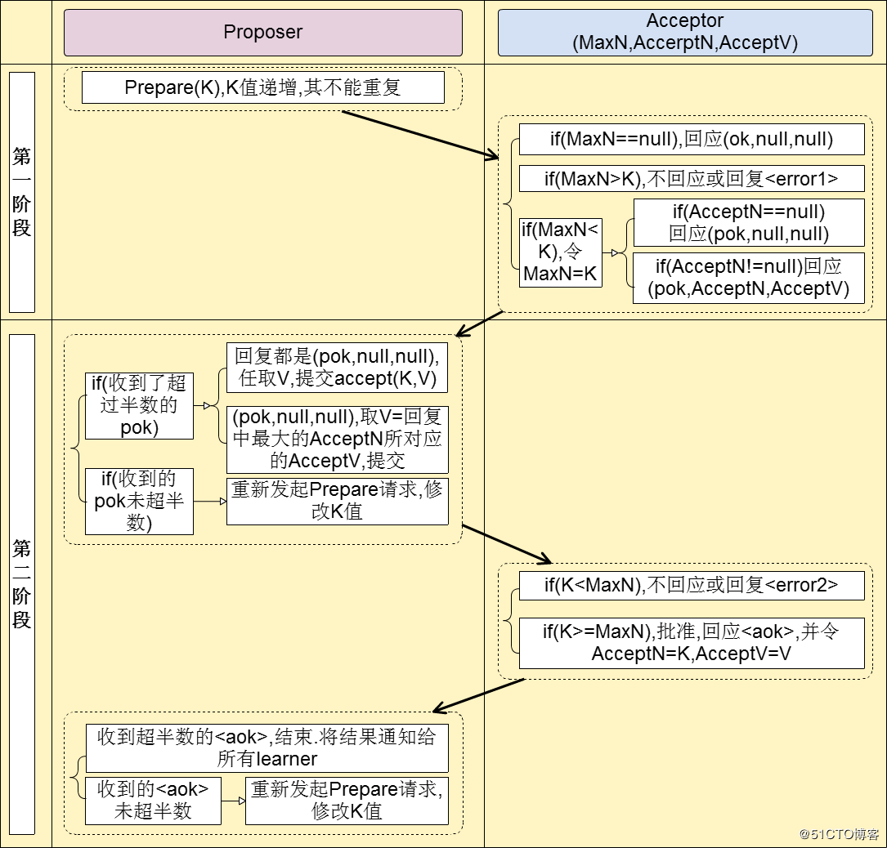

#### 1、2PC 与 3PC 
> 在跨多个节点执行事务时，为了保证事务处理的ACID特性，引入`协调者`、`参与者`的角色概念，参与者则是执行事务的各个节点，协调者则是负责调度参与者行为，并最终决定这些参与者是否要把事务真正进行提交的节点

##### 2PC（两阶段提交）：将事务执行分成了`投票`、`执行`两个阶段执行

> + 在`投票阶段`,协调者向所有参与者发送事务内容，询问各个参与者是否可以执行该事务，之后开始等待各个参与者的响应。
> + 各个参与者接收到事务内容后执行事务操作，并将`Undo`和`Redo`信息记入事务日志，注意此时各个参与者只是执行了事务，但是并未`Commit`
> + 如果参与者成功的执行了事务内容，则反馈`Yes`给协调者，表示可以执行事务；如果参与者没有成功执行事务内容，则反馈`No`给协调者表示事务不可执行；如果协调者在等待参与者响应时，等待超时，则认为该参与者反馈的结果是`No`。

> + 在`执行`阶段，协调者如果从所有的参与者得到的反馈结果都是`Yes`，则向所有的参与者发送`Commit`请求;如果任何一个参与者向协调者反馈了`No`，则向所有的参与者发送`Rollback`请求
> + 参与者在接收到协调者的信号（`Yes`、`Rollback`）后，如果是`Yes`，则提交事务，并在提交完成之后释放整个事务执行期间的所有事务资源；如果是`No`，则利用投票阶段中记录的`Undo`信息来执行回滚操作，回滚完成之后释放整个事务执行期间的所有事务资源。
> + 参与者在提交/回滚事务完成之后，向协调者发送`ACK`消息
> + 协调者接收到所有参与者的`ACK`消息之后，结束本次事务请求

##### 2PC的缺点
> + **同步阻塞**：在等待提交阶段，各个参与者都在等待其他参与者的事务执行反馈结果的过程中，无法进行其他任何操作，会一直处于同步阻塞状态

> + **单点问题**：提交阶段过渡依赖于协调节点，如果协调节点在进入提交阶段后挂掉，那么参与者将会一直处于锁定事务资源的状态，无法继续完成事务操作

> + **数据不一致**：在提交阶段，当协调向所有参与者发送`Commit`请求后，发生了网络分区，或者尚未发送完`Commit`请求之前协调者就挂掉了，导致部分参与者未能接收到请求，部分参与者接收到了请求，这样子会出现数据不一致现象发生。

##### 3PC（三阶段提交）：将事务执行分成了`CanCommit`、`PreCommit`、`DoCommit`三个阶段执行
> + 在`CanCommit`阶段，协调者向所有参与者发送一条包含事务内容的`CanCommit`请求，询问是否可以执行事务内容，并等待各个参与者的响应
> + 参与者接收到`CanCommit`请求后，根据自身情况反馈是否可以顺利执行事务内容，如果可以执行，则返回`Yes`，如果不可以执行，则返回`No`

> + 在`PreCommit`阶段 ，如果协调者接受到的所有参与者的反馈结果都是`Yes`，则向所有参与者节点发出`PreCommit`请求；如果任何一个参与者的反馈结果是`No`，则协调者向所有参与者节点发出`Abort`请求；如果协调者在等待参与者响应时，等待超时，则认为该参与者反馈的结果是`No`。
> + 参与者在接收到协调者请求后，如果是`PreCommit`，则执行事务内容，并将`Undo`、`Redo`信息记录到事务日志，最后根据执行结果`Yes`或`No`，反馈给协调者（注意此时事务并未执行`Commit`操作）；如果是`Abort`，或者在等待协调者请求时等待超过，则中断事务。

> + 在`DoCommit`阶段，如果`PreCommit`阶段，协调者向参与发出的请求时`Abort`，则不存在本阶段。
> + 如果协调者接受所有的参与者执行事务内容的反馈结果都是`Yes`,则发送`DoCommit`请求给所有参与者；如果任何一个参与者的事务内容执行的反馈结果是`No`，则协调者向所有参与者发送`Abort`请求；如果协调者在等待参与者响应时，等待超时，则认为该参与者事务内容执行的反馈结果是`No`
> + 参与者在接收到协调者请求（`DoCommit`或者`Abort`）后，如果是`DoCommit`，则执行事务提交，并在事务提交完成之后释放整个事务执行期间的所有事务资源；如果是`Abort`，则根据`PreCommit`阶段中的`Undo`信息来执行回滚操作，回滚完成之后释放整个事务执行期间的所有事务资源；**如果参与者在等待协调者请求时，等待超过，则继续执行事务提交。**

##### 3PC的优点
> + 降低了参与者的阻塞范围，利用`CanCommit`阶段，一定程度的降低了由于部分参与者执行事务失败带来的无效阻塞

> + 解决了单点问题，即使`DoCommit`阶段，协调者挂掉了，参与者也能执行事务提交，不会出现参与者一直处于锁定事务状态中的情况

##### 3PC的缺点
> + **数据不一致**：在`PreCommit`阶段，所有的参与者都接收到协调者的`PreCommit`请求后，出现网络分区。协调者由于网络分区接收不到部分参与者的事务内容执行反馈结果，故在`DoCommit`阶段向所有参与者发出的请求是`Abort`。然而这部分网络隔离的参与者由于无法与协调者通信，也意味着无法接受协调者在`DoCommit`阶段的请求。最后，因为在`DoCommit`阶段，参与者等待协调者请求超时后就会自行执行事务提交，必然导致数据不一致状态。

#### 2、PAXOS协议
+ `Paxos`协议算法中，有三种角色：`Proposer`（提议者）、`Acceptor`（接受者）、`Learners`（学习者）。每个节点的角色不是唯一的，可能同时充当多种角色。

+ `Proposer`提出提案，提案包括提案内容（V）和提案编号（N），只要提出的提案被半数以上的`Acceptor`同意，才认为该提案被选中。

+ `Acceptor`负责对`Proposer`提出的提案进行表决，只有当`Proposer`提出的提案的编号大于自己目前已经接收的最大提案编号，才会认同该提案，做出响应给`Proposer`。否则，不做出任何响应，即否决该提案。

+ `Learner`向`Aceeptor`学习哪个提案被选中，`Acceptor`告诉`Learner`哪个提案被选中，`Learner`就认为哪个提案被选中（类似于ZK中的 `Observer` 节点，不参与选举，只对最终选举的数据复制，为提高集群的吞吐量而存在）

> Paxos算法分为两个阶段
> + **第一阶段**，`Propeser`发送一个提案编号给所有的`Acceptor`，如果`Acceptor`从未接收过任何提案，则返回响应给`Proposer`；如果`Acceptor`之前接收过提案，则分两种情况：如果`Proposer`提出的提案编号大于`Acceptor`之前接收的最大提案编号，则返回附带自己目前已经接收的提案（包括提案内容和提案编号）的响应，并更新自己目前已接收的最大提案编号；如果`Proposer`提出的提案编号小于或者等于`Acceptor`之前接收的最大提案编号，则不作出任何响应。
> + **第二阶段**，如果`Proposer`收到了超过半数的`Acceptor`响应，选取响应中提案编号最大的提案内容作为本次提案的内容，发送给所有`Acceptor`。如果所有响应的`Acceptor`回复的响应都不附带提案，则选取自己认为的值作为提案内容，发送给所有的`Acceptor`。如果`Proposer`未收到超过半数的`Acceptor`响应，则修改提案编号，回退到第一阶段。
> + **第二阶段**，`Acceptor`对于`Proposer`发过来的提案，如果提案编号大于或等于自己目前已经接受的最大提案编号，则回复响应，并修改自己目前已接受的提案。否则不作出任何响应
> + **第二阶段**，如果`Proposer`未收到超过半数的`Acceptor`响应，则提案未通过，修改提案编号，回退到第一阶段。如果超过半数，则认为该提案被选定
> + **备注**：对于在所有的`Proposer`来说，提案编号是不重复，并且递增的。

#### 3、ZAB协议
+ ZAB协议是为分布式协调服务`Zookeeper`专门设计的一种支持`消息广播`、`崩溃恢复`的协议。基于该协议，`Zookeeper`实现了一种`主备模式`的系统架构，来保持集群中各个副本之间的数据一致性，所谓`主备模式`的系统架构即一个节点负责处理外部的写请求，该节点称为`Leader`节点，然后`Leader`节点将数据同步到其他`Follower`节点。`ZAB`协议包括两种基本模式：`消息广播`、`崩溃恢复`。
+ 为了保证各个节点之间的数据一致性，`ZAB`协议保证：**那些已经在 Leader 节点上提交的事务最终会被所有服务器提交**、**丢弃那些只在 Leader 节点上提出/复制，但没有提交的事务**

#### 4、ZAB协议之消息广播
+ `Leader`节点接收到一个客户端写请求，`Leader`节点将该写请求包装为一个事务`Proposal`，并且附带事务ID——`ZXID`（ZXID是一个64位的数字，高32位表示`epoch`，即集群年代，每发生一次选举，该`epoch`就递增1，并且将低32位归零。低32位表示事务ID，每次事务递增1），将事务在本地执行，记入本地事务日志，并不提交，同时将事务内容发送给所有的`Follow`节点（称之为数据复制）

+ `Follow`节点接收到事务后，开始执行事务，记入本地事务日志，并不提交，执行完成后，回应`ACK`给`Leader`节点

+ `Leader`接收到超过半数`Follower`的`ACK`后，提交自己本地的事务，同时并发送`Commit`消息给`Follow`节点，`Follow`节点收到`Commit`消息后，提交事务（称之为提交）

+ 此外，`Leader`节点为每个`Follower`节点分配一个单独的队列，然后将需要广播的`Proposal`依次放到队列中去，并且根据`FIFO`策略进行消息发送。该过程类似于`2PC`，但是通过队列、超过半数`ACK`回应机制解决了 2PC 的同步阻塞问题。

#### 4、Zookeeper Leader选举过程
+ 当集群启动时，或者运行过程中，`Leader`节点挂了，集群就会发起新一轮的`Leader`选举。`Leader`选举要求：**新选举的 Leader 节点中含有最大的 zxid**、**新选举出来的 Leader 不能包含未提交的 Proposal**。（*注意：当`Leader`节点收到超过半数的`Ack`确认后，会在提交本地事务的同时，发送`Commit`消息给所有`Follow`，如果此时`Leader`节点挂了，要不本地事务未执行并没有一个`Commit`发送出去，要么本地事务执行了并且会有部分`Follow`收到了`Commit`命令*）

+ 在选举过程中，每个节点的状态有三种：`LOOKING`(无`Leader`产生，观望状态)、`LEADING`（当前节点就是选举出来的Leader节点）、`FOLLOWING`（已有Leader节点产生，但不是当前节点）

+ 选举规则：**选举过程中，ZXID越大、编号越大的节点权重越大**

+ 在选举开始时，每个节点都期待自己能够成为`Leader`节点，自己将票投给自己，则向与自己网络互通的其他节点发送自己的投票信息`（节点编号，ZXID）`，进行拉票。同时，接收其他节点发的投票信息（也是（节点编号，zxid）形式的数据，只不过节点编号是对方的编号），节点接下来就是将接收到其他节点的投票与自己的投票进行对比，根据选举规则，选取出ZXID最大或者ZXID相同时，节点编号最大的投票，如果选取出来的投票结果不是自己，则更改自己的投票，重新向其他网络互通的节点发送投票信息，即更新自己的投票信息，表示自己将票投给指定节点。上述即一次投票过程，`Leader`选举过程包含至少一次投票过程，每次投票完成后，节点都会根据接收到的投票和自己的发出去的投票统计，如果有超过半数节点的投票信息一样，则该投票信息中的节点编号指向的机器就是`Leader`节点。选举`Leader`过程中，集群不能对外界提供服务

+ 每次选举出新的`Leader`节点后，所有节点就会进入数据同步状态，也称之为数据恢复状态。`Leader`与`Follow`节点之间根据`ZXID`进行数据同步，一个`Follow`节点的数据与`Leader`一致时，`Leader`将该`Follow`节点列入可用的`Follower`节点列表中。此时，`Leader`节点、可用的`Follower`节点可以对外提供服务

#### 5、Zookeeper数据存储

+ 节点类型：**持久化节点**、**持久化顺序节点**、**临时节点**、**临时顺序节点**

+ 单个节点包含：**节点数据data**、**节点ACL信息**（create—创建子节点权限、read—读取节点数据和子节点列表权限、write—更新节点数据权限、delete—删除子节点权限、admin—设置节点ACL权限）、**节点版本信息Stat**（version—当前节点版本、cversion—当前节点子节点版本、aversion—当前节点ACL版本）、**子节点列表**（指向其各个子节点的指针）

+ Zookeeper在运行时会在内存中维护一个完整的数据，就像内存数据库一样。Zookeeper的内存数据库叫做`ZKDatabase`，负载管理Zookeeper的会话、存储和事务日志。它会定期dump一份数据快照到硬盘上，在Zookeeper启动时根据这个快照数据和事务日志来加载一份完整的数据到内存

#### 7、Zookeeper如何处理脑裂（网络分区）情况
+ 解决脑裂的常用思路
1. `Quorums`（法定人数法）：通过设定法定人数，进而确定集群的容忍度，当集群中存活的节点少于法定人数时，集群将不可用，比如5个节点组成的集群，法定人数为3，3个节点组成的集群，法定人数为2

2. `Redundant Communications`（冗余通信）：集群节点之间采用多种通信机制，防止一种通信方式失效导致集群节点之间无法通信

3. `Fencing`（共享资源）：通过共享资源的方式，将所有共享资源添加到集群中，能够对共享资源进行写操作（即加锁）的节点就是`Leader`节点

+ `Zookeeper`采用了`Quorums`方式：当出现网络分区时，假设有两个分区：分区A和分区B，分区A的节点数超过半数，分区B的节点数不超过半数。

+ 如果`Leader`节点在分区A，因为分区A有大多数节点存在，所以分区A仍然可以对外正常提供服务。对于分区B，因为分区B中的从节点失去了和`Leader`节点之间的联系，因此会发起投票选举，但是由于分区B的节点数不过半，会导致选举一直结束不了，分区B对外不可用。

+ 如果`Leader`节点在分区B，分区B接受到写请求后，`Leader`节点分发请求给从节点，由于分区B的节点数不过半，因此收不到过半数的`Ack`，因此一直无法提交。对于分区A，因为分区A中的从节点失去了和`Leader`节点之间的联系，因此发起投票选择，因为分区A中的节点数过半，所以能选出一个新的`Leader`节点，继续对外提供服务。

+ 当网络分区消失后，如果出现了两个`Leader`节点，那么这两个`Leader`节点会进行对比`epoch`值，如果自己的`epoch`值小于对方的`epoch`，则回滚分区产生后、分区消失前提交的写请求，变为`Follower`节点，与新的`Leader`节点之间进行数据同步。

#### 6、Zookeeper如何实现Master选举
+ 所有的节点向Zookeeper上的同一个路径创建一临时个节点，由于只能有一个创建成功，则创建成功的节点即为`Master`节点，其余未创建成功的节点则注册一个该`Master`节点的`Watcher`，用于监控当前`Master`节点是否存活，如果`Master`节点挂了，则重新发起一轮选举`Master`流程

#### 7、Zookeeper如何实现分布式锁
+ 排它锁的实现类似于`Master`选举，只不过不同的是，当使用结束后，锁的持有者可以手动通过删除节点来释放锁，其他节点监控到锁被删除，则发起抢锁

+ 对于共享锁，则在一个节点下，创建临时顺序节点（通过节点名称标注该节点是读请求节点，还是写请求节点），并监控该节点下所有序列节点。对于读请求，如果没有序列号比自己小的节点，或者比自己小的节点都是读节点，则表示加锁成功，否则需等待。对于写请求，如果没有序列号比自己小的节点，则表示加锁成功，否则加锁失败。解锁操作和排他锁处理方式一样