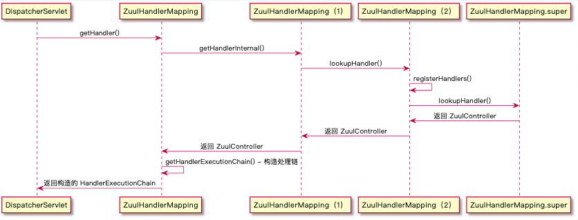
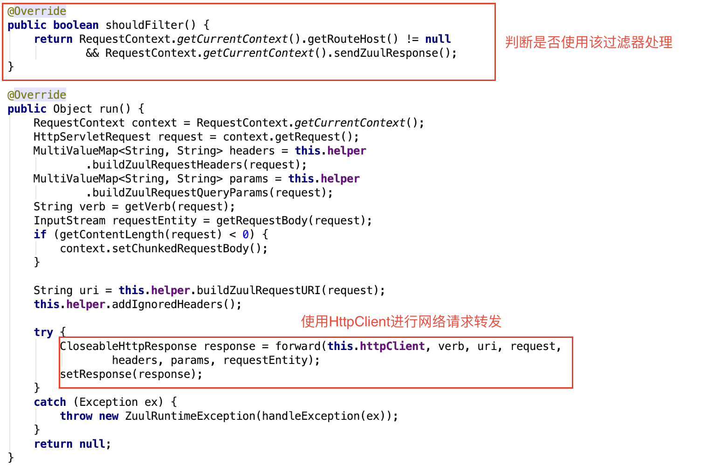

# 网关之`Zuul 1.X`实现原理分析

在现有系统设计中，网关用到的很多，不仅仅用于反向代理，还可用于限流、黑白名单、负载均衡等，用到的最多的如`nginx`。但在微服务架构设计中，针对服务接口层，还会前置一层网关，用于针对服务进行管理，在SpringCloud全家桶里，作为网关用的最多的是`Zuul`，下面将结合具体的示例来分析`Zuul`的实现原理。

## 示例Demo

### **`pom`配置引入 `zuul` 组件**
```xml
<dependency>
    <groupId>org.springframework.boot</groupId>
    <artifactId>spring-boot-starter-actuator</artifactId>
</dependency>
<dependency>
    <groupId>org.springframework.cloud</groupId>
    <artifactId>spring-cloud-starter-netflix-zuul</artifactId>
</dependency>
```

### **`application.properties`添加路由配置**
```
zuul.routes.custom-url.path=/csdn
zuul.routes.custom-url.url=https://blog.csdn.net
```

### **启动类添加`@EnableZuulProxy`注解**
```java
@EnableZuulProxy
@SpringBootApplication
public class SpringCloudZuulDemoApplication {

    public static void main(String[] args) {
        SpringApplication.run(SpringCloudZuulDemoApplication.class, args);
    }
}
```
## 执行过程
在浏览器中，输入`http://127.0.0.1:8080/csdn`，将会看到响应页面是`https://blog.csdn.net`网址的界面，也就是`zuul`将请求转发到了`https://blog.csdn.net`。

## 实现分析

`Zuul 1.x` 的实现是基于`Servlet`架构来实现的，也就是走的`BIO`模式，并非目前流行的`NIO`模式。上述示例在启动时，通过`ZuulServerAutoConfiguration`自动配置类向`Spring`中注入一个叫做`ZuulHandlerMapping`的组件


该组件用于在`DispatcherServlet`的处理流程中，对外部过来的请求进行拦截、处理、转发、以及响应。`DispatcherServlet`的处理流程如下


在根据请求获取对应的处理过程中，有如下处理
```java
protected HandlerExecutionChain getHandler(HttpServletRequest request) throws Exception {
    if (this.handlerMappings != null) {
        for (HandlerMapping mapping : this.handlerMappings) {
            //从 ZuulHandlerMapping 中获取对应的Handler，即 ZuulController
            HandlerExecutionChain handler = mapping.getHandler(request);
            if (handler != null) {
                return handler;
            }
        }
    }
    return null;
}
```
后续与`ZuulHandlerMapping`交互的具体过程如下所示


从上图中，可以看出最为关键的两步分别是`registerHandlers()`、`lookupHandler()`。`registerHandler()`是根据`application.properties`中的路由配置信息注册路径与处理器的映射，`lookupHandler()`则是根据请求的路径来获取对应的处理器-`ZuulController`。

在`registerHandlers()`中的具体实现如下
```java
private void registerHandlers() {
    Collection<Route> routes = this.routeLocator.getRoutes();
    if (routes.isEmpty()) {
        this.logger.warn("No routes found from RouteLocator");
    }
    else {
        for (Route route : routes) {
            registerHandler(route.getFullPath(), this.zuul);
        }
    }
}
```
这里以`Route`对象的`fullPath`字段为`key`，`ZuulController`为`value`存入到路径->处理映射中，`Route`对象的定义如下所示，所有的字段值均来自我们在`application.properties`中定义的配置。*（两者并不完全等同，因为`application.properties`中的配置对应于`ZuulProperties`对象，到`Route`对象中间有一些转换操作）*


弄清楚映射关系后，最终所有的请求都会交给`ZuulController`来处理，在`ZuulController`中的处理如下


其中，在`ZuulServlet.init()`中，则将请求对象-`HttpServletRequest`、响应对象-`HttpServletResponse`存入到以`ThreadLocal`形式保存的`RequestContext`对象中。


至于`preRoute()`、`route()`、`postRoute()`这是三个方法执行，均是交给了`FilterProcessor`的`runFilters()`方法执行，这三个方法唯一的区别是入参不同，具体的对应关系如下
方法|preRoute(..)|route(..)|postRoute(..)
-|-|-|-
入参|pre|route|post
`FilterProcessor`的`runFilters()`方法实现如下所示
```java
public Object runFilters(String sType) throws Throwable {
    if (RequestContext.getCurrentContext().debugRouting()) {
        Debug.addRoutingDebug("Invoking {" + sType + "} type filters");
    }

    boolean bResult = false;
    List<ZuulFilter> list = FilterLoader.getInstance().getFiltersByType(sType);
    if (list != null) {
        for(int i = 0; i < list.size(); ++i) {
            ZuulFilter zuulFilter = (ZuulFilter)list.get(i);
            Object result = this.processZuulFilter(zuulFilter);
            if (result != null && result instanceof Boolean) {
                bResult |= (Boolean)result;
            }
        }
    }

    return bResult;
}
```
即根据入参 `sType` 来获取对应的`ZuulFilter`过滤器列表，遍历这些过滤器，对`HttpServletRequest`、`HttpServletResponse`对象进行处理。具体的调用执行链如下

```java
FilterProcessor.processZuulFilter(...)

               |
               v

      ZuulFilter.runFilter()

               |
               v

        ZuulFilter.run()
```
`ZuulFilter`是一个抽象类，有很多实现子类，对应于各个维度的过滤处理，如`SendForwardFilter`(应用内请求转发)、`RibbonRoutingFilter`(负载均衡处理转发)、`SimpleHostRoutingFilter`(网络请求转发)，所有的实现子类如下

继承 `ZuulFilter` 需要实现以下接口
```java
public class CustomZuulFilter extends ZuulFilter {
    @Override
    public String filterType() {
        //返回过滤器类型，pre、route、post
        return null;
    }

    @Override
    public int filterOrder() {
        //返回过滤器处理的优先级
        return 0;
    }

    @Override
    public boolean shouldFilter() {
        //是否对进来的 HttpServletRequest、HttpServletResponse 进行处理
        return false;
    }

    @Override
    public Object run() throws ZuulException {
        //对进来的 HttpServletRequest、HttpServletResponse 进行处理
        return null;
    }
}
```
本文示例Demo中用到的`ZuulFilter`是`SimpleHostRoutingFilter`，具体的实现如下所示


## 备注
在最新的`SpringCloud`版本中，已经采用`SpringCloud Gateway`来代替了`Zuul 1.x`。`SpringCloud Gateway`用`Webflux`响应处理模型替换了`Servlet`线程模型，底层采用基于`netty`的`NIO`模式来实现，性能方面要优于`Zuul 1.x`。最后，值得一说的是`Zuul 2.x`也改用了基于`NIO`模式来实现，但并未集成到`SpringCloud`方案中。

## 引用

+ [SpringCloud Gateway](https://www.cnblogs.com/crazymakercircle/p/11704077.html)
