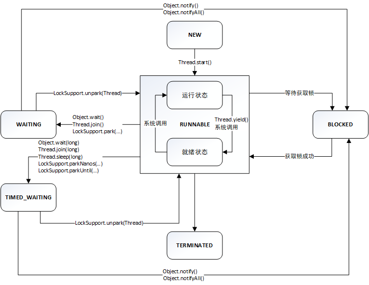
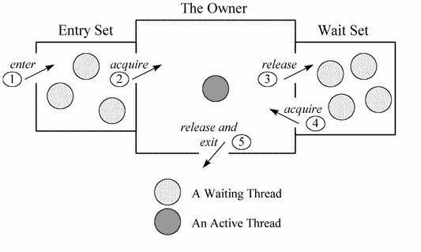
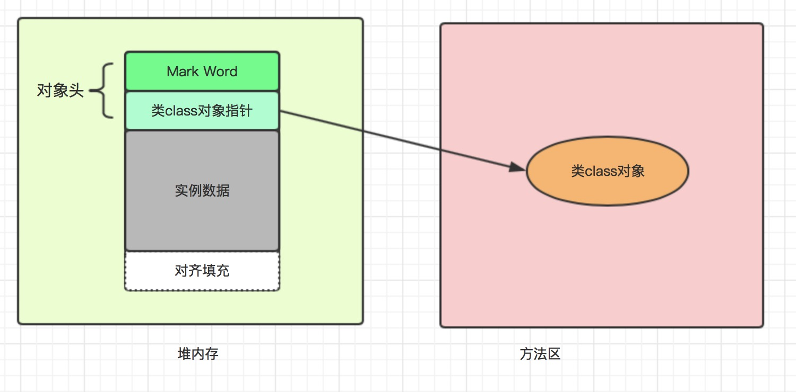
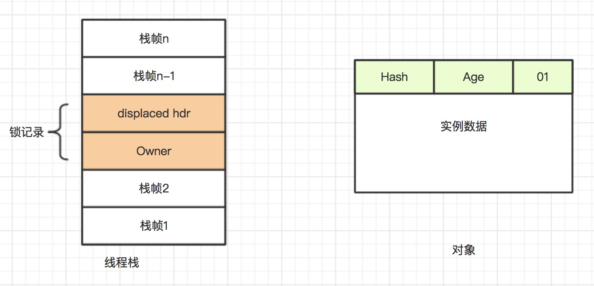
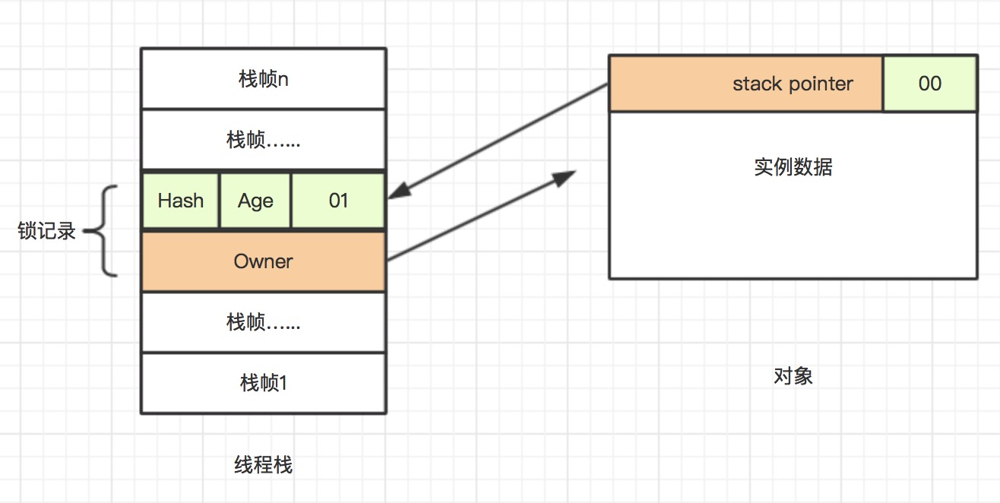
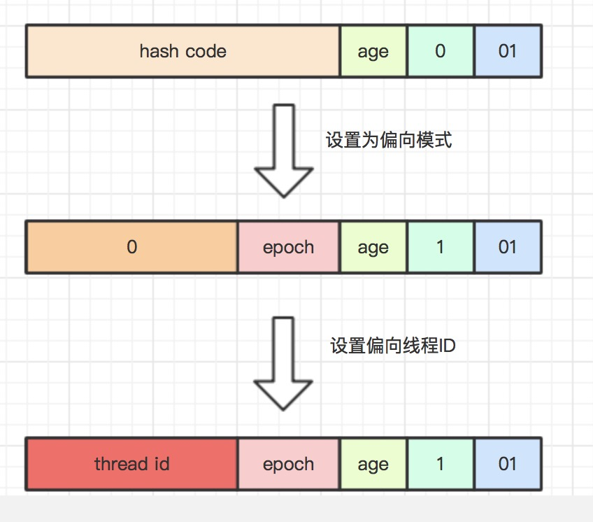
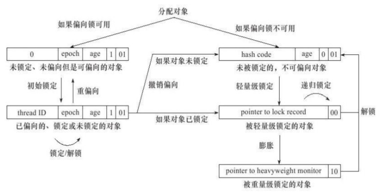

## Java多线程之`synchronized`
多线程环境下，涉及到对于临界区代码的并发访问，有多种同步策略，其中`synchronized`作为最原始的一种同步访问策略存在已久。相比于`API`层面的`Lock`锁，`synchronized`是基于指令的语义层面的一种同步机制，通过在字节码中插入`monitorenter`、`monitorenter`指令来实现，相关使用以及具体实现会在下面阐述。
#### `synchronized` 三种使用场景
+ 锁定对象，对一个对象进行加锁
```java
public class Console {

    public static void main(String[] args) {

        Console console = new Console();

        synchronized (console) {

            System.out.println("hello, world");

        }
    }

}
```
锁定一个具体的实例对象，在锁定的代码块中，同一时间，最多只有一个线程能进来执行，其他线程在代码块外阻塞等待

+ 锁定实例方法，对具体的实例方法加锁
```java
public class Console {

    public synchronized void doSomeThing() {

        System.out.println("hello,wolrd");

    }

}
```
锁定一个具体的实例方法（其实锁定的是当前对象），同一时间，最多只有一个线程能进来执行，其他线程方法外阻塞等待

+ 锁定静态方法，对静态方法加锁
```java
public class Console {

    public synchronized static void doSomeThing() {

        System.out.println("hello,wolrd");

    }

}
```
与锁定实例方法不同，锁定静态方法是对当前类的`class`对象加锁，同样同一时间，最多只有一个线程能进来执行，其他线程方法外阻塞等待，和如下示例等同
```java
public class Console {

    public static void doSomeThing() {

        synchronized(Console.class) {
            System.out.println("hello,wolrd");
        }
    }

}
```

#### `synchronized` 与 `wait/notify`机制
+ 当一个线程持进入到`synchronized`修饰的代码块，即表示该线程持有`锁`，在执行完同步代码块之前，其他线程只能在同步代码块外阻塞等待，并且这个等待是无限等待。

+ 如果这个线程在持有锁期间，想要释放当前持有的锁，可以借助`wait/notify`机制实现。在锁定代码块中，通过调用锁定对象的`wait()`方法，当前线程会释放所持有的锁，这样其他线程能够获取到锁。

+ 当线程在锁定代码中调用`wait()`方法后，线程会进入`WAITING`状态，等待唤醒，如果需要唤醒该线程，则需要其他获得锁的线程调用锁定对象的`notify()`或者`notifyAll()`。

具体代码如下所示
```java
public class Console {

    public static void main(String[] args) throws InterruptedException {
        Console console = new Console();

        Thread t1 = new Thread(() -> {
            synchronized (console) {

                try {

                    System.out.println("start......");
                    console.wait();
                    System.out.println("end......");

                } catch (InterruptedException e) {
                    e.printStackTrace();
                }

            }
        });
        t1.start();

        TimeUnit.SECONDS.sleep(1);

        Thread t2 = new Thread(() -> {

            synchronized (console) {

                System.out.println("new start......");
                console.notify();
                System.out.println("new end......");

            }

        });
        t2.start();
    }

}
```
输入如下
```
start......
new start......
new end......
end......

Process finished with exit code 0
```
备注：在调用锁定对象`wait()`方法时，需要确保该线程已经持有锁，更确切的来说是必须在同步代码块内调用`wait()`方法，否则会抛出`java.lang.IllegalMonitorStateException`异常，如下代码所示
```java
public class Console {

    public static void main(String[] args) throws InterruptedException {
        Console console = new Console();
        console.wait();
    }

}
```
输入如下
```java
Exception in thread "main" java.lang.IllegalMonitorStateException
	at java.lang.Object.wait(Native Method)
	at java.lang.Object.wait(Object.java:502)
	at Console.main(Console.java:9)

Process finished with exit code 1
```

*释放当前锁不仅可以通过调用`wait()`方法释放，也可以通过*`wait(long timeout)`方法释放，只不过`wait(long timeout)`方法不同的是，线程调用该方法后，进入`TIMED_WAITING`（有限等待）状态，如果等待超时则退出`TIMED_WAITING`（有限等待）状态，重新抢锁，如果抢锁失败，则进入`BLOCKED`（阻塞）状态，关于线程的状态变化可参考下图


#### `synchronized` 底层实现
在字节码层面，`synchronized`经过编译后，会在同步块前后分别形成`monitorenter`、`monitorexit`两个字节码指令，这两个字节码指令将同步代码块包围起来，如下所示Java代码
```java
public void test() {

    synchronized (this) {

        System.out.println();

    }
}
```
经过编译后的字节码如下所示

```
public test()V
    TRYCATCHBLOCK L0 L1 L2 null
    TRYCATCHBLOCK L2 L3 L2 null
   L4
    LINENUMBER 9 L4
    ALOAD 0
    DUP
    ASTORE 1
    MONITORENTER            //表示同步代码块的开始
   L0
    LINENUMBER 11 L0
    GETSTATIC java/lang/System.out : Ljava/io/PrintStream;
    INVOKEVIRTUAL java/io/PrintStream.println ()V
   L5
    LINENUMBER 13 L5
    ALOAD 1
    MONITOREXIT             //表示同步代码块的结束
   L1
    GOTO L6
   L2
   FRAME FULL [Console java/lang/Object] [java/lang/Throwable]
    ASTORE 2
    ALOAD 1
    MONITOREXIT             //如果同步代码块执行中抛异常，也会结束
   L3
    ALOAD 2
    ATHROW
   L6
    LINENUMBER 14 L6
   FRAME CHOP 1
    RETURN
   L7
    LOCALVARIABLE this LConsole; L4 L7 0
    MAXSTACK = 2
    MAXLOCALS = 3
}
```
此外，`monitorenter`、`monitorexit`这两个字节码指令都需要一个`reference`类型的参数来指明要锁定和解锁的对象，也就是我们传递进入的锁定对象。如果`java`程序中的`synchronized`明确指定了对象参数，那就是这个对象的`reference`，如果没有明确指定，那就根据`synchronized`修饰的是实例方法还是静态方法，去取对应的对象实例或`class`对象来作为锁定对象。（*摘自<<深入理解Java虚拟机>>*）

上面只是`synchronized`关键词在字节码层面的实现，在JVM内部执行时，每一锁定对象都有一个`ObjectMonitor`对象在JVM底层与之对应，关于`ObjectMonitor`对象的内部数据结构如下所示：
```c
ObjectMonitor() {
    _header       = NULL;//markOop 对象头
    _count        = 0;
    _waiters      = 0,// 等待线程数
    _recursions   = 0;// 重入次数
    _object       = NULL;// 监视器锁寄生的对象. 锁不是平白出现的, 而是寄托存储于对象中.
    _owner        = NULL;// 指向获得 ObjectMonitor 对象的线程或基础锁
    _WaitSet      = NULL;// 处于 wait 状态的线程, 会被加入到 waitSet;
    _WaitSetLock  = 0;
    _Responsible  = NULL;
    _succ         = NULL;
    _cxq          = NULL;
    FreeNext      = NULL;
    _EntryList    = NULL;// 处于等待锁 block 状态的线程, 会被加入到 entryList;
    _SpinFreq     = 0;
    _SpinClock    = 0;
    OwnerIsThread = 0;
    _previous_owner_tid = 0;// 监视器前一个拥有者线程的 ID
}
```
*因为JVM底层使用C++来实现的，所以上述是C++代码*

如上述结构所示，其中，
+ `_object`指向了当前锁定对象，如果`synchronized`有指定对象实例，则该`_object`就指向该对象实例，如果`synchronized`修饰的是实例方法或者静态方法，则`_object`指向的就是实例对象或者`class`对象。
+ `_owner`指向了获得锁的线程

+ `_recursions`表示当前持有锁的线程的重入次数，因为`synchronized`是可重入的，所以每进入一次同步代码块，该属性就会+1，每退出一次同步代码块，该属性就会-1，当线程释放锁时，该属性的值为0

+ `_WaitSet`表示处于等待状态（`WAITING`、`TIMED_WAITING`）的线程集合，是一个`Set`结构

+ `_EntryList`表示处于阻塞状态（`BLOCKING`）的线程集合，是一个`Set`结构

`_EntryList`、`_WaitSet`、`_owner`之间的转换如下所示


如上图所示，有两个集合`_EntryList`、`_WaitSet`，用保存等待获取锁的线程集合，`_owner`指向当前持有锁的线程。
+ 当多个线程同时访问同步代码块时，如果当前锁未被任何线程持有，则会尝试获取锁，如果获取成功，则会将`_owner`指向自己，如果获取失败，则进入`_EntryList`集合，进入`BLOCKING`状态。如果当前锁已经被其他线程持有，则直接进`_EntryList`集合，进入`BLOCKING`状态。
+ 如果在持有的线程在执行期间，调用了`wait()`或者`wait(long timeout)`方法，则会释放锁，对`_owner`属性进行复位，然后进入`_WaitSet`集合，等待被唤醒或者等待超时。

+ 如果`_WaitSet`集合中的线程等待超时，则会在超时之后尝试获取锁，如果获取失败，将会进入`_EntryList`集合等待，此时线程状态是`BLOCKING`状态

#### `synchronized` 与对象头
在JVM中，对象在堆内存中的布局分为三块：对象头、实例数据、对齐填充。其中，对象头存储着与该对象相关的元数据（如指向方法区类`class`对象的指针）、`HashCode`、`GC`分代年龄、以及当前对象的锁定状态等；实例数据则是存储着对象真正的数据，包括父类继承过来的字段，以及自身定义的字段；对齐填充是因为JVM中要求每个对象的内存空间大小必须为8字节的整数倍，如果对象头和实例数据加一起已经是8字节的整数倍，则不存在对齐填充来补全。其中，对象头内部还分为两部分数据：第一部分用于存储对象的`HashCode`、`GC`分代年龄、锁状态等，被称为`Mark Word`，第二部分用于存储指向方法区类`class`对象的指针。（如果当前对象是数组对象的话，还会有第三部分用于存储数组长度），具体的对象内部布局结构如下图所示：


关于`Mark Word`这部分在32位的JVM、64位的JVM中，所占的内存空间大小是不一样的，32位JVM中`Mark Word`内存大小是32`bit`，64位JVM中`Mark Word`内存大小是64`bit`。因为需要在`Mark Word`中存储的数据有很多，已经超过了32`bit`或者64`bit`，所以`Mark Word`被设计成了一个不固定的数据结构以便能够在这个固定的空间里存储更多的信息。下面是对象在各种状态下，`Mark Word`的内部存储结构图（以32`bit Mark Word`为例）

锁状态|25`bit`|4`bit`|1`bit`（是否偏向）|2`bit`（锁标志）
-|-|-|-|-
无锁状态|对象的`HashCode`|对象分代年龄|0|01
偏向锁|线程ID + `epoch`|对象分代年龄|1|01

***

锁状态|30`bit`|2`bit`（锁标志）
-|-|-
轻量级锁|指向栈中锁记录的指针|00
重量级锁|指向互斥量(重量级锁)的指针|10
`GC`标志|空|11

#### 重量级锁

上面讲述了关于对象内存结构以及`Mark Word`的内存结构，那么这些和`synchronized`有什么关系呢，尤其是`Mark Word`？ 在`Mark Word`中，有个关键字段：**锁标志**，始终存在，不管对象是处于什么状态，这个锁状态就是和`synchronized`相关。当通过`synchronized`对
一个对象加锁时，`Mark Word`会变成如下所示状态：
锁状态|30`bit`|2`bit`（锁标志）
-|-|-
重量级锁|指向互斥量(重量级锁)的指针|10

锁标志位变为`10`，表示此时对象处重量级锁状态，前30`bit`存储着指向互斥量的指针，这个互斥量可以理解为就是我们上文中提到的`ObjectMintor`。

#### 轻量级锁

从重量级锁字面意义上，就能够理解到`synchronized`是一种比较耗性能的锁机制，耗性能是因为加锁和解锁的过程需要内核介入，需要在内核态和用户态之间进行来回切换。即使对于同一时间，只有一个线程获取锁也是一样。其实在大部分并发场景下，同一时刻发起获取锁的只有一个线程，并没有多线程去同时竞争锁。为了优化这种情况，引入了轻量级锁的概念。

轻量级锁即在线程获取锁时，如果锁定对象此时处于无锁状态（锁标志位是`01`），则首先在获取锁的线程的栈帧中建立一个名为锁记录的空间，用于存储锁定对象目前`Mark Word`的拷贝（称之为`Displaced Mark Word`），然后通过`CAS`操作，将对象`Mark World`的前30`bit`指向栈中的锁记录，同时将锁标志改为`00`，一旦操作成功，则表示获取到了线程获取到了锁，对象处于轻量级锁状态。如果操作失败，JVM首先会检查对象的`Mark Word`是否指向当前线程的栈帧，如果是，则表明当前线程之前已经获取了这个对象的锁，直接进入同步代码块继续执行。否则表示有其他线程也在竞争获取锁，则表示获取锁失败，膨胀为重量级锁。轻量级锁的转换如下图所示

**轻量级锁定之前如下所示**

**轻量级锁定之后如下所示**



上述是轻量级锁的加锁过程，轻量级锁的解锁过程也是通过`CAS`操作来进行的，如果对象的`Mark Word`仍然指向线程的锁记录，即表示此时处于轻量级锁状态，通过`CAS`操作把对象当前的`Mark Word`和线程中复制的`Displaced Mark Word`替换回来。*轻量级锁仅仅在锁定对象处于无锁状态，且同一时刻只有一个线程去获取锁的情况下有效，一旦在此期间存在其他线程尝试去获取锁，轻量级锁状态会被打破，膨胀为重量级锁。*

#### 偏向锁

在轻量级锁中，每次线程进入同步代码块时，都需要进行`CAS`操作以及检查锁定对象的`Mark Word`是否指向当前线程的栈帧。对于多次重入同步代码块场景，频繁的重入同步代码块背后的频繁`CAS`操作以及检查锁定对象的`Mark Word`是否指向当前线程的栈帧，会带来一定的性能损耗，对于这种情况，偏向锁就出现了，对于持有轻量级锁的线程频繁重入同步代码块的情况进行了性能优化。

当锁定对象第一次被线程获取时，JVM会将`Mark Word`中的锁标志位设置为`01`、是否偏向位设置为`1`，即表示偏向模式。同时使用`CAS`操作把获取锁的线程的ID记录在对象的`Mark Word`中，如果操作成功，则表示线程获取锁成功，之后持有偏向锁的线程每次进入同步代码块时，JVM都不会再进行任何同步操作。相比轻量级锁，偏向锁只使用了一次`CAS`操作。偏向锁加锁过程如下所示：
**偏向锁加锁过程**


与轻量级锁一样，当有另外一个线程尝试获取锁时，偏向模式宣告结束，根据锁定对象目前是否处于被锁定状态，撤销偏向后恢复到未锁定状态，或者恢复到轻量级锁定状态，后续的同步操作就如同上面轻量级锁那样执行。偏向锁、轻量级锁状态转化、以及对象`Mark Word`变化如下


*偏向锁在`JDK1.6`以及`JDK1.6`以后的版本中可用，默认开启，可以通过添加启动参数`-XX:-UseBiasedLocking`关闭。偏向锁和轻量级锁一样，可以提高有同步但无多线程竞争的程序性能。但是对于锁总是同时被多个线程获取访问场景，偏向锁、轻量级锁就是多余的，因为这种场景下，总会膨胀到重量级锁，关闭偏向锁优化反而可以提升性能*

#### 自旋锁
在使用`synchronized`进行加锁，同步多线程并发访问时，未获取到锁的线程会进入阻塞状态，也就是挂起状态，当持有锁的线程释放锁之后，需要唤醒那些在阻塞、等待获取锁的线程。因为`Java`的线程是映射到操作系统的原生线程之上的，因此阻塞或者唤醒一个线程需要操作系统来完成，需要从用户态转换为内核态，状态上下文的切换需要耗费很多的处理器时间。

实际在大多数应用上，共享数据的锁定状态只会持续很短一段时间，为了这段时间去挂起或者恢复线程不是很值得，因此引入了自旋锁的概念。通过添加启动参数`-XX:+UseSpining`来开启自旋锁（JDK6以及JDK6以上的版本默认开启），当一个线程获取锁失败时，不会立刻放弃CPU的执行时间，而是自旋等待一段时间，每自旋一次后就尝试获取一次锁，如果超过限定的自旋次数后仍未获取锁，则挂起线程，放弃CPU执行时间。自旋次数默认是10次，可以通过添加`-XX:PreBlockSpin`参数来修改。

*在JDK1.6之后，引入自适应自旋锁，自适应意味着自旋的次数不再固定了，根据之前在同一锁对象上自旋次数以及自旋结果来决定本次的自旋次数，也就是根据之前的历史自旋数据来预测本次的自旋次数。*


#### 相关引用
+ [深入理解Java虚拟机第二版](http://product.dangdang.com/23259731.html)
+ [从对象头出发了解 Synchronized 关键字](https://www.h3399.cn/201808/608080.html)