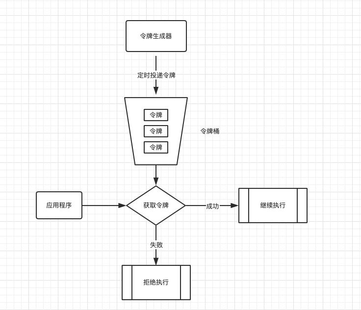
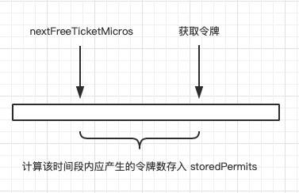
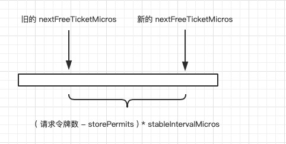
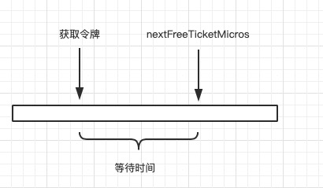

## 限流之 `Guava RateLimiter` 实现原理浅析

`Guava` 作为一个工具包，内部提供了 `RateLimiter` 这样的限速工具，`RateLimiter`采用令牌桶的原理限制同一时刻的并发数量，起到限流作用。关于令牌桶的原理，如下图所示


1. 令牌生成器负责向令牌桶内定时投递令牌，如果令牌桶满了，则溢出，保持令牌桶的令牌数不超过令牌桶容量

2. 应用程序每次执行时，都要向令牌桶获取令牌，如果成功获取令牌，则继续执行，如果获取令牌失败，则拒绝执行

### 简单使用
+ 创建一个`RateLimiter`，设定每秒产生的令牌数量
    ```java
    //每秒产生 10 个令牌
    RateLimiter rateLimiter = RateLimiter.create(10);
    ```
+ 阻塞获取令牌
    ```java
    //从令牌桶内获取令牌，获取成功则返回，获取不到则一直阻塞直至获取
    rateLimiter.acquire();
    ```

+ 尝试获取令牌
    ```java
    //尝试获取令牌，获取成功则立刻返回 true，否则返回 false
    boolean gainSuccess = rateLimiter.tryAcquire()
    ```

如下代码所示，展示了每间隔 1s 打印一次时间戳
```java
RateLimiter rateLimiter = RateLimiter.create(1);

for (; ; ) {
    rateLimiter.acquire();
    System.out.println(System.currentTimeMillis());
}
```
打印结果
```
1578028136784
1578028137783
1578028138786
1578028139782
1578028140786
1578028141785
1578028142785
1578028143788
1578028144787
1578028145785
1578028146785

Process finished with exit code 137 (interrupted by signal 9: SIGKILL)
```
*`RateLimiter`是一个线程安全的对象，可以在多线程环境下使用*

### 实现原理
在令牌桶模型中，有定时生成令牌的令牌生成器，而`RateLimiter`中并没有令牌生成器，也没有专门的后台线程来定时生成令牌，而是采用了**基于时间戳、纯依赖使用方线程驱动**的方式来实现。以下面代码为示例，创建一个每秒产生 10 个令牌的`RateLimiter`
```java
//第 1 步
RateLimiter rateLimiter = RateLimiter.create(10);

for (; ; ) {

    // 第二步
    rateLimiter.acquire();

    //TODO Business
}
```

第一步的 `RateLimiter` 对象被创建后（实际上创建的是`SmoothBursty`对象，是`RateLimiter`的子类），主要有以下四个属性

| 属性 | 类型 | 描述
| :-----| :-----| :-----|
| storedPermits | double | 令牌桶内可用的令牌数
| stableIntervalMicros | double | 产生每个令牌的时间间隔，单位微妙
| maxPermits | double | 令牌桶的容量，即能存放的令牌数量
| nextFreeTicketMicros | long | 有令牌可用时的时间戳，在该时间戳前，`RateLimiter`都是无令牌可用的，相当于令牌资源的开放时间（注意，该时间戳是相对于`RateLimit` 创建时间的相对时间戳）

对应于上述的代码，则 

+ `stableIntervalMicros = 100 000.0`，即 100 毫秒，平均 100 毫秒产生一个令牌
+ `maxPermits = 10.0`，即令牌桶的容量为 10 个令牌

在第二步通过 `acquire()` 向 `RateLimiter` 获取令牌时，

1. 如果**当前时间戳**大于`nextFreeTicketMicros`，将会拿**当前时间戳**减去`nextFreeTicketMicros`，然后除以 `stableIntervalMicros` ，计算出在 `nextFreeTicketMicros` 到**当前时间戳**之间的这段时间内应该产生的令牌数，然后存入`storedPermits`（即令牌桶）。就如同上面所说的纯依赖使用方线程驱动来产生令牌，这就是鲜明的体现。具体如下图所示（*这里的当前时间戳并不是真正的当前时间戳，而是当前时间和`RateLimiter`创建时间之间的相对时间戳*）

    

    计算这段时间内产生令牌数的公式如下
    ```
    ( nowMicros - nextFreeTicketMicros ) / stableIntervalMicros
    ```

2. 如果`storedPermits`（桶内现有令牌数）小于请求的令牌数（示例中请求的令牌数是1），则用请求的令牌数减去`storePermits`表示还需要多少令牌，然后根据需要的令牌数乘以`stableIntervalMicros`，表示还需要多少时间可以产出需要的令牌数，最后在`nextFreeTicketMicros` 之上加上这个时间，即成为新的`nextFreeTicketMicros`，表示下一次有令牌可用的时间，如下图所示

    

    如果`storedPermits`（桶内现有令牌数）大于或等于请求的令牌数（示例中请求的令牌数是1），则不重置`nextFreeTicketMicros`

上述只是讲述了关于令牌的管理，并未讲述到关于获取令牌，是因为`RateLimiter`采用了**超前消费**的处理方式，所谓的**超前消费**就是如果令牌桶内的令牌数小于一次要获取的令牌数，**注意是一次**，比如桶内有 1 个令牌，某次请求需要获取 10 个令牌，那么`RateLimiter`会将除了令牌桶内 1 个令牌外的其他 9 个未产生的令牌超前返回，并且在今后的 `9 * stableIntervalMicros` 的这段时间内不再提供令牌可用，在这段时间内所有获取令牌的请求都会阻塞，直至这段时间结束。`RateLimiter`的**超前消费**就相当于拿未来生产令牌的时间来提前预支此次请求的令牌数，当然前提是当前请求时间戳大于`RateLimiter`的`nextFreeTicketMicros`，即当前`RateLimiter`有令牌可用。

弄懂了上面的概念，关于获取令牌就一目了然了，获取令牌时，如果**当前时间戳**大于或者等于`nextFreeTicketMicros`，则不会阻塞，直接返回；如果**当前时间戳**小于`nextFreeTicketMicros`，则会阻塞等待到`nextFreeTicketMicros`，如下图所示


    
### 预热功能

作为一款限流器，`RateLimiter`不仅仅提供了限流的作用，还在限流的基础之上提供了预热的支持，所谓的预热就是考虑到应用在使用内存缓存场景下，应用在启动初期会根据请求来加载数据内存，以供后续请求使用。对于这种情况，在初期不易接受大量的请求，需要所谓的一个预热阶段，`RateLimiter`提供了对预热的支持，如下述API所示
```java
public static RateLimiter create(double permitsPerSecond, long warmupPeriod, TimeUnit unit)
```
在预热阶段，`RateLimiter`并不会让请求快速到达`permitsPerSecond`设定的速率，而是在这段预热时间内逐步增长到`permitsPerSecond`设定的速率。

### 引用
[谈谈服务限流算法的几种实现](https://blog.csdn.net/linhui258/article/details/81155622)

[Guava源码](https://github.com/google/guava)