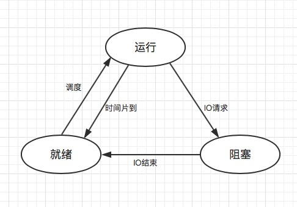

## 1、进程间常用的通信方式（`IPC`，即`InterProcess Communication`）

### **管道**

管道，通常是指**无名管道**，是`UNIX`系统`IPC`最古老的方式

+ 半双工，具有固定的读端和写端

+ 只能用于具有亲缘关系的进程之间的通信，通常是父子进程之间

+ 可以看成是一种特殊的文件，对于管道的读写可以采用普通的`read()`、`write()`函数。但它不是普通的文件，不属于任何文件系统，并且只存在于内存中

+ 容量有限、速度慢

### **命名管道（`FIFO`）**

+ 是一个文件类型，需要有路径名与之关联，以一种**特殊设备文件**的形式存在于**文件系统**中

+ 可以在**无关的进程**之间交换数据

+ 容量有点、速度慢

### **消息队列**

+ 消息以链表的形式存放在**内核**中，一个消息队列由一个标识符来标识，即**队列ID**

+ 消息队列是面向记录的，消息队列中的消息具有特定的格式和特定的优先级

+ 独立于发送进程、接受进程。发送进程、接受进程终止时，消息队列以及其中的消息是不会被删除的

+ 可以对队列中存放的消息随机查询、以及按类型读取

+ 容量受到系统限制，而且第一次读取时，需要考虑上一次没有读完数据的情况

### **信号量**

信号量是一个计数器，用于实现进程之间的互斥与同步，而不是用于存储进程之间通信数据

+ 用于进程之间同步，常常结合**共享内存**来实现线程之间传递数据

+ 基于操作系统的`PV`操作，对于信号量的操作都是原子操作

+ 每次对信号量的`PV`操作，不仅仅可以加一、减一，也可以加减任意正整数

+ 不能传递复杂消息，只能用于进程间同步

*`PV`操作就是操作系统中，实现进程互斥与同步的一种方式，`P`表示通过，`V`表示释放，并且在执行路径上，有一个`P`就必须有一个`V`。简单理解，`P`是获取，`V`是释放*

### **共享内存**

就是多个进程共享同一块给定的内存空间

+ 因为是直接对内存进行存取，所以是最快的进程通信方式

+ 多个进程可以同时操作，所以需要同步，常常和**信号量**结合一起使用

### **套签字**

基于网络的进程间通信方式，常常用于不同机器之间的进程通信

## 2、进程的状态

+ **就绪**
  
  进程已经分配到除`CPU`以外的所有必要资源，等待获取`CPU`资源

+ **执行**

  进程已经获得`CPU`，正在执行

+ **阻塞**

  由于发生事件（比如`IO`请求）暂时无法继续执行

## 3、进程调度算法

+ **先到先服务**

  先来的程序先执行，执行完毕后让出`CPU`给后面到来的进程，可以采用`FIFO`队列来实现。如果一个正在执行的进程有许多`IO`操作，那么将会导致`CPU`空闲，该策略是**非抢占式调度**。

+ **最短作业优先**

  将具有最短处理时间的进程先执行，如果存在同样处理时间长度的进程，则采用先到先服务策略。该调度算法的最大难点就是操作系统如何获取就绪队列中的哪一个进程具有最短的处理时间，操作系统只能根据任务历史的处理时间来预估本次的处理时间。
  

+ **优先权调度**

  通过给每个进程定义一个优先级，具有最高优先级的进程会先被执行，相同优先级的进程采用先到先服务处理。该策略会存在低优先级任务无限饥饿的情况，可以采用**老化**的处理方式，老化即逐渐增加在就绪队列中长时间等待的进程优先级。
  
  
+ **时间片轮转法**

  通过定义一个较小的时间单元，称为时间片。采用抢占方式为轮流为每一个进程分配处理时间。如果时间片划分太大，则对于交互式系统来说，响应比较大；如果时间片划分太小，则会出现频繁的上下文切换，这个切换时间在整个时间片中的占比较大。

+ **多级队列**

  将就绪队列分为多个独立的队列，根据进程的某些属性，划分到某个队列，每个队列采用单独的调度算法，队列与队列之间也会存在调度。

+ **多级反馈队列**

  在多级队列的基础之上，允许进程在队列之间移动。如果进程使用的`CPU`时间过多，将会被移动到更低优先级的队列，目的是为了将IO约束和交互式进程留在较高优先级队列中。对于低优先级的队列，则采用老化处理方式，逐渐提升其优先级。

## 4、进程同步机制

+ **临界区**
  
  过对多线程的串行化来访问公共资源或一段代码，保证在某一时刻只有一个线程能访问数据。缺点是只能用来同步本进程内的线程，而不可用来同步多个进程中的线程

+ **互斥量**

  互斥对象只有一个，只有拥有互斥对象的线程才具有访问资源的权限。互斥量是跨进程的，使用互斥量不仅仅能够在同一应用程序不同线程中实现资源的安全共享，而且可以在不同应用程序的线程之间实现对资源的安全共享。

+ **信号量**

  控制在同一时刻访问同一资源的最大线程数目，互斥量是信号量的一种特殊情况，当信号量的最大资源数=1就是互斥量了。信号量是基于操作系统的`PV`操作实现的，但是`PV`操作分散在各用户程序的代码中，不易控制和管理，容易出现死等和信号不释放情况。

+ **事件**

  通过事件来通知线程有一些事件已发生，从而启动后继任务的开始，可以在不同进程之间的线程间触发。