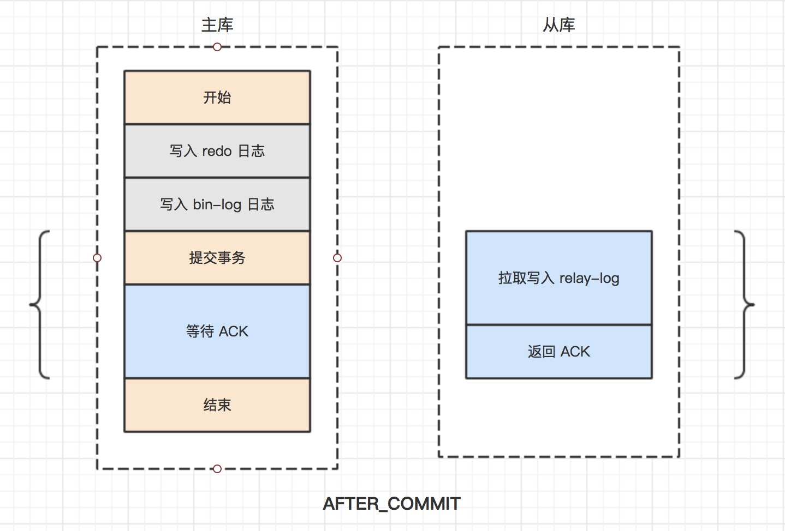
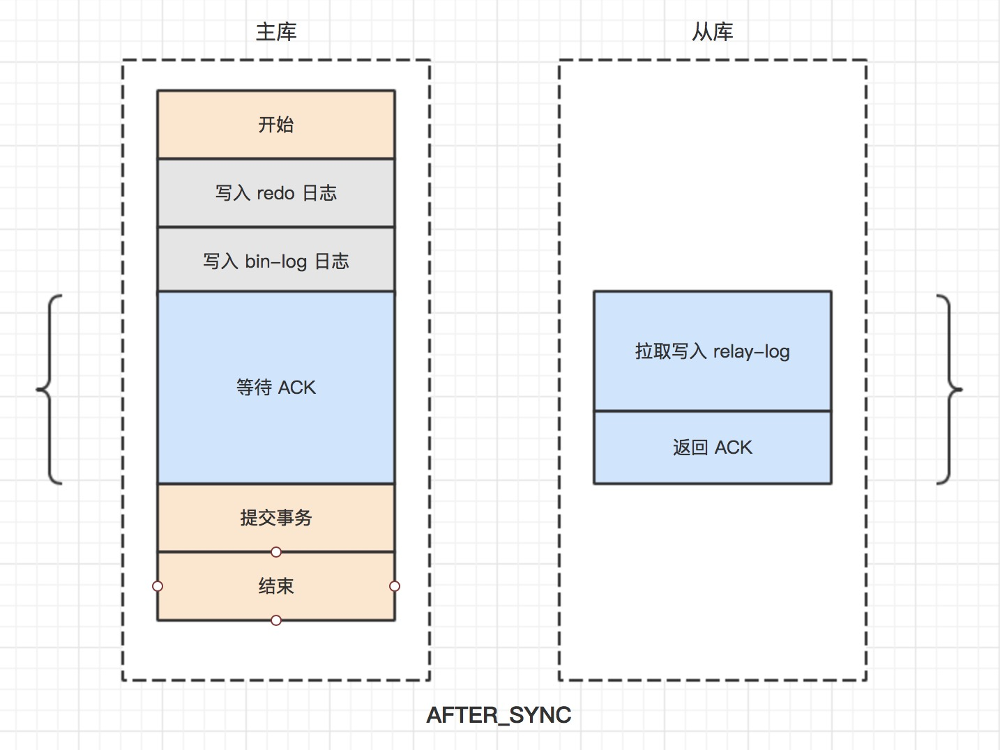

## 复制流程

如上图所示，主库在进行数据改动时，将日志记录到`bin-log`里，从库存在两个线程，一个叫做**IO 线程**，一个叫做**SQL 线程**。**IO 线程**从主库的`bin-log`里拉取日志，存入到从库的`relay-log`，**SQL 线程**则从`relay-log`中读取日志，进行回放、应用到从库，从而实现主从复制。

## 复制模式

### 异步复制
主库完成将日志记录到本地的`bin-log`后，就返回成功给客户端，即不关心从库是否拉取日志完成，当然不更会关心从库上的数据是否更改完成。

### 半同步复制

主库不仅需要将日志记录到本地的`bin-log`，而且还需要等待从库将日志拉取到`relay-log`中后，才能返回成功给客户端。**主库不需要关心从库上的数据是否更改完成，因为从库可能只是拉取、存入了`relay-log`，但是`SQL`线程还没有回放、执行。**

在根据 **主库等待从库返回`ACk`** 在半同步复制流程中的顺序，还可以分为以下两种

+ `AFTER_COMMIT` 模式

    *先提交事务，后等待从库`ACK`返回*

+ `AFTER_SYNC` 模式

    *先等待从库`ACK`返回，后提交事务*

## `bin-log`日志数据格式

### `STATEMENT`模式 **（5.7.7以前的默认格式）**

基于`SQL`语句的复制，每一条会修改数据的`SQL`语句会记录到`bin-log`中，简称`SBR`。

+ **优点**
  
  不需要记录每一条`SQL`语句造成的数据变化，只需要记录`SQL`语句即可

+ **缺点**
  
  当`SQL`中存在内部函数、存储过程调用时，可能会存在主从双方数据不一致，比如调用函数 `last_insert_id()`

### `ROW`模式 **（5.7.7以后，包括5.7.7的默认格式）**

基于行数据的复制，每一条被改动或者新增的数据都会记录到`bin-log`中，简称`RBR`。

+ **优点**

  不会出现因为`SQL`中存在内部函数、存储过程的调用导致主从双方数据不一致的情况。

+ **缺点**

  当进行表结构更改时，会产生大量日志，比如`alter table ...`

### `MIXED`模式

`STATEMENT`模式、`ROW`模式混合使用。一般的复制使用`STATEMENT`模式，对于`STATEMENT`模式下下无法复制的操作采用`ROW`模式保存，`MySQL`会根据执行的`SQL`语句选择适合的模式，简称`MBR`。